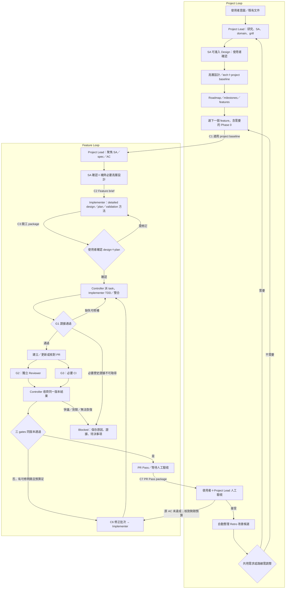
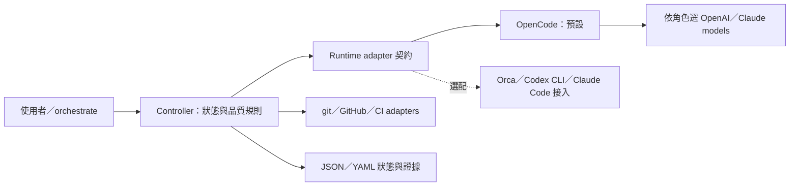

# Delivery Harness：總體流程、交接契約與工具

日期：2026-09-27。本文是整體導覽；規則以 [決策](decisions.md)、[Workflow Design](workflow-design.md) 與 [交接契約](workflow-contracts.md) 為準。文件中 C1–C8 是交接位置的導覽標籤，不是新增 gates、固定檔名或已實作 API。

目前已完成需求與流程設計整理；orchestrate skill／controller 尚未實作，也沒有真實 E2E 證據。以下標示「候選」的方法仍待 Q-METHOD 收斂。Controller 的本次實作指定由 Opus 5.5 agent 承接，待具體 design＋plan 依 D11 確認後執行；此指定不是未來所有專案的固定 model 政策。

## 1. 一個入口、兩層流程

使用者透過所在環境的 agent 入口與目前角色協作（預設 OpenCode，亦可選 Orca 等已驗證入口），orchestrate 引導目前階段；controller 管理唯一的 feature 派工、證據判定與恢復。Project Lead 負責需求、專案協調及高層設計，Implementer 負責詳細設計與交付，Reviewer 獨立審查與覆核。

圖只展開主路徑。SA 的確認與 D11 開工確認分開；已有適用成果與確認可沿用，不重做完整 grill。人工驗收的新需求／規格錯誤回 Project Lead 與使用者裁決，原 AC 缺陷才回同一 run 修正；到限仍為 Blocked。相依的下一個 feature 等上游人工接受、merge 事實與採用 baseline 均符合 D27 才實作。Phase 0 的程式變更走相同 feature 流程，不繞 gates。

Review clean 表示未解 blocking finding 為零；CI 綠燈或 agent done 均不能替代三 gates。所有 Pass 與接受帶版本，新 head／base／規格變更會觸發適用性重評；歷史 Red 可早於最終 SHA，但最終 Green／回歸適用整合 head。流程沒有自動 merge、關票、release 或 deploy。

## 1.1 OpenCode 預設接法與選配入口（D37／D38）

OpenCode 是預設 agent runtime，可依角色選用 OpenAI／Claude models。Controller 是獨立的確定性程式，透過共用 adapter 派工及讀取結果；它的狀態、gates、預算與恢復不依賴 Orca、Codex 或 Claude Code。公司與本機使用相同設計。

| 層次 | 責任／預設 | 選配與查核邊界 |
| --- | --- | --- |
| 使用入口 | OpenCode 中的角色 session＋orchestrate skill，或直接 controller CLI | 有 Orca 時可加上 console／session 整合；ChatGPT 等 UI 只在具備已驗證交接能力時接入，不推定存在派工 API |
| Controller | 唯一狀態機、派工、證據、gates、budget、outbox／reconcile | 核心依賴抽象 adapter，不讀 Orca 專有 IDs 作必填條件，也不直接用模型回答取代 gate 計算 |
| Agent runtime | OpenCode adapter 建立、查詢與恢復獨立 sessions，讀取原生 messages／結果 | Orca 派工、Codex CLI、Claude Code 為可選 adapter；未選用的接入缺失或斷線不阻斷 OpenCode 路徑 |
| Provider／model | 每個角色有明確 provider、requested model、實際 model 證據 | 選 Claude model 不要求 Claude Code；選 OpenAI model 不要求 Codex CLI。精確模型與帳戶能力另查，不默默 fallback |
| 工作區／驗證／GitHub | Controller 經 git 管理 worktree，runner 留驗證證據，GitHub adapter 讀寫 issue／PR／CI | Reviewer 使用獨立 session 及可核對的工具隔離；只有另一個 session 或禁用 edit 都不足以證明完整隔離 |

同一 OpenCode runtime 可承載 Implementer 與 Reviewer，但兩者須有獨立 assignments／sessions，Reviewer 按核准 model profile 執行且不能修改作者 branch。既有 Codex 審查要求在模型／能力層查核；D38 解除對 Codex CLI 的必要依賴，不批准任意 OpenAI model 自動符合 G2。精確 model IDs、公司權限及隔離能力仍待查證。

OpenCode 的 skills 與 session 接入研究見 [runtime 查核](research/2026-09-26/agent-messaging-and-opencode.md)。適配時保留原 skill 的觸發限制，原生接受回應、idle、通知均不等於完成。Controller 的安裝及啟動只檢查所選 profile 的依賴；可選 adapter 失敗須限縮回報，不暗中更換 runtime/model。

驗收以不安裝／不配置 Orca、Codex CLI、Claude Code 的 OpenCode 路徑為基線，再按選用的 adapter 分別驗 placement、實際 model、結果、隔離與恢復。Mock contract tests、真實 adapter 及完整 feature E2E 各自留證。本機已安裝 OpenCode 1.18.32，完成 health、session 建立／讀取及 server 重啟後讀回；[安裝與 probe 證據](research/2026-09-27/opencode-setup.md) 未包含模型推論、Reviewer 隔離或產品 gates。D39 的本次 bootstrap 開發分工獨立於產品預設 runtime。

## 2. Project 共用產出物

完整定義見 [Project baseline](workflow-contracts.md#project-baseline)。此處列可被 project orchestrate 與各 feature 重用的內容；實體文件可合併或分開，保留原 repo／工具慣例。

| 產出物角色 | 回答什麼 | 主要維護者／引用者 |
| --- | --- | --- |
| Mission／intent | 為誰解決什麼問題、目標、範圍與業務成功條件 | Project Lead＋使用者；選 feature 與 Replanning 使用 |
| CONTEXT／domain | 標準用語、概念區別及領域邊界 | Project Lead；所有角色在相關領域工作前引用 |
| Project spec | 跨 feature 的行為規則、責任與不變條件 | Project Lead；feature spec、design、review 共同引用 |
| Architecture／tech | 元件責任、主要資料流、技術選擇與設計限制 | Project Lead；Implementer 與 Reviewer 引用 |
| Roadmap／milestones | 成果節點、完成條件、feature 切分與依賴順序 | Project Lead＋使用者；project orchestrate 選擇下一步 |
| 工程／驗證基準 | 適用工程規則、setup／build／test 與必要 CI | 引用 repo 規範、scripts／CI，避免維護重複副本 |
| Research／必要 ADR | 現況證據、取捨理由、假設與待決事項 | 依當前範圍讀取，為需求及設計提供來源 |

保留 Matt 原生 `CONTEXT.md`；它承載共同語言，較完整的業務規則、流程與狀態由 Spec 承載，技術實作由 Design／ADR 承載。多個 context 才按需用 Context Map；不強制另建 `domain-model.md`。

`project-lead-sa.md` 是 harness 的工作指引，告訴 Project Lead 如何分析；以上是執行工作後留下的專案產物。兩者用途分開。

## 3. Feature 工作文件

| 內容角色 | 產出者 | 交接內容 | 採 OpenSpec 時的建議承載方式 |
| --- | --- | --- | --- |
| Requirements／spec | Project Lead＋使用者 | 目的、scope、可觀察行為、例外、依賴、限制、穩定 AC IDs | 同一 change 的 proposal 與 specs；引用 project baseline |
| Design | Project Lead 提供高層邊界；Implementer 完成詳細設計 | 元件／介面、資料與狀態、失敗恢復、migration、測試策略 | design.md 或適用的既有 design 引用 |
| Plan／tasks | Implementer 維護，Project Lead 可提草案 | Task groups、穩定 task IDs、順序／依賴、scope、具體步驟、AC 對照及完成驗法 | tasks.md；採 Writing Plans 方法時補足細節，維持唯一計畫 |
| Validation | Project Lead 定 AC；Implementer 規劃／執行；Reviewer 核查 | AC → 方法／步驟 → 環境 → 通過標準 → 證據位置／實際結果與版本 | 既有 validation 文件或明確區段，binding 指實際位置；不是 OpenSpec 預設必有 artifact |

因此 SDD 的 requirements／plan／validation 均已涵蓋，另有 design。語意涵蓋不代表本 repo 的實作計畫與驗證對照已完成：目前 change 已有 proposal／specs，design／tasks／具體 validation 仍在準備。

Validation 的自動化測試、curl、UI 或人工檢查依 AC 選擇；標準要可判定，但不強迫每條需求數值化。計畫與實測分開，功能符合要求與業務改善達成也分開；JSON 裡的 gate 才保存 controller 的現行判定。

## 4. 八個交接位置

交接契約包含輸入、輸出、身份／版本、責任與能否往下走的判定。下表是現有契約的整理，不要求為每列新增一份 Markdown。

| 位置 | 從誰 → 給誰 | 至少交什麼 | 下一步條件 |
| --- | --- | --- | --- |
| C1 Project baseline | Project Lead → project orchestrate／所有 feature 角色 | Repo、mission、domain、project spec、design／tech、roadmap 的實際 references、版本、已確認／待決狀態 | 適用來源可讀且無影響當前工作的未解衝突；既有基準可引用 |
| C2 Feature brief | Project Lead → Implementer | Feature／issue、所屬 milestone、baseline、scope／非目標、穩定 AC、設計邊界、依賴、SA 確認與剩餘待決項 | 足以 detailed design；需求阻擋回人，不自行補定 |
| C3 開工 package | Implementer → 使用者確認，controller 核對 | Detailed design、唯一 plan／tasks、task→AC、依賴、修改範圍、validation 方法、版本 | D11 的適用確認已保存，才允許 implementation 派工 |
| C4 Assignment／result／evidence | Controller → worker → controller | run/task/attempt、角色、runtime/model、repo/worktree/branch、版本、scope/tools、依賴、skills、AC、輸出位置；回傳實際版本、執行狀態、證據與待決事項 | IDs、scope、版本與證據可核對；task succeeded 不等於 gate passed |
| C5 Review／CI | Controller → 獨立 Reviewer／CI adapter → controller | 固定 PR head／review base、spec/design/AC、完整 diff、規範、舊 findings；review verdict／穩定 findings 與真實 required checks | G1 先通過；G2、G3 分開判，同一版本收齊才合併修正 |
| C6 Correction batch | Controller → Implementer → 獨立 Reviewer | Finding IDs、CI 問題、依據／預期、scope、AC、驗法、剩餘預算；逐項 fix_submitted／disputed、commit、證據 | 新 head 重新驗 G1／G2／G3；blocker 需 Reviewer 覆核或明確人工裁決才解除 |
| C7 PR Pass／人工接受 | Controller／Implementer → 使用者＋Project Lead | 適用版本、三 gates 理由／證據、findings、限制、發布狀態；接受或具理由退回 | 三 gates 同版本通過才 Pass；accepted、merged 各自保存真實狀態 |
| C8 Retro／Replanning | 已接受 feature → Project Lead＋使用者 → 後續 feature | 證據→問題→改善候選→owner→驗法；適用時更新 baseline／roadmap 與版本影響 | 自動產候選；修改規範／範圍仍依授權，無新知不造待辦 |

每個階段的 Blocked 回報均帶原因、證據、受影響工作、需誰決定什麼及最小恢復條件。Controller 保留結果與已用預算，正常修正最多三輪，infra 操作最多兩次額外重試，主動時間上限四小時；不靠換 session 或 run ID 歸零。

Implementer 與 Reviewer 經 controller、以已保存結果交接；通知只喚醒 reconcile。Review 明細發布 PR，原 issue 保留可採取行動的摘要與連結；本機 JSON finding registry 是唯一現行權威。先保存結果再發布，發文失敗只重試發布。

## 5. Harness skills 與工具組合

狀態說明：「已安裝」只表示本機檔案／CLI 可查，不等於已整合；「既定方法」來自已確認決策；「候選」待 Q-METHOD；「待開發」目前不可直接呼叫。

| 階段 | Skill／工作方法 | 工具與執行者 | 狀態／接合限制 |
| --- | --- | --- | --- |
| 共同入口 | orchestrate router，依階段載入工作指引 | 預設 OpenCode＋角色 agent；Orca 等入口選配，唯一 controller 管理派工 | 待開發；不是已可用的 slash command |
| Research／SA | Project Lead SA 指引；Matt grilling／domain-modeling 方法 | Agent 讀 repo、rg／git、文件及必要官方來源 | 指引已寫；Matt skills 已安裝。每輪 1–3 題依 D34；graphiphy／research-codebase 的實際工具仍待對應，不假稱執行 |
| Domain | Matt domain-modeling | Project Lead 維護 CONTEXT.md，按需 Context Map／ADR | 已安裝；保留原生文件職責 |
| 互動 grill | Matt grill-with-docs 或明示整合 grilling／domain 方法 | 使用者＋Project Lead | 已安裝；原 grill-with-docs 為 user-only，orchestrate 不在背景偷叫原版 |
| Feature spec | OpenSpec 分步規劃入口；Matt to-spec 為比較候選 | Project Lead＋OpenSpec CLI | 建議同一 change 接續交接。OpenSpec 1.13.1；to-spec 不設為必經、不另造第二份需求權威 |
| Detailed design／plan | Writing Plans 方法細化 OpenSpec tasks | Implementer＋OpenSpec CLI | 候選；本機 Superpowers 6.3.0。明示改由 controller 接手執行，不能原封不動啟動另一個 Superpowers loop |
| Implement／fix | Superpowers TDD；systematic-debugging／receiving-code-review 按需 | Implementer runtime＋git／測試 runner | TDD 依 D26 既定；技能已安裝。純文件例外仍需獨立 eligibility 核對，設定不自動豁免 |
| Independent review | Delivery review 薄封裝；參考 Matt 的 spec／standards 兩軸方法 | Controller 派獨立 Codex Reviewer，隔離 checkout／驗證 | 薄封裝待開發；預設 OpenCode 獨立 session，Codex CLI 選配，精確 reviewer model 與隔離能力待查。原 Matt skill 含平行 subagents，需明示適配，不能直接冒稱已符合 G2 |
| CI | 確定性查詢；失敗診斷才請 agent | GitHub CLI／API＋專案 CI pipeline | Required checks 依 repo 明定；pending／missing／cancelled 不算成功 |
| Retro | 明示整合 Matt retro 方法的 reference | Project Lead 讀已接受版本、findings、review／驗證證據 | 自動整理時點依 D28；reference 待開發，原 user-only retro 不隱式呼叫 |
| 持久化／恢復 | 確定性 controller，沒有另一個 agent 外層 loop | 建議 Python CLI；YAML 設定、JSON 狀態、JSONL 歷史；預設 OpenCode、可選 Orca／Codex／Claude Code 接入，以及 git／GitHub adapters | JSON／YAML 與單一 controller 既定，語言／介面為設計提案；無 DB／dashboard |

Skills 管工作方法；工具執行讀寫與查詢；controller 核對版本、狀態、gates、去重與預算。GitHub check 查詢不需要另外包成「CI skill」。

## 6. 本次開發的分工與目前缺口

- 依 D36／D39，本次由 Opus 5.5 Implementer 設計與實作、GPT／Codex Reviewer 獨立審查，由目前協作者協調。實際派工通道仍須核對，OpenCode 登入不是 bootstrap 前置；產品的 OpenCode 預設依 D38 維持。前次 Claude Code 設計 intake 遇本機 proxy 連線遭拒，沒有模型結果；見 [bootstrap 證據](research/2026-09-27/controller-bootstrap.md)。核對精確 model ID 及實際回報，不只相信 `opus` alias。
- 主協作者交接整體契約、spec／AC 與設計邊界；Opus Implementer 承接 detailed design 與最終 plan，再於 D11 確認後實作；獨立 Reviewer 依 G2 做審查。這是建立 harness 本身的分工，不表示 controller 每次判 gate 都要呼叫 Opus，也不改所有未來 feature 的 model 預設。
- 本輪 read-only 查核：Orca 1.4.212、Claude Code 2.1.283、OpenSpec 1.13.1、Superpowers 6.3.0；uv 已有 Python 3.12.13。細節見 [planning preflight](research/2026-09-27/planning-preflight.md)。
- 1.4.209 的舊 probes 保留其歷史結論；新版本仍需重驗 repo placement、worker 生命周期、Reviewer 隔離、crash／reconcile 與 GitHub 發布。Help 或 model catalog 可用不等於 V4／E2E 通過。
- 預設 runtime 依 D38 為 OpenCode；方法組合、精確 reviewer model 與環境能力仍待收斂；controller 的具體 design、唯一 tasks 與逐 AC validation 對照正在準備，尚未取得 D11 開工確認。

工作順序維持 D33：先在 orca-delivery 測通這套 harness，再用 cross-node-file-transfer 匯入既有基準、從初始化驗完整交付。既有 gigaxfer／P03 PR 保留暫緩。
