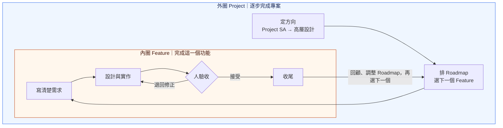
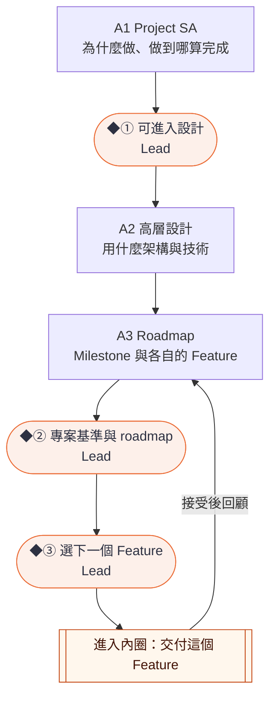
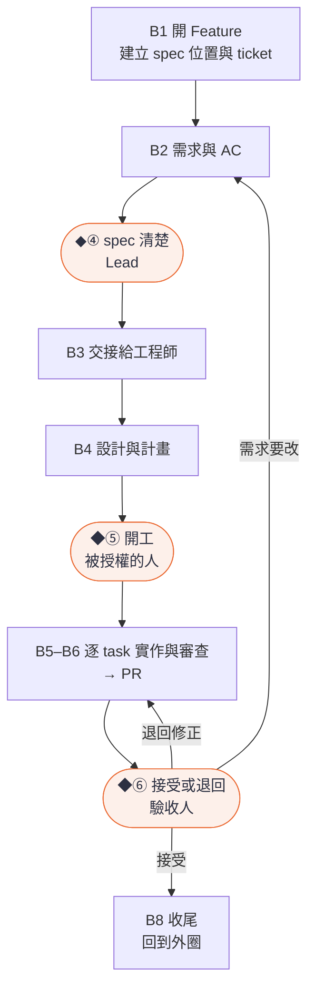

# Loop Engineering 使用指南

> 草案：流程已定，自動化還在做，現在可以照著人工演練。見[目前進度](../README.md)。

**先決定要什麼，再一次交付一個 Feature；每交付一個，就回頭調整計畫。**

就是熟悉的 SDLC，只是大部分工作由 Agent 做，人負責做決定。

## 大圈包小圈



Project 外圈先釐清為什麼做、做到哪裡算完成，再安排 Roadmap，每次選一個 Feature。每個 Feature 都走自己的內圈：釐清需求、設計實作、人工驗收；退回就修正，接受後收尾。完成的需求在合併後成為系統現況，交付經驗帶回外圈，調整後續安排。Agent 負責大部分工作，人負責關鍵確認。

## 誰做什麼

| 誰 | 做什麼 | 確認哪幾個 |
| --- | --- | --- |
| Lead | 給目標與限制、回答問題、選下一個 Feature | ①②③④ |
| 工程師 | 安排技術交付、審設計與計畫 | ⑤（被授權時） |
| 驗收人 | 看每條 AC 的證據與 demo | ⑥ |
| Agent：Project Lead Agent、Implementer、Reviewer | 研究、寫文件、實作、審查；不做確認 | — |

- **角色是工作，不是職位**：同一人兼任 Lead 與工程師是常態，這時 ④ 併入 ⑤。每個 Feature 開始時，寫明誰確認開工、誰驗收。
- **Lead 和 Project Lead Agent 不同**：Lead 做決定，Agent 做分析與建議。驗收人也不是審查程式的 Reviewer Agent。

## 活動卡怎麼讀
每個活動一張卡，卡是這個活動的正式定義：

- **目的**：一句話。
- **輸入**：開始前要有的東西。
- **步驟**：誰、做什麼、用什麼。「skill 第 N 步」指 [project-lead skill](../../skills/project-lead/SKILL.md) 的章節。
- **產出**：每一列一個產出，寫明位置、內容與由哪一步產生。controller 可用前，交付紀錄放在 ticket 留言；薄 controller 第一片已把開工確認與接受紀錄定在它自己的狀態檔，用它時以狀態檔為準，ticket 留言是摘要。
- **完成條件**：每一條都可以檢查。

標「工程師」的卡，只帶專案的人可以跳過。

## 外圈：Project



### A1 Project SA

**目的**：確定為什麼做、做到哪裡算成功，作為後面所有取捨的依據。

**輸入**

- 問題描述與限制（人提供）
- 既有資料：repo、現成需求文件、設計（有的話）

**步驟**

| # | 誰 | 做什麼 | 用什麼 |
| --- | --- | --- | --- |
| 1 | 人 | 交代要解決的問題、限制與既有資料 | 下方的開口句 |
| 2 | Agent | 讀既有資料，記下來源與版本 | skill 第 0–1 步（Project 模式） |
| 2a | Agent → 人 | 有現成需求文件時才做：提出「原章節 → 能力」對照；人確認拆法後，照原意搬進需求輸入並記下來源版本 | skill 第 1 步 |
| 3 | Agent | 研究現況，分清事實、推論與未知 | skill 第 2 步；research-codebase |
| 4 | Agent | 搭骨架：SA 七項，每一格標「假設」 | skill 第 3 步 |
| 5 | 人＋Agent | 由上往下問答，每輪 1–3 題 | skill 第 3 步；需要時用 grill-with-docs、domain-modeling |
| 6 | Agent | 每輪把答案寫進對應的文件 | skill 第 3–4 步 |
| 7 | Agent → 人 | 交一頁摘要，提出「可進入設計」；人確認（◆①） | skill 第 5 步 |

**產出**

| 產出 | 位置 | 內容 | 步驟 |
| --- | --- | --- | --- |
| 研究報告 | 專案的研究目錄（例如 `docs/research/`） | 現況與依據；事實、推論、未知 | 3 |
| project intent | 專案選定的位置（例如 `docs/project-intent.md`） | 問題與目標、範圍與不做、共用限制 | 6 |
| 共同詞彙 | `CONTEXT.md` | 共用的領域用語 | 6 |
| 需求輸入 | 專案自訂，例如 `docs/research/<日期>-import/` | 問出來的端到端情境、能力清單、關鍵規則與驗收方向；有現成需求文件時，另附它依能力拆分的內容、「原章節 → 能力」對照與來源版本 | 2a、6 |
| 決策與待決 | 決策紀錄（例如 `docs/decisions.md`） | 已確認的決策、待決事項與影響 | 5、6 |
| 確認紀錄 | 決策紀錄 | 誰、何時、原話、確認的版本 | 7 |

**完成條件**

- [ ] 目標、範圍、端到端情境、能力清單、共用限制都已確認
- [ ] 沒有擋住設計的待決；可延後的已列出影響與處理時點
- [ ] 人確認「可進入設計」（◆①），紀錄含版本

> 請用 project-lead skill 做 project 的 SA。Repo 在〈路徑〉，既有資料在〈位置〉。我想解決的問題是〈一兩句〉。

骨架怎麼搭、怎麼由上往下問，見參考的[需求是怎麼問出來的](reference.md#需求是怎麼問出來的)。

### A2 高層設計

**目的**：定下元件責任、主要資料流與技術選擇，roadmap 才切得出能單獨驗收的 Feature。

**輸入**

- A1 的 project intent、能力清單、共用限制
- 既有設計與 ADR（有的話）

**步驟**

| # | 誰 | 做什麼 | 用什麼 |
| --- | --- | --- | --- |
| 1 | Agent | 沿用或提出高層設計與方案比較 | skill 第 5a 步 |
| 2 | 人 → Agent | 人在方案之間做選擇；Agent 記進決策紀錄 | skill 第 5a 步 |
| 3 | Agent | 把重要取捨寫成 ADR | skill 第 5a 步 |

**產出**

| 產出 | 位置 | 內容 | 步驟 |
| --- | --- | --- | --- |
| 高層設計 | 既有設計文件的位置，或專案選定的位置（例如 `docs/design/`） | 元件責任、主要資料流、對外契約、技術棧 | 1 |
| 技術決策 | 決策紀錄 | 人的選擇與原話 | 2 |
| ADR | 既有 ADR 目錄（例如 `docs/adr/`） | 重要取捨與理由 | 3 |

**完成條件**

- [ ] 每個能力都有負責的元件
- [ ] 技術選擇有依據，重要取捨有 ADR

### A3 Roadmap

**目的**：決定先做什麼，讓每次只交出一個 Feature。

**輸入**

- 能力清單、共用限制（A1）
- 高層設計（A2）

**步驟**

| # | 誰 | 做什麼 | 用什麼 |
| --- | --- | --- | --- |
| 1 | Agent | 提出 Milestone：成果與完成條件 | skill 第 5a 步 |
| 2 | Agent | 切法有依據時，把當前 Milestone 切成 Feature：名稱、一句範圍、依賴、相關需求輸入；沒有依據時先只列交付能力 | skill 第 5a 步 |
| 3 | 人 → Agent | 人排順序、決定範圍，標出近期的 1–2 個；Agent 更新 roadmap 並記進決策紀錄 | skill 第 5a 步 |
| 4 | Agent → 人 | 交專案基準與 roadmap 的摘要；人確認（◆②） | skill 第 5a 步 |

**產出**

| 產出 | 位置 | 內容 | 步驟 |
| --- | --- | --- | --- |
| roadmap | 專案選定的位置（例如 `docs/roadmap.md`） | Milestone 的成果與完成條件；已切出的 Feature 的名稱、範圍、依賴、相關需求輸入、狀態（近期或暫定） | 1–3 |
| 範圍與順序的決策 | 決策紀錄 | 人的決定與原話 | 3 |
| 確認紀錄 | 決策紀錄 | 專案基準與 roadmap 的確認，含版本 | 4 |

**完成條件**

- [ ] 每個 Milestone 有成果與完成條件
- [ ] 已切出的 Feature 各自能用自己的 AC 驗收，每個受影響的 repo 一個審得動的 PR
- [ ] 近期的 1–2 個 Feature 已標出
- [ ] 人確認專案基準與 roadmap（◆②）

切多細、Feature 的定義，見參考的[工作層級](reference.md#工作層級milestonefeaturetask)與[Roadmap 要切多細](reference.md#roadmap-要切多細)。

## 內圈：一個 Feature



Lead 同時擔任工程師時，④ 併入 ⑤：spec、設計、計畫一起確認一次。不同人擔任時分開，Lead 先確認 spec，工程師才開始設計。

### B1 開 Feature

**目的**：讓這個 Feature 有自己的 spec 位置與追蹤入口。

**輸入**

- roadmap 上這個 Feature 的一行

**步驟**

| # | 誰 | 做什麼 | 用什麼 |
| --- | --- | --- | --- |
| 1 | 人 | 選這個 Feature（◆③），指定工程師 | — |
| 2 | Agent | 建立 spec 的位置 | skill 第 0 步（Feature 模式）；`openspec new change <id>` |
| 3 | Agent | 開 ticket，或把既有的 ticket 連上 spec；寫到 GitHub 前先問人 | skill 第 6 步的 ticket 欄位 |

**產出**

| 產出 | 位置 | 內容 | 步驟 |
| --- | --- | --- | --- |
| spec 的位置 | root 的 `openspec/changes/<id>/` | 之後放 proposal、spec、design、tasks | 2 |
| ticket | GitHub Issue | 目標、Milestone、spec 連結、Blocked by、狀態 | 3 |

**完成條件**

- [ ] `openspec/changes/<id>/` 已建立
- [ ] ticket 連到 spec，依賴寫清楚

### B2 Feature SA

**目的**：把這個 Feature 做到什麼算完成，寫成可以驗收的 spec。

**輸入**

- roadmap 上這個 Feature 的一行
- 相關的需求輸入與共用限制
- 專案基準（intent、設計、`openspec/specs/` 的現況）；交接時記錄它們的實際路徑與版本

**步驟**

| # | 誰 | 做什麼 | 用什麼 |
| --- | --- | --- | --- |
| 1 | 人 | 請 Agent 準備這個 Feature | 下方的開口句 |
| 2 | Agent | 讀輸入、研究現況 | skill 第 1–2 步；research-codebase |
| 3 | Agent | 搭骨架：目標、不做、角色與流程、規則、例外、驗收、待決 | skill 第 3 步 |
| 4 | 人＋Agent | 由上往下問答，每輪 1–3 題 | skill 第 3 步 |
| 5 | Agent | 寫 proposal 與 spec，檢查格式 | skill 第 4 步；`openspec validate <id>` |
| 5a | Agent | 這個 Feature 需要新的高層設計邊界時，寫進專案的設計文件或 ADR，並在 proposal 引用；`design.md` 留給 Implementer | skill 第 4 步 |
| 6 | Agent → 人 | 交一頁摘要；人確認（◆④）。兼任工程師時不在這裡確認，改在 B4 一起確認 | skill 第 5 步 |

**產出**

| 產出 | 位置 | 內容 | 步驟 |
| --- | --- | --- | --- |
| proposal | `openspec/changes/<id>/proposal.md` | 為什麼、範圍與不做、待決與依賴、引用的設計邊界、SA 確認紀錄 | 5、5a、6 |
| 設計邊界（需要時） | 專案的設計文件或 ADR | 這個 Feature 需要的新元件責任或對外契約 | 5a |
| spec | `openspec/changes/<id>/specs/<能力>/spec.md` | 這次新增或修改的需求；每條需求附 Scenario，每個 Scenario 是一條帶 ID 的 AC | 5 |
| 一頁摘要 | 給人確認用，不另存 | 照意思排列，附連結與版本（見下方範例） | 6 |

**完成條件**

- [ ] SA 七項都有答案，或列為待決
- [ ] 沒有會改變核心範圍、行為或驗收的阻擋性待決；可延後的已寫明影響與承接者
- [ ] 每條需求至少有一個 Scenario
- [ ] `openspec validate <id>` 通過
- [ ] 人確認摘要（◆④），或註明併入 B4 的開工確認

> 請用 project-lead skill 準備〈Feature〉：補足 spec、AC、必要高層設計與依賴，引用專案基準的實際版本。

一頁摘要的樣子：

```text
目標：……                          → proposal.md#why
不做：……                          → proposal.md
規則：ING-01 ……、ING-02 ……        → specs/<能力>/spec.md
例外：AC-I03 重複寫入、AC-I04 逾時
待決：Q1 容量上限（阻擋設計，請你確認前先決定）
版本：<commit 或檔案 hash>
```

需求從哪來、spec 怎麼寫，見參考的[需求放在哪](reference.md#需求放在哪)與[Spec 怎麼寫](reference.md#spec-怎麼寫放哪)。

### B3 交接

**目的**：讓工程師不必回頭問，就能開始設計。

**輸入**

- B2 的 spec，以及 SA 確認紀錄或「併入開工確認」的註記
- 專案基準

**步驟**

| # | 誰 | 做什麼 | 用什麼 |
| --- | --- | --- | --- |
| 1 | 人 | 指定誰批准開工、誰驗收（兼任時自己接） | — |
| 2 | Agent | 組交接包；獲授權時貼成一則 ticket 留言，未獲授權就交給人貼 | skill 第 6 步 |
| 3 | Agent 或人 | ticket 補上驗收 ID，狀態改為就緒；Agent 只在獲授權時寫 ticket | skill 第 6 步 |
| 4 | 工程師 | 核對交接包：能開始設計，或退回具體問題 | — |

**產出**

| 產出 | 位置 | 內容 | 步驟 |
| --- | --- | --- | --- |
| 交接包 | ticket 留言 | 工程師開始設計需要的一切：spec 與版本、每個受影響 repo 的起點與預定的 PR、SA 確認或「併入開工確認」的註記、依賴、待決與決策者（完整欄位見[交接契約](../workflow/contracts.md#角色交接摘要)） | 2 |
| ticket | GitHub Issue | 驗收 ID；狀態：就緒 | 3 |

**完成條件**

- [ ] 交接包每一欄都有內容，或寫明不適用
- [ ] 工程師已核對，能開始設計或已退回具體問題

各欄位的定義見參考的[交接](reference.md#交接)。

### B4 Design＋plan（工程師）

**目的**：決定怎麼做、拆成哪些 task。

**輸入**

- 交接包、spec
- 專案基準與高層設計

**步驟**

| # | 誰 | 做什麼 | 用什麼 |
| --- | --- | --- | --- |
| 1 | 工程師，或獲授權的 Project Lead | 啟動這個 Feature 的 loop；Project Lead 只能在人授權的範圍內啟動 | 下方的開口句；orchestrate（可用前由人協調） |
| 2 | Implementer | 研究並寫 detailed design | OpenSpec 的 design |
| 3 | Implementer | 拆 tasks（每個一個 session 做得完），寫每條 AC 的驗法 | OpenSpec 的 tasks；驗證對照 |
| 4 | 被授權的人 | 確認開工（◆⑤；兼任時連 spec 一起確認）；確認記成一則 ticket 留言，獲授權才由 Agent 張貼，否則交人張貼 | orchestrate（可用前由協調的人寫） |

**產出**

| 產出 | 位置 | 內容 | 步驟 |
| --- | --- | --- | --- |
| design | `openspec/changes/<id>/design.md` | 模組介面、資料、失敗與恢復、測試策略 | 2 |
| tasks | `openspec/changes/<id>/tasks.md` | task 清單、順序、依賴、對應的 AC；多 repo 時每個 task 註明改哪個 repo | 3 |
| AC 驗法 | 專案的驗證文件，或 plan 裡明確的一段 | 每條 AC 的方法、環境、通過標準、證據位置 | 3 |
| 開工確認紀錄 | ticket 留言 | 誰、何時、原話、確認的 design＋plan 版本 | 4 |

**完成條件**

- [ ] 每個 task 一個 session 做得完
- [ ] 每條 AC 都有驗法
- [ ] 開工確認有紀錄

> 請用 orchestrate 承接〈Feature〉。先由 Implementer 讀取它引用的專案基準、spec／AC 與高層設計，提出 detailed design、可執行 tasks 及 AC 驗證方式，交我確認後開工。保留 worktree 與證據；終點是 PR Pass，等待人驗收。

### B5 實作（工程師）

**目的**：一個 task 一個 task 把行為做出來，每一步都能驗證。

**輸入**

- 確認過的 design 與 tasks

**步驟**（每個 task 重複）

| # | 誰 | 做什麼 | 用什麼 |
| --- | --- | --- | --- |
| 1 | Implementer | 先寫會失敗的測試（Red），再實作到通過（Green） | Superpowers TDD |
| 2 | Implementer | 提交一到幾個 commit，每個 commit 自己綠燈 | Git；Feature branch 或 worktree |
| 3 | Reviewer（不同模型、新 session） | 審這個 task 的 commit | 獨立 Reviewer，唯讀 |
| 4 | Implementer → Reviewer | 有 blocking 就修掉，Reviewer 覆核 | — |
| 5 | orchestrate | 每個 task 審完都記一則 ticket 留言，沒有 finding 也記；獲授權才張貼，否則交人張貼 | orchestrate |

**產出**

| 產出 | 位置 | 內容 | 步驟 |
| --- | --- | --- | --- |
| commits | 受影響 repo 的 Feature branch | 這個 task 的程式差異 | 1、2 |
| TDD 證據 | controller 保存（第一片實作中） | Red → Green 紀錄 | 1 |
| 局部 review 紀錄 | ticket 留言，每個 task 一則 | 審查者與模型、時間、審的 commit 範圍、verdict、findings、修正與覆核結果、連結 | 5 |

**完成條件**

- [ ] 每個行為 task 都有有效的 Red 與 Green；純文件或註解的 task 標 TDD N/A，附理由與檢查，並由獨立 Reviewer 確認
- [ ] 局部 review 的 blocking 已修好並覆核

### B6 PR（工程師）

**目的**：用獨立審查與 CI 證明整個 Feature 符合 spec。

**輸入**

- 所有 task 都完成的 Feature branch

**步驟**

| # | 誰 | 做什麼 | 用什麼 |
| --- | --- | --- | --- |
| 1 | Implementer | G1：在整合後的 head 跑最終 Green 與回歸；通過才 push 送審 | Superpowers TDD |
| 2 | Implementer | 每個受影響的 repo 開一個 PR，連到同一張 ticket並互相連結 | GitHub |
| 3 | Reviewer | G2：對照 spec 與 design，審整組 PR | 獨立 Reviewer |
| 4 | CI | G3：各 repo 跑必要 checks | GitHub Actions |
| 4a | Implementer | 修正批次，最多 3 輪；每次新 push 都重新評估三個 gates | orchestrate 派工 |
| 5 | orchestrate＋controller | 核對三個 gates 在同一組版本通過，整理驗收包，貼成一則 ticket 留言；獲授權才張貼，否則交人張貼 | orchestrate；controller |

**產出**

| 產出 | 位置 | 內容 | 步驟 |
| --- | --- | --- | --- |
| PR | GitHub，每個受影響的 repo 一個 | 程式差異與說明 | 2 |
| gates 證據 | controller 保存（第一片實作中）；CI 結果在 GitHub | G1–G3 的結果與適用版本 | 1、3、4、5 |
| PR Pass 驗收包 | ticket 留言，連到每個 PR | 驗收人判斷需要的一切：這次交付的原因與範圍、每條 AC 的結果與證據、各 PR 的版本、風險與連結（完整欄位見[交接契約](../workflow/contracts.md#角色交接摘要)） | 5 |

**完成條件**

- [ ] 每個 repo 的 G1、G3 都在它 PR 目前的 head 通過
- [ ] G2 對整組 PR 的目前版本通過；任一 PR 有新 push，就重評整組 G2
- [ ] 驗收包每一欄都齊

Gates 的證據要求、review-fix loop 與 Blocked，見參考的[做出來：工程師的細節](reference.md#做出來工程師的細節)。

### B7 驗收、merge

**目的**：由人判斷結果是不是真的是要的。

**輸入**

- PR Pass 驗收包

**步驟**

| # | 誰 | 做什麼 | 用什麼 |
| --- | --- | --- | --- |
| 1 | 驗收人 | 讀驗收包、看 demo，逐條對照 AC | — |
| 2 | 驗收人 | 接受或退回（◆⑥）。AC 沒達成就退回修正；需求要改，回 Project Lead 更新 spec | — |
| 3 | Agent | 把接受或退回記成一則 ticket 留言；未獲授權就交給人貼 | skill 第 7 步 |
| 4 | 人 | 只有接受、且版本仍適用時才 merge；多個 PR 依依賴順序、提供方先 | GitHub |

**產出**

| 產出 | 位置 | 內容 | 步驟 |
| --- | --- | --- | --- |
| 接受或退回紀錄 | ticket 留言 | 誰、何時、原話、理由、對應的版本 | 3 |
| merge | GitHub | — | 4 |

**完成條件**

- [ ] 每條 AC 都有證據
- [ ] PR Pass、接受、merge 分開記錄

### B8 收尾

**目的**：把做完的需求變成系統現況，並用這次的經驗調整後面的計畫。

**輸入**

- 接受紀錄（步驟 1、2 在接受後就做）
- 這個 Feature 的所有 PR 都已 merge（步驟 3 才需要）

**步驟**

| # | 誰 | 做什麼 | 用什麼 |
| --- | --- | --- | --- |
| 1 | Agent | 接受後，整理 1–3 個有證據的 Retro 候選，貼成一則 ticket 留言；未獲授權就交給人貼 | skill 第 7 步 |
| 2 | Agent | 重看並更新 roadmap、檢查依賴，提出下一個 Feature 的候選（選擇在 B1） | skill 第 7 步、第 5a 步 |
| 3 | Agent | 確認這個 Feature 的所有 PR 都已 merge 後，把 spec 併入現況 | skill 第 7 步；`openspec archive <id>` |

**產出**

| 產出 | 位置 | 內容 | 步驟 |
| --- | --- | --- | --- |
| Retro 候選 | ticket 留言 | 來源、原因、改善、owner、驗法 | 1 |
| roadmap 更新 | roadmap | 狀態與順序的調整 | 2 |
| 現況 spec | `openspec/specs/<能力>/spec.md` | 這次做完的需求 | 3 |
| 封存的 Feature 資料夾 | `openspec/changes/archive/<日期>-<id>/` | 原本的 proposal、spec、design、tasks | 3 |

**完成條件**

- [ ] `openspec/specs/` 與已 merge 的實作一致
- [ ] roadmap 已重看，下一個 Feature 的候選已提出

有依賴的 Feature 要等上游接受並 merge 後才開始實作。一個 goal 推進多個 Feature 的目標做法，見參考的[給一個 goal](reference.md#給一個-goal推進多個-feature)。

## Milestone 驗收
待定：跨 Feature 的整合驗證怎麼控還在討論。Milestone 驗收不能把一串 PR 綠燈直接加總成完成。

## 想知道為什麼

本手冊只說怎麼做。規則本身、設計理由與取捨在內部設計文件：[決策紀錄](../decisions.md)、[交接契約](../workflow/contracts.md)、[流程設計](../workflow/overview.md)、[SA 階段契約](../workflow/project-lead-sa.md)；手冊和它們有出入時，以它們為準。各主題對應哪條決策，見參考的[想知道為什麼](reference.md#想知道為什麼)。工具分層、repo 結構與範例演練路線也在[參考](reference.md)。
