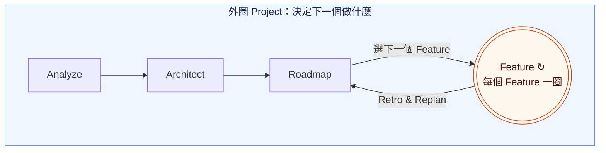
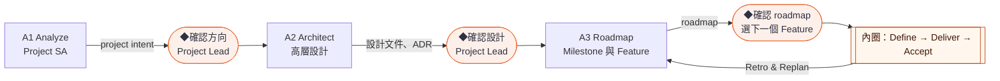
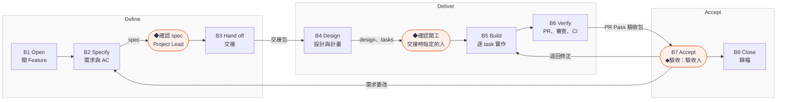

# Loop Engineering 使用指南

> 草案：流程已定，自動化還在做，現在可以照著人工演練。見[目前進度](../README.md)。

**先決定要什麼，再一次交付一個 Feature；每交付一個，就回頭調整計畫。**

就是熟悉的 SDLC，只是大部分工作由 Agent 做，人負責做決定。**Feature** 是能單獨驗收的一次交付；**Milestone** 是幾個 Feature 合起來、可以展示的成果。縮寫：SA 是需求分析，AC 是驗收條件，ADR 是架構決策紀錄，ADE 是讓 Agent 工作的開發環境。

## 大圈包小圈



外圈 Project 決定下一個做什麼：**Analyze**（為什麼做、做到哪算完成）→ **Architect**（高層設計）→ **Roadmap**（排 Milestone 與 Feature，決定先做什麼），每次選一個 Feature。每個 Feature 走自己的一圈，直到人工驗收通過，這一圈在下方「內圈」放大。接受後，**Retro & Replan** 把經驗帶回 Roadmap，再選下一個。Agent 做大部分工作，人在關鍵點確認。

## 誰做什麼

Agent 做大部分工作；人在六個 ◆ 確認點做決定：

| 誰 | 做什麼（◆ 是他要確認的點） |
| --- | --- |
| Project Lead | [分析需求](#a1-analyzeproject-sa)（先研究 codebase）◆確認方向 → [切模組與邊界](#a2-architect高層設計) ◆確認設計 → [排 roadmap、選下一個 Feature](#a3-roadmap排-milestone-與-feature) ◆確認 roadmap → [訂 Feature spec](#b2-specifyfeature-sa) ◆確認 spec → [驗收後收尾與回顧](#b8-close歸檔與回顧) |
| Engineer | [設計與計畫](#b4-design設計與計畫engineer) ◆確認開工 → [實作](#b5-build實作engineer) → [PR、審查、CI](#b6-verifypr審查與-ciengineer) |
| 驗收人：預設是 Project Lead；需求由別人提出時，是提出的人 | [看每條 AC 的證據與 demo](#b7-accept驗收與-merge) ◆驗收：接受或退回 |
| Agent：Project Lead Agent、Implementer、Reviewer | 研究、寫文件、實作、審查；不做確認 |

- **角色是工作，不是職位**：中小型 Feature 的外圈很薄，同一人兼任 Project Lead 與 Engineer 是常態，這時 ◆確認 spec 併入 ◆確認開工。交接時寫明誰確認開工、誰驗收；確認開工的人通常是 Engineer。
- **Project Lead 和 Project Lead Agent 不同**：Project Lead 做決定，Agent 做分析與建議。驗收人也不是審查程式的 Reviewer Agent。

## 人、Agent 與工具的分層

```text
┌─ Human ──────────────────────────────────┐
│ Project Lead / Engineer                  │  做決定：方向、設計、roadmap、spec、開工、驗收
└────────────────────┬─────────────────────┘
                     │ 用自然語言交代、確認
┌─ ADE ──────────────▼─────────────────────┐
│ Herdr / OpenCode / Claude Code           │  開 session 與 worktree，讓多個 Agent 並排工作
│ Orca (optional)                          │
└────────────────────┬─────────────────────┘
                     │
┌─ Harnessing ───────▼─────────────────────┐
│ Skills: project-lead / orchestrate /     │  約束 Agent 怎麼做：
│         research-codebase                │  照哪個方法、用哪個模型、先寫什麼
│ Model: chosen per role                   │  例如 Reviewer 和 Implementer 用不同模型
│ TDD, spec-driven (OpenSpec)              │  先寫測試再實作；先寫 spec 再設計
└────────────────────┬─────────────────────┘
                     │
┌─ Agents ───────────▼─────────────────────┐
│ Project Lead Agent <-> Implementer       │  做實際的分析、實作與審查
│ <-> Reviewer                             │
└────────────────────┬─────────────────────┘
                     │ 讀寫
┌─ Records & checks ─▼─────────────────────┐
│ Git branch / worktree, OpenSpec files,   │  共用的狀態：人和 Agent 靠它交接，不靠聊天
│ GitHub Issue / PR / CI                   │
│ controller                               │  核對版本、證據與三個 gates（第一片實作中）
└──────────────────────────────────────────┘
```

**Workflow** 是 Project、Feature 兩層的步驟與規則，貫穿所有層；**Harnessing** 是套在 Agent 身上的做法：skills、模型選擇、TDD、spec-driven，讓 Agent 照規則做。

## 活動卡怎麼讀

每個活動一張卡：一句**目的**，一張表，再加**完成的樣子**。表照做事的順序排：

- **Step**：第幾步。
- **Who**：誰做：Project Lead、Engineer、驗收人或 Agent；◆ 是要人確認的點，見[誰做什麼](#誰做什麼)。
- **Do**：做什麼。
- **How**：用什麼。skill 會連到 repo 裡它的 `SKILL.md`；指令連到說明文件。第一次使用前，在 loop-engineering 執行 `./setup.sh` 安裝這些 skills。
- **Output**：產出什麼。示範專案已經有的，附上範例連結；示範還沒走到的步驟先不放，示範專案推上 GitHub 之前，部分連結會打不開。

Agent 寫 ticket 或 PR 留言之前，會先問人，或照人事先給的授權。controller 可用之前，交付紀錄都放在 ticket 留言；只有確認方向、設計、roadmap 記在決策紀錄，確認 spec 記在 proposal。標「Engineer」的卡，只帶專案的人可以跳過。

## 外圈：Project

大圈的三格放大後：**Analyze** 是 A1，**Architect** 是 A2，**Roadmap** 是 A3。



### A1 Analyze：Project SA

**目的**：確定為什麼做、做到哪裡算完成。

| Step | Who | Do | How | Output |
| --- | --- | --- | --- | --- |
| 1 | Project Lead | 說明要解決的問題和限制 | 開一個 Agent session，貼上卡片下方的 prompt | — |
| 2 | Agent | 研究現況，分清事實、推論與未知 | skill [research-codebase](../../skills/research-codebase/SKILL.md) | 研究報告：`docs/research/<日期>-<主題>.md`（[範例](https://github.com/yschiang/cross-node-root/blob/main/docs/research/2026-09-28-import-from-gigaxfer.md)） |
| 3 | Agent | 有既有的需求文件（客戶規格、上游專案的 spec）時，依能力分組整理成需求輸入，註明來源版本；分組先請 Project Lead 看過。沒有就跳過 | skill [project-lead](../../skills/project-lead/SKILL.md) | 需求輸入：`docs/research/<日期>-import/`（[範例](https://github.com/yschiang/cross-node-root/blob/main/docs/research/2026-09-28-import/README.md)） |
| 4 | Agent ⇄ Project Lead | 從目標開始一層層往下問：目標 → 範圍 → 情境 → 規則 → 例外 → 驗收，每輪 1–3 題 | skill [project-lead](../../skills/project-lead/SKILL.md)；想被追問得更深，Project Lead 自己輸入 `/grill-with-docs`（[說明](../../skills/third-party/mattpocock/engineering/grill-with-docs/SKILL.md)，Agent 不會自動叫它） | project intent（[範例](https://github.com/yschiang/cross-node-root/blob/main/docs/project-intent.md)）、共同詞彙（[範例](https://github.com/yschiang/cross-node-root/blob/main/CONTEXT.md)） |
| 5 | Project Lead | 看一頁摘要，◆確認方向：可以進入設計 | — | 決策紀錄（[範例](https://github.com/yschiang/cross-node-root/blob/main/docs/decisions.md)） |

**完成的樣子**

- [ ] 目標、範圍、情境、能力清單、共用限制都確認了
- [ ] 沒有會擋住設計的問題；可以延後的已寫明影響
- [ ] Project Lead ◆確認了方向

**對 Agent 說：**

> 請用 project-lead skill 做 project 的 SA。Repo 在〈路徑〉，既有資料在〈位置〉。我想解決的問題是〈一兩句〉。

問法的細節見參考的[需求是怎麼問出來的](reference.md#需求是怎麼問出來的)。

### A2 Architect：高層設計

**目的**：定下元件責任與技術，roadmap 才切得出能單獨驗收的 Feature。

| Step | Who | Do | How | Output |
| --- | --- | --- | --- | --- |
| 1 | Agent | 沿用既有設計，或提出方案與比較 | skill [project-lead](../../skills/project-lead/SKILL.md) | 高層設計（[範例](https://github.com/yschiang/cross-node-root/blob/main/docs/design/README.md)） |
| 2 | Project Lead | 在方案之間做選擇 | — | 決策紀錄 |
| 3 | Agent | 把重要取捨寫成 ADR | skill [project-lead](../../skills/project-lead/SKILL.md) | ADR（[範例](https://github.com/yschiang/cross-node-root/tree/main/docs/adr)） |
| 4 | Project Lead | 看設計摘要，◆確認設計：元件責任與技術 | — | 決策紀錄 |

**完成的樣子**

- [ ] 每個能力都有負責的元件
- [ ] 重要取捨有 ADR
- [ ] Project Lead ◆確認了設計

### A3 Roadmap：排 Milestone 與 Feature

**目的**：決定先做什麼，讓每次只交出一個 Feature。

| Step | Who | Do | How | Output |
| --- | --- | --- | --- | --- |
| 1 | Agent | 提出 Milestone：成果與完成條件 | skill [project-lead](../../skills/project-lead/SKILL.md) | roadmap（[範例](https://github.com/yschiang/cross-node-root/blob/main/docs/roadmap.md)） |
| 2 | Agent | 切法有依據時，把當前 Milestone 切成 Feature；沒有依據先只列交付能力 | skill [project-lead](../../skills/project-lead/SKILL.md) | roadmap 的 Feature 表 |
| 3 | Project Lead | 排順序、決定範圍，標出接下來要做的 1–2 個 | — | 決策紀錄 |
| 4 | Project Lead | ◆確認 roadmap，選定下一個 Feature，指定 Engineer | — | 決策紀錄 |

**完成的樣子**

- [ ] 每個 Milestone 有成果與完成條件
- [ ] 每個 Feature 都能用自己的 AC 驗收
- [ ] Project Lead ◆確認了 roadmap，選好下一個 Feature

每個 Feature 收尾後都回到這裡：只看變動的部分，再 ◆確認 roadmap、選下一個。

Feature 怎麼切、切多細，見參考的[工作層級](reference.md#工作層級milestonefeaturetask)與[Roadmap 要切多細](reference.md#roadmap-要切多細)。

## 內圈：一個 Feature

上圖的 Feature 圈放大後分三段：**Define**（B1–B3，把要做什麼寫清楚）→ **Deliver**（B4–B6，設計、實作、審查）→ **Accept**（B7–B8，驗收與歸檔）。



Project Lead 同時擔任 Engineer 時，◆確認 spec 併入 ◆確認開工：spec、設計、計畫一起確認一次。不同人擔任時分開，Project Lead 先確認 spec，Engineer 才開始設計。

### B1 Open：開 Feature

**目的**：讓 A3 選定的 Feature 有自己的 spec 位置和追蹤入口。

| Step | Who | Do | How | Output |
| --- | --- | --- | --- | --- |
| 1 | Agent | 在 root repo 建立 spec 的位置；專案第一次用時，先執行 `openspec init` | 指令 `openspec new change <id>`（[說明](https://github.com/Fission-AI/OpenSpec/blob/main/docs/cli.md)） | Feature 資料夾（[範例](https://github.com/yschiang/cross-node-root/tree/main/openspec/changes/project-skeleton)） |
| 2 | Agent | 開 ticket，或連上既有的 ticket | skill [project-lead](../../skills/project-lead/SKILL.md) | ticket（[範例](https://github.com/yschiang/cross-node-root/issues/1)） |

**完成的樣子**

- [ ] ticket 連到 spec，依賴寫清楚

### B2 Specify：Feature SA

**目的**：把這個 Feature 做到什麼算完成，寫成可以驗收的 spec。

| Step | Who | Do | How | Output |
| --- | --- | --- | --- | --- |
| 1 | Agent | 讀需求輸入、project intent、高層設計與 roadmap，研究現況 | skill [research-codebase](../../skills/research-codebase/SKILL.md) | 研究報告：`docs/research/<日期>-<主題>.md` |
| 2 | Agent ⇄ Project Lead | 從目標往下問：流程 → 規則 → 例外 → 驗收，每輪 1–3 題 | skill [project-lead](../../skills/project-lead/SKILL.md) | — |
| 3 | Agent | 寫 proposal 與 spec，檢查格式；需要新的設計邊界時寫進設計文件或 ADR | skill [project-lead](../../skills/project-lead/SKILL.md)；指令 `openspec validate <id>`（[說明](https://github.com/Fission-AI/OpenSpec/blob/main/docs/cli.md)） | proposal（[範例](https://github.com/yschiang/cross-node-root/blob/main/openspec/changes/project-skeleton/proposal.md)）、spec（[範例](https://github.com/yschiang/cross-node-root/blob/main/openspec/changes/project-skeleton/specs/engineering-baseline/spec.md)） |
| 4 | Project Lead | 看一頁摘要，◆確認 spec。Project Lead 同時是 Engineer 時，改到 B4 一起確認 | — | proposal 裡的確認紀錄 |

**完成的樣子**

- [ ] 每條需求至少有一個 Scenario（也就是 AC）
- [ ] 沒有會改變範圍、行為或驗收的待決
- [ ] `openspec validate <id>` 通過

**對 Agent 說：**

> 請用 project-lead skill 準備〈Feature〉：補足 spec、AC、必要高層設計與依賴，引用 project intent、高層設計與 roadmap 的版本。

一頁摘要長這樣：

```text
目標：……                          → proposal.md#why
不做：……                          → proposal.md
規則：ING-01 ……、ING-02 ……        → specs/<能力>/spec.md
例外：AC-I03 重複寫入、AC-I04 逾時
待決：Q1 容量上限（阻擋設計，確認前要先決定）
版本：<commit 或檔案 hash>
```

### B3 Hand off：交接

**目的**：讓 Engineer 不必回頭問，就能開始設計。

| Step | Who | Do | How | Output |
| --- | --- | --- | --- | --- |
| 1 | Project Lead | 指定誰批准開工、誰驗收（驗收人預設是 Project Lead；需求由別人提出時，指定那個人） | — | — |
| 2 | Agent | 組交接包，貼成 ticket 留言 | skill [project-lead](../../skills/project-lead/SKILL.md) | 交接包 |
| 3 | Agent | ticket 補上驗收 ID，標為就緒 | skill [project-lead](../../skills/project-lead/SKILL.md) | ticket 狀態 |
| 4 | Engineer | 核對交接包：能開始就開始，不行就退回具體問題 | — | — |

**完成的樣子**

- [ ] Engineer 已核對，能開始設計

交接包要確認什麼，見參考的[交接](reference.md#交接)。

### B4 Design：設計與計畫（Engineer）

**目的**：決定怎麼做、拆成哪些 task。

| Step | Who | Do | How | Output |
| --- | --- | --- | --- | --- |
| 1 | Engineer | 啟動這個 Feature 的 loop | skill orchestrate（實作中，可用前由人協調） | — |
| 2 | Implementer | 寫詳細設計 | 指令 `openspec instructions design --change <id>` | design |
| 3 | Implementer | 拆 tasks，每個 task 一個 session 做得完；寫每條 AC 的驗法 | 指令 `openspec instructions tasks --change <id>` | tasks；AC 驗法寫在 validation 文件或 tasks 的明確段落 |
| 4 | 交接時指定的人 | ◆確認開工（兼任時連 spec 一起確認） | skill orchestrate（實作中，可用前由人協調），記成 ticket 留言 | 開工確認紀錄 |

**完成的樣子**

- [ ] 每條 AC 都有驗法
- [ ] 交接時指定的人 ◆確認了開工

**對 Agent 說：**

> 請用 orchestrate 承接〈Feature〉。先由 Implementer 讀取它引用的 project intent、roadmap、spec／AC 與高層設計，提出 detailed design、可執行 tasks 及 AC 驗證方式，交我確認後開工。保留 worktree 與證據；終點是 PR Pass，等待人驗收。

### B5 Build：實作（Engineer）

**目的**：一個 task 一個 task 把行為做出來，每一步都能驗證。

| Step | Who | Do | How | Output |
| --- | --- | --- | --- | --- |
| 1 | Implementer | 先寫會失敗的測試，再實作到通過 | skill [test-driven-development](../../skills/third-party/superpowers/test-driven-development/SKILL.md)（Superpowers） | commits、Red → Green 紀錄 |
| 2 | Reviewer（另一個模型） | 審這個 task 的 commit | 獨立 Reviewer | 局部 review 紀錄（ticket 留言） |
| 3 | Implementer | 修掉 blocking，Reviewer 覆核 | — | 修正的 commits |

**完成的樣子**

- [ ] 每個行為 task 都有 Red 與 Green；純文件的 task 要有理由，並由 Reviewer 確認
- [ ] 局部 review 的 blocking 都修好了

### B6 Verify：PR、審查與 CI（Engineer）

**目的**：用獨立審查和 CI 證明整個 Feature 符合 spec。

| Step | Who | Do | How | Output |
| --- | --- | --- | --- | --- |
| 1 | Implementer | 在整合後的版本跑完整測試（G1），通過才送審 | skill [test-driven-development](../../skills/third-party/superpowers/test-driven-development/SKILL.md)（Superpowers） | 測試結果 |
| 2 | Implementer | 每個受影響的 repo 開一個 PR，連到同一張 ticket | GitHub | PR |
| 3 | Reviewer＋CI | 審整組 PR（G2）；跑必要 checks（G3） | 獨立 Reviewer、GitHub Actions | review 與 CI 結果 |
| 4 | Implementer | 修正，最多 3 輪；每次 push 都重新評估 | skill orchestrate（實作中，可用前由人協調） | 新的 commits |
| 5 | 協調的人；orchestrate 可用後由它做 | 三個 gates 都在目前版本通過後，整理驗收包 | 人工核對每個 gate 的證據都對應目前版本，照[交接契約](../workflow/contracts.md#角色交接摘要)的欄位寫；controller 可用後由它核對 | PR Pass 驗收包（ticket 留言） |

**完成的樣子**

- [ ] 三個 gates 都在目前版本通過
- [ ] 驗收包齊全

Gates 的證據要求與 review-fix loop，見參考的[做出來：Engineer 的細節](reference.md#做出來engineer-的細節)。

### B7 Accept：驗收與 merge

**目的**：由人判斷結果是不是真的是要的。

| Step | Who | Do | How | Output |
| --- | --- | --- | --- | --- |
| 1 | 驗收人 | 看驗收包和 demo，逐條對照 AC | — | — |
| 2 | 驗收人 | ◆驗收：接受或退回。AC 沒達成就退回修正；需求要改就回 B2 | — | 接受或退回紀錄（ticket 留言） |
| 3 | 人 | 接受、而且版本仍適用時才 merge；多個 PR 照依賴順序，提供方先 | GitHub | merge |

**完成的樣子**

- [ ] 每條 AC 都有證據
- [ ] PR Pass、接受、merge 分開記錄

### B8 Close：歸檔與回顧

**目的**：把做完的需求變成系統現況，並用這次的經驗調整後面的計畫。

| Step | Who | Do | How | Output |
| --- | --- | --- | --- | --- |
| 1 | Agent | 接受後，整理 1–3 個有證據的改善建議 | skill [project-lead](../../skills/project-lead/SKILL.md) | Retro 候選（ticket 留言） |
| 2 | Agent | 更新 roadmap，提出下一個 Feature 的候選（回到 A3 選） | skill [project-lead](../../skills/project-lead/SKILL.md) | roadmap |
| 3 | Agent | 所有 PR 都 merge 後，把 spec 併入現況 | 指令 `openspec archive <id> --yes`（[說明](https://github.com/Fission-AI/OpenSpec/blob/main/docs/cli.md)） | 現況 spec、封存的 Feature 資料夾 |

**完成的樣子**

- [ ] 現況 spec 和已 merge 的實作一致
- [ ] roadmap 已重看

有依賴的 Feature 要等上游接受並 merge 後才開始實作。

## Milestone 驗收
待定：跨 Feature 的整合驗證怎麼控還在討論。Milestone 驗收不能把一串 PR 綠燈直接加總成完成。

## 想知道為什麼

本手冊只說怎麼做。規則本身、設計理由與取捨在內部設計文件：[決策紀錄](../decisions.md)、[交接契約](../workflow/contracts.md)、[流程設計](../workflow/overview.md)、[SA 階段契約](../workflow/project-lead-sa.md)；手冊和它們有出入時，以它們為準。各主題對應哪條決策，見參考的[想知道為什麼](reference.md#想知道為什麼)。repo 結構與範例演練路線在[參考](reference.md)。
