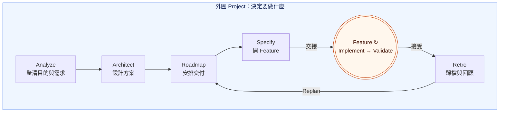
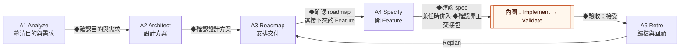
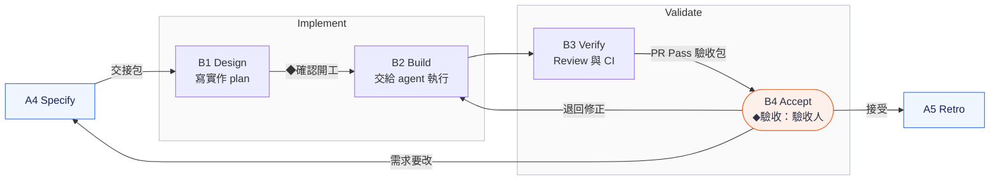

# Loop Engineering 使用指南

> 草案：流程已定，自動化還在做，現在可以照著人工演練。見[目前進度](../README.md)。

**先決定要什麼，再切成能單獨驗收的 Feature 交付，沒有依賴的可以同時進行；每交付一個，就回頭調整計畫。**

> 手冊有兩份：這份講流程，照著做就好；每一步的細節（需求怎麼問、spec 怎麼寫、交接要看什麼、gates 要哪些證據、常見問題）在 **[參考手冊](reference.md)**，順序跟流程相同。每張卡片最後的「**細節**」連到對應的小節。

就是熟悉的 SDLC，只是大部分工作由 Agent 做，人負責做決定。**Feature** 是能單獨驗收的一次交付；**Milestone** 是幾個 Feature 合起來、可以展示的成果。縮寫：SA 是需求分析，AC 是驗收條件，ADR 是架構決策紀錄，ADE 是讓 Agent 工作的開發環境，TDD 是先寫會失敗的測試、再實作到通過。

## 大圈包小圈



外圈 Project 決定要做什麼：**Analyze**（釐清目的與需求）→ **Architect**（設計方案）→ **Roadmap**（安排交付，選接下來要做的 Feature）→ **Specify**（開 Feature：寫成可驗收的 spec，交接出去）。每個 Feature 各走自己的內圈，沒有依賴的可以同時進行；內圈把它做出來並證明是對的：**Implement**（寫實作 plan、交給 agent 執行）→ **Validate**（Review 與 CI、驗收）。接受後進 **Retro**（歸檔與回顧），把經驗帶回 Roadmap，再選下一個。Agent 做大部分工作，人在關鍵點確認。

## 誰做什麼

Agent 做大部分工作；人在六個 ◆ 確認點做決定：

| 誰 | 做什麼（◆ 是他要確認的點） |
| --- | --- |
| Project Lead | • [釐清目的與需求](#a1-analyze釐清目的與需求)（先研究 codebase）◆確認目的與需求<br>• [設計方案](#a2-architect設計方案) ◆確認設計方案<br>• [安排交付](#a3-roadmap安排交付)：排 roadmap、選接下來要做的 Feature ◆確認 roadmap<br>• [開 Feature](#a4-specify開-feature)：寫 Feature spec、交接 ◆確認 spec<br>• [歸檔與回顧](#a5-retro歸檔與回顧) |
| Engineer | • [寫實作 plan](#b1-design寫實作-plan) ◆確認開工<br>• [交給 agent 執行](#b2-build交給-agent-執行)<br>• [Review 與 CI](#b3-verifyreview-與-ci)<br>• 中小型 Feature 也常自己[開 Feature](#a4-specify開-feature) |
| 驗收人：預設是 Project Lead；需求由別人提出時，是提出的人 | • [驗收](#b4-accept驗收)：看每條 AC 的證據與 demo ◆驗收：接受或退回 |
| Agent：Project Lead Agent、Implementer、Reviewer | • 研究、寫文件、實作、審查<br>• 不做確認 |

- **角色是工作，不是職位**：中小型 Feature 的外圈很薄，同一人兼任 Project Lead 與 Engineer 是常態，這時 ◆確認 spec 併入 ◆確認開工。交接時寫明誰確認開工、誰驗收；確認開工的人通常是 Engineer。
- **Project Lead 和 Project Lead Agent 不同**：Project Lead 做決定，Agent 做分析與建議。驗收人也不是審查程式的 Reviewer Agent。

## 人、Agent 與工具的分層

```text
┌─ Human ──────────────────────────────────┐
│ Project Lead / Engineer                  │  做決定：目的與需求、設計方案、roadmap、spec、開工、驗收
└────────────────────┬─────────────────────┘
                     │ 用自然語言交代、確認
┌─ ADE ──────────────▼─────────────────────┐
│ Herdr / OpenCode / Claude Code           │  開 session 與 worktree，讓多個 Agent 並排工作
│ Orca (optional)                          │
└────────────────────┬─────────────────────┘
                     │
┌─ Harnessing ───────▼─────────────────────┐
│ Skills: project-lead / orchestrate /     │  約束 Agent 怎麼做：
│         research-codebase                │  照哪個方法、用哪個模型、先寫什麼
│ Model: chosen per role                   │  例如 Reviewer 和 Implementer 用不同模型
│ TDD, spec-driven (OpenSpec)              │  先寫測試再實作；先寫 spec 再設計
└────────────────────┬─────────────────────┘
                     │
┌─ Agents ───────────▼─────────────────────┐
│ Project Lead Agent <-> Implementer       │  做實際的分析、實作與審查
│ <-> Reviewer                             │
└────────────────────┬─────────────────────┘
                     │ 讀寫
┌─ Records & checks ─▼─────────────────────┐
│ Git branch / worktree, OpenSpec files,   │  共用的狀態：人和 Agent 靠它交接，不靠聊天
│ GitHub Issue / PR / CI                   │
│ controller                               │  核對版本、證據與三個 gates（第一片實作中）
└──────────────────────────────────────────┘
```

**Workflow** 是 Project、Feature 兩層的步驟與規則，貫穿所有層；**Harnessing** 是套在 Agent 身上的做法：skills、模型選擇、TDD、spec-driven，讓 Agent 照規則做。

## 活動卡怎麼讀

每個活動一張卡：一句**目的**，一張表，表下再逐步寫**怎麼做**，**完成**寫成勾選清單。表照做事的順序排：

- **Step**：第幾步。
- **Who**：誰做：Project Lead、Engineer、驗收人或 Agent。`Project Lead ⇄ Agent` 是兩邊來回做，通常 Agent 提出、人調整；◆ 是要人確認的點，只由人做，見[誰做什麼](#誰做什麼)。
- **Do**：做什麼。
- **How**：用什麼。skill 會連到 repo 裡它的 `SKILL.md`；指令連到說明文件。prompt 開頭的 `/skill 名稱` 會直接叫用那個 skill，只寫「請用某某 skill」不保證會叫用：Claude Code 照寫 `/project-lead`；Codex 改成 `$project-lead`；OpenCode 沒有直接叫用的寫法，改成「請用 project-lead skill」，再看 Agent 有沒有說已載入。第一次使用前，在 loop-engineering 執行 `./setup.sh` 安裝這些 skills。
- **Output**：產出什麼。示範專案已經有的，附上範例連結；示範還沒走到的步驟先不放，示範專案推上 GitHub 之前，部分連結會打不開。

Agent 寫 ticket 或 PR 留言之前，會先問人，或照人事先給的授權。controller 可用之前，交付紀錄都放在 ticket 留言；只有確認目的與需求、設計方案、roadmap 記在決策紀錄，確認 spec 記在 proposal。

## 外圈：Project

大圈放大後：**Analyze** 是 A1，**Architect** 是 A2，**Roadmap** 是 A3，**Specify** 是 A4；每個 Feature 接受後的 **Retro** 是 A5，做完回到 A3。



### A1 Analyze：釐清目的與需求

**目的**：確定為什麼做、做到哪裡算完成。

| Step | Who | Do | How | Output |
| --- | --- | --- | --- | --- |
| 1 | Project Lead | 說明要解決的問題和限制 | 開一個 Agent session，貼上：`/project-lead 做 project 的 SA。Repo 在〈路徑〉，既有資料在〈位置〉。我想解決的問題是〈一兩句〉。` | — |
| 2 | Project Lead ⇄ Agent | Research：分清現況的<br>• Facts<br>• Assumptions<br>• Unknown | • skill [research-codebase](../../skills/research-codebase/SKILL.md)<br>• codebase 大或第一次接手：先用 skill graphify（[說明](https://github.com/Graphify-Labs/graphify)） 建知識圖，`/graphify <路徑>` | • 研究報告：`docs/research/<日期>-<主題>.md`（[範例](../research/2026-09-25/integration-gaps.md)）<br>• 用了 graphify：`graphify-out/GRAPH_REPORT.md` |
| 3 | Project Lead ⇄ Agent | （選用）解析參考資料：<br>• Project Lead 把客戶規格、上游 spec、會議紀錄放進資料夾<br>• Agent 依能力分組、註明來源版本 | skill [project-lead](../../skills/project-lead/SKILL.md) | 需求輸入：`docs/research/<日期>-import/`（[範例](https://github.com/yschiang/cross-node-root/blob/main/docs/research/2026-09-28-import/README.md)） |
| 4 | Project Lead ⇄ Agent | 由上往下問，每輪 1–3 題：<br>• 目標<br>• 範圍<br>• 情境<br>• 規則<br>• 例外<br>• 驗收 | • skill [project-lead](../../skills/project-lead/SKILL.md)<br>• 想被追問得更深：Project Lead 自己輸入 `/grill-with-docs`（[說明](../../skills/third-party/mattpocock/engineering/grill-with-docs/SKILL.md)；Agent 不會自動叫它） | • project intent（[範例](https://github.com/yschiang/cross-node-root/blob/main/docs/project-intent.md)）<br>• 共同詞彙 `CONTEXT.md`（[範例](https://github.com/yschiang/cross-node-root/blob/main/CONTEXT.md)） |
| 5 | Project Lead | 看一頁摘要，◆確認目的與需求：可以進入設計方案 | — | 決策紀錄（[範例](https://github.com/yschiang/cross-node-root/blob/main/docs/decisions.md)） |

**每一步怎麼做、怎樣算完成**

1. **說明問題和限制**
   - 怎麼做：填上 repo、既有資料的位置，用一兩句說要解決的問題；講不清楚也可以，Agent 會問。
   - 完成：
     - [ ] Agent 回報已載入 project-lead skill
     - [ ] Agent 用自己的話複述了問題、範圍與已知限制，Project Lead 認可
2. **Research**
   - 怎麼做：
     - Project Lead 給要查的問題
     - Agent 查 codebase 與既有資料；用了 graphify 時，先讀 `GRAPH_REPORT.md` 找核心模組，再用 `/graphify query "<問題>"` 查關係
     - Project Lead 讀報告，有疑問就追問
   - 完成：
     - [ ] 報告存進 `docs/research/`
     - [ ] Facts、Assumptions、Unknown 分開列
     - [ ] 每條 Fact 都附路徑、行號或出處
3. **解析參考資料（選用）**
   - 怎麼做：
     - Project Lead 把參考資料放進 `docs/research/<日期>-import/`
     - Agent 先列「來源段落 → 能力」對照表
     - Project Lead 同意後，Agent 照表整理；沒有參考資料就跳過
   - 完成：
     - [ ] 每段來源都對到一個能力
     - [ ] 記下來源版本
     - [ ] 沒有放進 `openspec/specs/`
4. **由上往下問**
   - 怎麼做：
     - Agent 先把骨架七項寫成草稿，每項標「假設」
     - 從目標問起，上一層確認了才問下一層
     - 每題附選項、影響與建議；答案當場寫進文件
   - 完成：下面都寫好，沒有一項還標「假設」
     - [ ] `docs/project-intent.md` 寫齊骨架七項：
       - [ ] 問題與目標
       - [ ] 範圍與不做
       - [ ] 角色與情境
       - [ ] 行為與規則，也就是能力清單
       - [ ] 例外與限制，也就是每個 Feature 都要守的共用限制
       - [ ] 驗收方向
       - [ ] 待決：每條寫明影響與誰決定，沒有一條擋住設計
     - [ ] `CONTEXT.md` 收錄用到的領域詞彙，每個一句定義
     - [ ] 有參考資料時，需求輸入的每一段都對到一個能力
5. **◆確認目的與需求**
   - 怎麼做：看一頁摘要（目標、不做、能力、限制、待決、版本），不必讀檔案；有疑問就回到第 4 步。
   - 完成：
     - [ ] 決策紀錄寫下誰、何時、原話和確認的版本

**細節**：參考手冊的[需求是怎麼問出來的](reference.md#需求是怎麼問出來的)、[外圈產出哪些文件](reference.md#外圈產出哪些文件)。

### A2 Architect：設計方案

**目的**：定下元件責任與技術，roadmap 才切得出能單獨驗收的 Feature。

| Step | Who | Do | How | Output |
| --- | --- | --- | --- | --- |
| 1 | Project Lead ⇄ Agent | 提出設計：<br>• 有既有設計：沿用，標出要改的地方<br>• 沒有：提出 2–3 個方案與比較 | skill [project-lead](../../skills/project-lead/SKILL.md) | 高層設計：`docs/design/`（[範例資料夾](https://github.com/yschiang/cross-node-root/tree/main/docs/design)），先看：<br>• [網頁版](https://yschiang.github.io/cross-node-root/)<br>• [system-design.md](https://github.com/yschiang/cross-node-root/blob/main/docs/design/system-design.md)<br>• [design-decisions.md](https://github.com/yschiang/cross-node-root/blob/main/docs/design/design-decisions.md) |
| 2 | Project Lead ⇄ Agent | 選方案：<br>• Project Lead 在方案之間做選擇<br>• Agent 把選擇與取捨寫成 ADR | skill [project-lead](../../skills/project-lead/SKILL.md) | ADR：`docs/adr/`（[範例](https://github.com/yschiang/cross-node-root/blob/main/docs/adr/0002-target-pull-over-http.md)） |
| 3 | Project Lead | 看設計摘要，◆確認設計方案 | — | 決策紀錄 |

**每一步怎麼做、怎樣算完成**

1. **提出設計**
   - 怎麼做：Agent 提出，Project Lead 補充限制與偏好。有既有設計時，把它複製進 `docs/design/` 與 `docs/adr/`，記下來源與版本，只標出要改的地方；沒有時，比較每個方案的優缺點並給建議。
   - 完成：`docs/design/` 的高層設計寫齊
     - [ ] 元件與責任：每個能力寫明由哪些元件負責、邊界在哪
     - [ ] 主要資料流
     - [ ] 對外介面
     - [ ] 技術選擇；還沒決定的，列成要選的方案
2. **選方案**
   - 怎麼做：
     - Project Lead 照比較選一個，或要 Agent 補比較
     - Agent 把每個選擇寫成一份 ADR：背景、選項、決定、後果
   - 完成：
     - [ ] 每個選擇都有一份 ADR，寫明誰選的
     - [ ] 高層設計連得到每份 ADR
3. **◆確認設計方案**
   - 怎麼做：看設計摘要：元件責任、技術、重要取捨。
   - 完成：
     - [ ] 決策紀錄寫下誰、何時、原話和確認的版本

**細節**：參考手冊的[外圈產出哪些文件](reference.md#外圈產出哪些文件)、[多個 repo 的專案](reference.md#多個-repo-的專案)。

### A3 Roadmap：安排交付

**目的**：決定先做什麼、什麼時候交：切成能單獨交付、單獨驗收的 Feature，沒有依賴的可以同時進行。

切法是一個循環：切 Feature → 分組成 Milestone、加上時間 → 時間放不下就回頭重切。每個 Feature 收尾後（A5）也回到這裡再切一次。

- **Feature**：一個自成一體的 use case，或一個被多個 use case 共用的元件；能用自己的 AC 驗收。
- **Milestone**：幾個 Feature 加上時間條件（目標日期），合起來是一個可以展示的成果。

| Step | Who | Do | How | Output |
| --- | --- | --- | --- | --- |
| 1 | Project Lead ⇄ Agent | 切 Feature：<br>• 一個 use case，或一個共用元件，切成一個 Feature<br>• 切法有依據：把能力清單整批切<br>• 沒有依據：先列交付能力，但至少切出下一個能單獨驗收的 Feature | skill [project-lead](../../skills/project-lead/SKILL.md) | roadmap 的 Feature 表 |
| 2 | Project Lead ⇄ Agent | 排 Milestone：<br>• 把 Feature 分組，加上目標日期<br>• 時間放不下，回第 1 步拆小或延後 | skill [project-lead](../../skills/project-lead/SKILL.md) | roadmap（[範例](https://github.com/yschiang/cross-node-root/blob/main/docs/roadmap.md)） |
| 3 | Project Lead ⇄ Agent | 排順序、決定範圍，標出接下來要做的 1–2 個 | — | 決策紀錄 |
| 4 | Project Lead | ◆確認 roadmap：<br>• 選定接下來要做的 Feature；沒有依賴的可以同時選幾個<br>• 指定誰做 Feature spec、誰是 Engineer | — | 決策紀錄 |

**每一步怎麼做、怎樣算完成**

1. **切 Feature**
   - 怎麼做：
     - Agent 提出切法，Project Lead 調整
     - 從能力清單與情境找出自成一體的 use case，每個切成一個 Feature
     - 多個 use case 都要用到的元件，切成自己的 Feature，排在用到它的 Feature 前面
     - 切法有依據（已經有實作、設計穩定）就整批切；沒有依據就先列交付能力，但至少切出下一個
   - 完成：Feature 表每一列都有
     - [ ] 名稱與一句範圍：哪個 use case，或哪個共用元件
     - [ ] 依賴
     - [ ] 對應的需求
     - [ ] 「近期」或「暫定」
     - [ ] 能用自己的 AC 驗收
2. **排 Milestone**
   - 怎麼做：
     - 把 Feature 分組，每組加上目標日期
     - 時間放不下，就回第 1 步把 Feature 拆小，或延到下一個 Milestone
   - 完成：`docs/roadmap.md` 每個 Milestone 都有
     - [ ] 目標日期
     - [ ] 可以展示的成果
     - [ ] 完成條件
     - [ ] 包含哪些 Feature
3. **排順序**
   - 怎麼做：Agent 依依賴與風險提出順序，Project Lead 決定範圍與先後。
   - 完成：
     - [ ] 接下來要做的 1–2 個已標出
     - [ ] 順序與範圍的決定記進決策紀錄
4. **◆確認 roadmap、選接下來的 Feature**
   - 怎麼做：從「近期」選；彼此沒有依賴的可以同時選幾個，各走自己的內圈、各開自己的 worktree。每個選中的 Feature，決定 spec 由 Project Lead 或 Engineer 做。
   - 完成：
     - [ ] 決策紀錄寫下確認、選中的 Feature 與負責的人

每個 Feature 收尾後都回到這裡：只看變動的部分，重切必要的 Feature、調整 Milestone 的日期，再 ◆確認 roadmap、選接下來的 Feature。

**細節**：參考手冊的[Roadmap 要切多細](reference.md#roadmap-要切多細)、[工作層級](reference.md#工作層級milestonefeaturetask)。

### A4 Specify：開 Feature

**目的**：把選中的 Feature 寫成可以驗收的 spec，交給 Engineer 不必回頭問就能開始設計。

- **誰做**：Project Lead 或 Engineer 帶著 Agent 做；中小型 Feature 常由 Engineer 自己寫。
- **誰確認**：◆確認 spec 仍由 Project Lead 做；兩個角色是同一人時，併入 B1 的 ◆確認開工。

| Step | Who | Do | How | Output |
| --- | --- | --- | --- | --- |
| 1 | Project Lead 或 Engineer | 交代要準備的 Feature | 開一個 Agent session，貼上：`/project-lead 準備〈Feature〉：補足 spec、AC、必要高層設計與依賴，引用 project intent、高層設計與 roadmap 的版本。` | — |
| 2 | Agent | 開 Feature：<br>• 在 root repo 建立 spec 的位置<br>• 開 ticket，或連上既有的<br>• 專案第一次用時，先執行 `openspec init --tools claude,codex` | • 指令 `openspec new change <id>`（[說明](https://github.com/Fission-AI/OpenSpec/blob/main/docs/cli.md)）<br>• skill [project-lead](../../skills/project-lead/SKILL.md) | • Feature 資料夾（[範例](https://github.com/yschiang/cross-node-root/tree/main/openspec/changes/project-skeleton)）<br>• ticket（[範例](https://github.com/yschiang/cross-node-root/issues/1)） |
| 3 | Project Lead 或 Engineer ⇄ Agent | Research：讀<br>• 需求輸入<br>• project intent<br>• 高層設計與 roadmap<br>• 這次會碰到的程式 | • skill [research-codebase](../../skills/research-codebase/SKILL.md)<br>• 有 `graphify-out/` 時，先用 `/graphify query` 查 | 研究報告：`docs/research/<日期>-<主題>.md`（[範例](../research/2026-09-25/integration-gaps.md)） |
| 4 | Project Lead 或 Engineer ⇄ Agent | 由上往下問，每輪 1–3 題：<br>• 流程<br>• 規則<br>• 例外<br>• 驗收 | skill [project-lead](../../skills/project-lead/SKILL.md) | — |
| 5 | Agent | 寫 proposal 與 spec；新的設計邊界寫進設計文件或 ADR | • skill [project-lead](../../skills/project-lead/SKILL.md)<br>• 指令 `openspec validate <id>`（[說明](https://github.com/Fission-AI/OpenSpec/blob/main/docs/cli.md)） | • proposal（[範例](https://github.com/yschiang/cross-node-root/blob/main/openspec/changes/project-skeleton/proposal.md)）<br>• spec（[範例](https://github.com/yschiang/cross-node-root/blob/main/openspec/changes/project-skeleton/specs/engineering-baseline/spec.md)） |
| 6 | Project Lead | 看一頁摘要，◆確認 spec；同時是 Engineer 時，改到 B1 一起確認 | — | proposal 裡的確認紀錄 |
| 7 | Project Lead | 指定：<br>• 誰確認開工<br>• 誰驗收 | — | — |
| 8 | Agent | 交接：<br>• 組交接包，貼成 ticket 留言<br>• ticket 補上驗收 ID，標為就緒 | skill [project-lead](../../skills/project-lead/SKILL.md) | • 交接包<br>• ticket 狀態 |
| 9 | Engineer | 核對交接包：能開始就開始，不行就退回具體問題 | — | — |

**每一步怎麼做、怎樣算完成**

1. **交代 Feature**
   - 怎麼做：填上 Feature 名稱；已知的限制或疑慮一起講。
   - 完成：
     - [ ] Agent 回報已載入 project-lead skill
     - [ ] Agent 複述了這個 Feature 的範圍，和它在 roadmap 上的依賴
2. **開 Feature**
   - 怎麼做：id 用簡短的英文，例如 `finalize-protocol`；ticket 只寫摘要，連到 spec。
   - 完成：
     - [ ] `openspec/changes/<id>/` 已建立
     - [ ] ticket 連到它，並寫明依賴
3. **Research**
   - 怎麼做：只查這個 Feature 會碰到的流程。
   - 完成：
     - [ ] 報告存進 `docs/research/`
     - [ ] Facts、Assumptions、Unknown 分開列
4. **由上往下問**
   - 怎麼做：
     - 從 Project 情境裡跟這個 Feature 有關的那一步搭骨架
     - 上一層確認了才問下一層
     - 檢查這次碰到哪些共用限制
   - 完成：
     - [ ] 主流程、規則、例外都有答案
     - [ ] 每個例外都有對應的 Scenario
5. **寫 proposal 與 spec**
   - 怎麼做：新的高層邊界寫進設計文件或 ADR，由 proposal 引用。
   - 完成：`openspec/changes/<id>/` 裡都寫好，沒有一項還標「假設」
     - [ ] `proposal.md`：為什麼做、改了什麼、不做什麼
     - [ ] `proposal.md` 的待決與依賴：每條寫明是否擋住設計與 owner；沒有一條會改變範圍、行為或驗收
     - [ ] `specs/<能力>/spec.md`：每條需求都有 ID，至少一個帶 ID 的 Scenario（也就是 AC）
     - [ ] Scenario 涵蓋主流程與每個例外
     - [ ] `openspec validate <id>` 通過
6. **◆確認 spec**
   - 怎麼做：看下方的一頁摘要，不必讀檔案。
   - 完成：
     - [ ] proposal 記下誰、何時、原話和確認的版本；兼任時記「併入確認開工」
7. **指定開工確認人與驗收人**
   - 怎麼做：
     - 開工確認人通常是 Engineer
     - 驗收人預設是 Project Lead；需求由別人提出時，指定那個人
   - 完成：
     - [ ] 兩個人都寫進交接包
8. **交接**
   - 怎麼做：照參考手冊的[交接](reference.md#交接)清單組。
   - 完成：交接包有
     - [ ] change ID 與 spec 的檔案版本
     - [ ] ◆確認 spec 的紀錄，或「併入確認開工」的註記
     - [ ] 引用的 project intent、高層設計、roadmap 版本
     - [ ] spec／AC 與設計邊界
     - [ ] 每個受影響 repo 的 base branch、commit 與預定要開的 PR
     - [ ] 依賴：上游的版本與狀態
     - [ ] 待決、決策者與下一位 owner
     - [ ] 開工確認人與驗收人
     - [ ] ticket 狀態是就緒
9. **核對交接包**
   - 怎麼做：對照 spec 與 AC，看能不能開始設計。
   - 完成：
     - [ ] Engineer 在 ticket 回覆可以開始，或列出具體問題退回

一頁摘要長這樣：

```text
目標：……                          → proposal.md#why
不做：……                          → proposal.md
規則：ING-01 ……、ING-02 ……        → specs/<能力>/spec.md
例外：AC-I03 重複寫入、AC-I04 逾時
待決：Q1 容量上限（阻擋設計，確認前要先決定）
版本：<commit 或檔案 hash>
```

**細節**：參考手冊的[需求放在哪](reference.md#需求放在哪)、[Spec 怎麼寫、放哪](reference.md#spec-怎麼寫放哪)、[交接](reference.md#交接)。

### A5 Retro：歸檔與回顧

**目的**：把做完的需求變成系統現況，並用這次的經驗調整後面的計畫。

| Step | Who | Do | How | Output |
| --- | --- | --- | --- | --- |
| 1 | Agent | 接受後，整理 1–3 個有證據的改善建議 | skill [project-lead](../../skills/project-lead/SKILL.md) | Retro 候選（ticket 留言） |
| 2 | Agent | 更新 roadmap，提出接下來的 Feature 候選 | skill [project-lead](../../skills/project-lead/SKILL.md) | roadmap |
| 3 | Agent | 所有 PR 都 merge 後，把 spec 併入現況 | 指令 `openspec archive <id> --yes`（[說明](https://github.com/Fission-AI/OpenSpec/blob/main/docs/cli.md)） | • 現況 spec<br>• 封存的 Feature 資料夾 |

**每一步怎麼做、怎樣算完成**

1. **整理 Retro 候選**
   - 怎麼做：從這次的 review、CI 與退回紀錄找改善。
   - 完成：
     - [ ] 每個候選都有來源、原因、改善、owner、驗法
     - [ ] 貼成 ticket 留言；沒有證據就不寫
2. **更新 roadmap**
   - 怎麼做：重看切法、依賴與順序。
   - 完成：
     - [ ] roadmap 草稿已更新，下一個候選標為「近期」
     - [ ] A5 做完後回到 A3 ◆確認 roadmap
3. **併入現況**
   - 怎麼做：先確認每個受影響 repo 的 PR 都已 merge，再在 root repo 執行。
   - 完成：
     - [ ] `openspec/specs/` 和已 merge 的實作一致
     - [ ] Feature 資料夾移進封存

有依賴的 Feature 要等上游接受並 merge 後才開始實作。

**細節**：參考手冊的[驗收之後：收尾](reference.md#驗收之後收尾)。

## 內圈：一個 Feature

上圖的 Feature 圈放大後分兩段：**Implement**（B1–B2，設計並做出來）→ **Validate**（B3–B4，用審查、CI 與人工驗收證明是對的）。內圈是 Engineer 和驗收人的工作，只帶專案的人可以直接看 B4。



Project Lead 同時擔任 Engineer 時，◆確認 spec 併入 ◆確認開工：spec、設計、計畫一起確認一次。不同人擔任時分開，Project Lead 先確認 spec，Engineer 才開始設計。

### B1 Design：寫實作 plan

**目的**：決定怎麼做、拆成哪些 task。

| Step | Who | Do | How | Output |
| --- | --- | --- | --- | --- |
| 1 | Engineer，或獲授權的 Project Lead Agent | 啟動這個 Feature 的 loop | skill orchestrate（實作中，可用前由人協調）：開一個 Agent session，貼上：`/orchestrate 承接〈Feature〉。先由 Implementer 讀取它引用的 project intent、roadmap、spec／AC 與高層設計，提出 detailed design、可執行 tasks 及 AC 驗證方式，交我確認後開工。保留 worktree 與證據；終點是 PR Pass，等待人驗收。` | — |
| 2 | Implementer | 寫詳細設計 | 指令 `openspec instructions design --change <id>` | design |
| 3 | Implementer | • 拆 tasks，每個 task 一個 session 做得完<br>• 寫每條 AC 的驗法 | 指令 `openspec instructions tasks --change <id>` | • tasks<br>• AC 驗法：寫在 validation 文件或 tasks 的明確段落 |
| 4 | 交接時指定的人 | ◆確認開工（兼任時連 spec 一起確認） | skill orchestrate（實作中，可用前由人協調），記成 ticket 留言 | 開工確認紀錄 |

**每一步怎麼做、怎樣算完成**

1. **啟動 loop**
   - 怎麼做：
     - 手動：Engineer 貼上 prompt，把〈Feature〉換成 change 的 id
     - 授權：Project Lead Agent 在 Project Lead 核准的範圍內啟動，見參考手冊的[控制方向與自主程度](reference.md#控制方向與自主程度)
   - 完成：
     - [ ] Agent 回報已載入 orchestrate skill
     - [ ] Implementer 讀完交接包，沒有要退回的問題
2. **寫詳細設計**
   - 怎麼做：在 A2 定的邊界內，決定模組、介面與資料流。
   - 完成：
     - [ ] `design.md` 寫明怎麼滿足每條需求
     - [ ] 超出邊界的問題已回報 Project Lead
3. **拆 tasks、寫 AC 驗法**
   - 怎麼做：
     - 每個 task 一個 session 做得完，註明改哪個 repo
     - 每條 AC 寫：怎麼驗、在哪驗、何謂通過、證據放哪
   - 完成：
     - [ ] tasks 有 ID、順序與依賴，每個 task 註明改哪個 repo、對到哪些 AC
     - [ ] 每條 AC 都有驗法
     - [ ] scope、必要環境、風險與執行限制都寫明
4. **◆確認開工**
   - 怎麼做：看 design、tasks、驗法、scope、環境、風險與執行限制；兼任時連 spec 一起看。
   - 完成：
     - [ ] ticket 留言記下誰、何時、原話和確認的版本

**細節**：參考手冊的[做出來：Engineer 的細節](reference.md#做出來engineer-的細節)。

### B2 Build：交給 agent 執行

**目的**：一個 task 一個 task 把行為做出來，每一步都能驗證。

| Step | Who | Do | How | Output |
| --- | --- | --- | --- | --- |
| 1 | Implementer | TDD：<br>• 先寫會失敗的測試<br>• 再實作到通過 | skill [test-driven-development](../../skills/third-party/superpowers/test-driven-development/SKILL.md)（Superpowers） | • commits<br>• Red → Green 紀錄 |
| 2 | Reviewer（另一個模型） | 審這個 task 的 commit | 獨立 Reviewer | 局部 review 紀錄（ticket 留言） |
| 3 | Implementer | 修掉 blocking，Reviewer 覆核 | — | 修正的 commits |

**每一步怎麼做、怎樣算完成**

1. **TDD**
   - 怎麼做：一次一個 task，先 Red，再 Green。
   - 完成：
     - [ ] 每個行為 task 都有 Red 與 Green
     - [ ] 純文件的 task 寫明理由，由 Reviewer 確認
2. **局部 review**
   - 怎麼做：只審這個 task 的 commit，對照 spec 與 design。
   - 完成：
     - [ ] Reviewer 是另一個模型、新開的 session
     - [ ] review 結果貼成 ticket 留言
3. **修正**
   - 怎麼做：修掉 blocking 後交 Reviewer 覆核；不同意的 finding，附證據交 Reviewer 再看一次。
   - 完成：
     - [ ] 每個 blocking 的修正都經 Reviewer 覆核
     - [ ] 局部 review 沒有未解的 blocking

**細節**：參考手冊的[做出來：Engineer 的細節](reference.md#做出來engineer-的細節)。

### B3 Verify：Review 與 CI

**目的**：用獨立審查和 CI 證明整個 Feature 符合 spec。

| Step | Who | Do | How | Output |
| --- | --- | --- | --- | --- |
| 1 | Implementer | G1：在整合後的版本跑完整測試，通過才送審 | skill [test-driven-development](../../skills/third-party/superpowers/test-driven-development/SKILL.md)（Superpowers） | 測試結果 |
| 2 | Implementer | 每個受影響的 repo 開一個 PR，連到同一張 ticket | GitHub | PR |
| 3 | Reviewer＋CI | • G2：Reviewer 審整組 PR<br>• G3：CI 跑必要 checks | • 獨立 Reviewer<br>• GitHub Actions | review 與 CI 結果 |
| 4 | Implementer | 修正，最多 3 輪；每次 push 都重新評估 | skill orchestrate（實作中，可用前由人協調） | 新的 commits |
| 5 | 協調的人；orchestrate 可用後由它做 | 三個 gates 都在目前版本通過後，整理驗收包 | • 人工核對每個 gate 的證據都對應目前版本<br>• 照[交接契約](../workflow/contracts.md#角色交接摘要)的欄位寫<br>• controller 可用後由它核對 | PR Pass 驗收包（ticket 留言） |

**每一步怎麼做、怎樣算完成**

1. **G1：完整測試**
   - 怎麼做：在整合後的版本跑全部測試。
   - 完成：
     - [ ] 全部通過才開 PR
2. **開 PR**
   - 怎麼做：每個受影響的 repo 一個 PR，互相連結。
   - 完成：
     - [ ] PR 都開好，都連到同一張 ticket
     - [ ] 描述連到 spec
3. **G2 審查、G3 CI**
   - 怎麼做：Reviewer 對照 spec 與 design 審整組 PR；CI 同時跑。
   - 完成：
     - [ ] 同一組版本的 review 與 CI 結果都收齊
4. **修正**
   - 怎麼做：
     - 一次修完一批 findings
     - 每次 push 後 G1–G3 都重新評估
     - 3 輪還沒過就轉 Blocked，交人決定
   - 完成：
     - [ ] 沒有未解的 blocking
5. **整理驗收包**
   - 怎麼做：逐一確認三個 gates 的證據都對應目前版本，再照交接契約的欄位寫。
   - 完成：
     - [ ] 三個 gates 都在目前版本通過
     - [ ] 每條 AC 都有結果與證據
     - [ ] 每個受影響 repo 的 PR、base／head commit、CI 與 review 連結
     - [ ] 風險與已知限制
     - [ ] run ID
     - [ ] 驗收包貼成 ticket 留言

**細節**：參考手冊的[做出來：Engineer 的細節](reference.md#做出來engineer-的細節)：gates 的證據與 review-fix loop。

### B4 Accept：驗收

**目的**：由人判斷結果是不是真的是要的。

| Step | Who | Do | How | Output |
| --- | --- | --- | --- | --- |
| 1 | 驗收人 | 看驗收包和 demo，逐條對照 AC | — | — |
| 2 | 驗收人 | ◆驗收：<br>• AC 沒達成：退回修正<br>• 需求要改：回 A4 | — | 接受或退回紀錄（ticket 留言） |
| 3 | 人 | merge：<br>• 接受、而且版本仍適用時才 merge<br>• 多個 PR 照依賴順序，提供方先<br>• 每個 PR 單獨 merge 都要安全（向後相容） | GitHub | merge |

**每一步怎麼做、怎樣算完成**

1. **對照 AC**
   - 怎麼做：看驗收包和 demo，一條一條對。
   - 完成：
     - [ ] 每條 AC 都看過證據
2. **◆驗收**
   - 怎麼做：AC 沒達成就退回 B2 修正；需求要改就回 A4 更新 spec。
   - 完成：
     - [ ] 接受或退回記成 ticket 留言：誰、何時、原話、版本
     - [ ] 退回附理由
3. **merge**
   - 怎麼做：多個 PR 照依賴順序，提供方先；每個 PR merge 前確認它單獨 merge 也安全（向後相容）。
   - 完成：
     - [ ] 每個 PR 都確認過單獨 merge 是安全的
     - [ ] PR Pass、接受、merge 分開記錄
     - [ ] 接著到 A5

**細節**：參考手冊的[交接](reference.md#交接)（驗收包要看什麼）、[驗收之後：收尾](reference.md#驗收之後收尾)。

## Milestone 驗收
待定：跨 Feature 的整合驗證怎麼控還在討論。Milestone 驗收不能把一串 PR 綠燈直接加總成完成。

## 想知道為什麼

本手冊只說怎麼做。規則本身、設計理由與取捨在內部設計文件：[決策紀錄](../decisions.md)、[交接契約](../workflow/contracts.md)、[流程設計](../workflow/overview.md)、[SA 階段契約](../workflow/project-lead-sa.md)；手冊和它們有出入時，以它們為準。各主題對應哪條決策，見參考的[想知道為什麼](reference.md#想知道為什麼)。repo 結構與範例演練路線在[參考](reference.md)。
