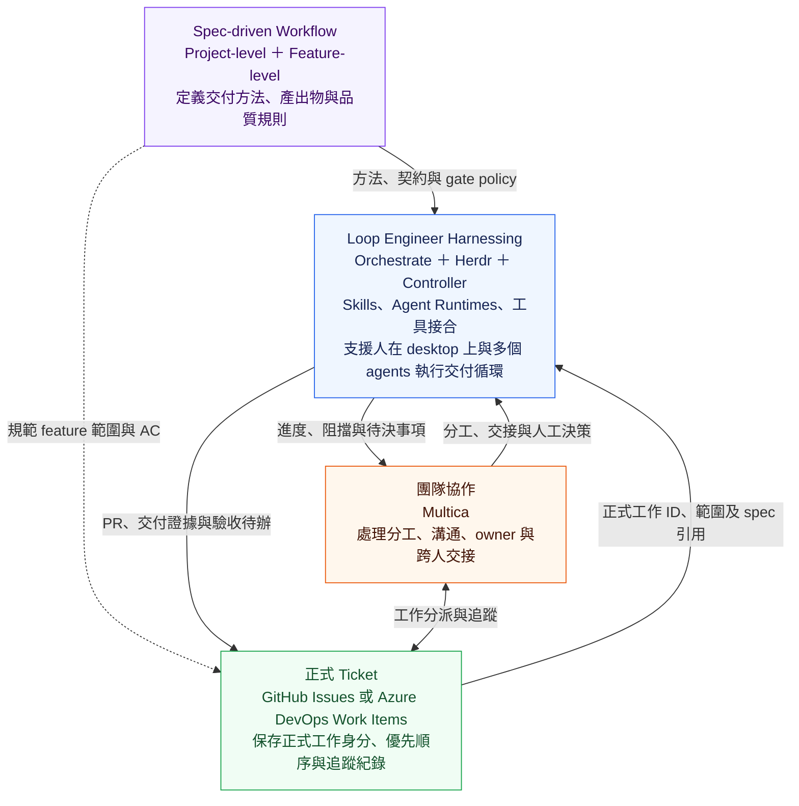
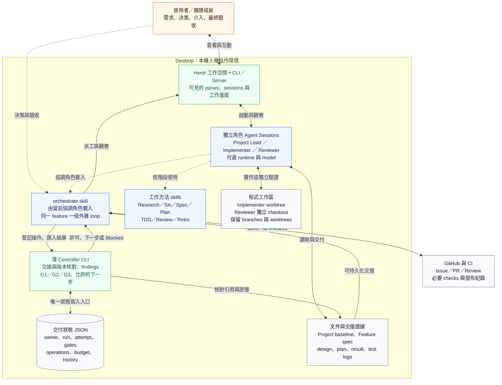

# Herdr 整合設計草案

日期：2026-09-27。狀態：**提案，未核准開工、未實作、未完成獨立 review**。

本次使用者要求開始 Herdr 整合設計，並評估兩套社群 orchestrator。目標、方法及成員操作流程維持；本文件只提出執行底層與薄 controller 的接合方式。原正式規格仍在 OpenSpec；本草案不取代其尚待修訂的 AC。

## 核心定位：Controller＋Herdr，人在 desktop 上與多個 agents 協作

本輪使用者確認的定位：**Controller＋Herdr 支援人在 desktop 上進行多 agent 協作，實踐 Loop Engineering。**

- 人透過桌面的終端工作空間，查看不同角色 agents 的進度、與任一角色對話，在需求、設計、爭議及驗收時介入，並能從保存的交接內容接手。
- Herdr 承接可見的 agent sessions、panes 與 worktree 操作，讓人與協調 agent 使用同一組可查詢的執行資源。
- Orchestrate skill 引導角色 agent 依 Project／Feature 方法協調工作、呼叫工具、收回結果及推進正常 review／fix loop，減少人手搬運 context。
- 薄 controller 是 orchestrate 可呼叫的確定性程式，保存交付狀態、驗證交接及版本、管理 findings 並計算三個 gates。
- Agent runtime／model 維持可選。Herdr 接入改變底層執行方式，目標、角色、方法及成員操作意圖維持。

這個定位同時包含人的可見性與介入能力，以及可自動前進的正常交付循環。Desktop 是第一個實作／驗證環境；多人交接仍屬成品目標，尚未宣稱跨主機同時控制已完成。

## 概念架構：四個關注層

這張圖說明 Loop Engineering 的四個關注層。每層處理不同問題；它們以工作身分、規格引用、角色交接及交付證據連接。箭頭表示概念上的交接關係，尚非已完成的工具整合。



| 關注層 | 解決的問題 | 主要內容／產出 | 在本架構中的責任邊界 |
| --- | --- | --- | --- |
| **Spec-driven Workflow** | 如何把目標逐步變成可驗收成果？ | Project：mission、domain／CONTEXT、project spec、tech、高層設計、roadmap／milestones；Feature：spec／AC、design、plan、TDD、review／fix、validation；驗收後 Retro | 定義方法、交接契約與品質規則；不負責啟動程序或替工具保存執行狀態 |
| **Loop Engineer Harnessing** | 如何讓人與 agents 按方法執行，持續到可交付？ | Orchestrate、Herdr、薄 controller、方法 skills、agent runtime／model、工具接合；產出 worktrees、結果、證據與 gate 判定 | 支援執行、協調與驗證；重大需求／政策／驗收仍由人決定 |
| **團隊協作（Multica）** | 誰負責、誰接手、誰需要知道或介入？ | 成員與角色、owner、工作分派、討論、交接、阻擋與決策可見性 | 協調人與 agents 的責任；協作看板狀態不直接構成 G1／G2／G3 通過 |
| **正式 Ticket（GitHub／Azure DevOps）** | 團隊正式承接哪些工作，如何追蹤承諾與成果？ | Issue／Work Item ID、scope／spec 引用、AC、優先順序、依賴、負責人、狀態與 PR／證據連結 | 保存正式工作及追蹤紀錄；ticket 的 Done／Closed 不等於 PR Pass 或人工驗收 |

四層是關注點分工，不是角色的上下級，也不是必須依序建成的四個部署平台。Workflow 提供共同規則，Harness 讓規則可執行，團隊協作承接人與角色的分工，正式 Ticket 承接工作身分與承諾。

### 同一個 feature 如何跨層

Project-level workflow 形成 roadmap 與 feature spec／AC；正式 Ticket 登記交付單位並引用規格；團隊協作安排 owner 與角色交接；Harness 執行 Feature loop，將進度、阻擋、PR 與 gate 證據回報。人完成驗收後，再由 Project-level workflow 更新 roadmap 並整理 Retro。

規格維持一份權威來源，Ticket 與協作工具引用它。Controller 管執行與 gate/finding 事實，Ticket 管正式工作追蹤；相互關聯但不以看板欄位取代品質判定。具體欄位同步方向、衝突處理及各欄位權威來源，在導入對應 adapter 時明確定義。

### 工具跨層與本次邊界

Multica 官方也包含將工作交給 agent runtime 執行的能力，因此其產品範圍會跨到 Harness。本圖表示我們希望如何分配責任；正式接合時須指定同一 feature 的唯一執行／協調入口，不能讓 Multica 與 orchestrate 各自派出同一份工作。[Multica 官方 Agents 文件](https://github.com/multica-ai/multica/blob/main/apps/docs/content/docs/agents.mdx)

GitHub／Azure DevOps 的產品範圍亦不只 Ticket；本圖的節點專指正式工作追蹤職責，PR／CI 的具體資料流仍見下方實作架構。

本輪補充的是概念分層。Multica 與 Azure DevOps 的 adapter、同步與控制權接合尚未設計／驗證；第一個 Herdr 切片仍沿用現有 GitHub 方向，不因此擴大成完整團隊平台。

## 1. 基準與範圍

- 專案為 `yschiang/loop-engineering`；本機 `/Users/johnson.chiang/workspace/loop-engineering`。舊 orca-delivery 路徑為相容連結。
- 沿用 [Project intent](../project-intent.md)、[D41／D42 及既有決策](../decisions.md)、[交接契約](../workflow/contracts.md)。
- Orchestrate 是唯一外層 feature 協調循環；controller 是交付狀態及 gate/finding 判定的唯一寫入入口。Herdr 管 sessions／panes／worktrees，不決定 PR Pass。
- Project Lead、Implementer、Reviewer 的分工、Project／Feature 兩層、原生 skill artifacts、人工裁決及 Retro 維持。
- 第一個切片：單一本機、單一 feature／PR、一名 Implementer、獨立 Reviewer，正常修正循環可自動前進。跨人交接保留；跨主機多 writer 與 stack scheduler 不放入此切片。
- D13 的 4h active、3 輪修正、每項 infra 額外重試 2 次維持。未知結果不因尚有重試額度就重送。
- 終點仍為 PR Pass／Ready for human acceptance；不加入自動 merge／close／release／deploy。

舊 S1 PR #2 與 17 項 findings 保留原狀。選 Herdr 不代表舊問題已修復，也不自動接管舊 agents／runs。

## 2. 方案選擇

查核證據、來源版本及比較見 [研究紀錄](../research/2026-09-27/herdr-orchestrators.md)。

**已選定第一條實作路徑（D45）：Herdr 原生 transport＋既有方法＋薄 controller。** 其他底座保留為研究參考，不作本輪派工前置；詳細設計及 D11 仍待完成。

- alexhooi/herdr-orchestrate：借用 lane／findings／小型命令介面的想法；不直接載入其外層 skill。
- kylezk777/herdr-orchestrator：列為首要替代底座。如果選用，讓它承接相應狀態權威，將三 gates 接入同一更新路徑；不把另一份 feature 狀態機放在外側同步。
- 尚未證明任何一套可以只加 wrapper 就符合全部 AC。現階段不 fork／vendor／安裝第三方程式。
- 若採用或改寫上游 skill／程式，固定來源版本、保留授權與來源說明，明列改動；不宣稱仍在原樣呼叫原 skill。

### 引用與自行實作的界線

目前建議採「引用方法、自有薄交接」，不是重寫第三方 runtime：

| 借用的做法 | 本專案如何接合 |
| --- | --- |
| kylezk777 的角色綁定、結構化 callbacks、decision 關聯 | 沿用 run/task/attempt 與版本契約，交接後由唯一 controller 匯入 |
| alexhooi 的 lane 身分、findings JSON、可見的工作進度 | 保留角色操作觀察；完成與 finding 關閉仍按本專案政策核對 |
| Herdr 的現成 session／pane／worktree 操作 | 直接呼叫固定版本介面，不自己建立 terminal supervisor |

自行維護的程式限於 assignment/result 轉接、證據及版本核對、gate/finding 狀態與窄工具呼叫。既有規則函式先修正及驗證後重用，不從空白重寫整套 controller。

本次是引用設計方法，沒有複製上游程式碼。後續若直接重用程式，須標記來源 commit、保留 license／attribution，評估升級及 patch 成本。只有映射契約比原生接法更簡單且通過同一驗證時，才正式依賴現成 orch；不為重用而降低 AC，也不為自主而拒絕可直接使用的能力。

## 3. 總體架構與資料流

架構分成「人與 agents 的工作空間」、「方法與交付控制」、「文件／程式／外部證據」。以下為整合提案，各元件的責任與已確認 workflow 一致。



圖中的 orchestrate 是載入角色 session 的 skill，不是另外新增一個管理角色；Project Lead 與 Implementer 可依工作階段及授權交接協調責任。Reviewer 的覆核責任維持獨立。

實線表示工具操作或資料交接，虛線表示人員介入或方法載入。人可直接與任一角色合作；會改變 scope、版本、gate 或 owner 的決定仍需經 controller 留下紀錄。

Herdr 保存執行環境狀態；controller 保存交付與品質狀態。圖中的 G1／G2／G3 依序代表 TDD／實作驗證、獨立 review、必要 CI；PR Pass 後仍由人做最終驗收。

Controller 一次呼叫完成一次狀態處理後返回，不另外常駐輪詢或啟動 agents。Transport helper 只將已允許操作轉成固定 argv、回傳 receipt／observation，不建立另一份 delivery ledger、不自行重試，不解讀需求。

| 元件 | 決定／執行 |
| --- | --- |
| Project Lead／使用者 | 目標、需求、SA、高層設計、roadmap、feature spec／AC、重要變更與驗收 |
| Implementer／Reviewer | 詳細設計、TDD、修正／獨立 review 的語意工作 |
| Orchestrate | 讀取狀態、套用方法、呼叫許可及工具、回收結果、處理等待與人工接管 |
| Controller | 結構及版本驗證、單一寫入、去重、gates／findings、預算與下一步 |
| Herdr／git／GitHub | Session 操作、checkout 與實際 PR／CI／發布結果 |

Herdr 的 session state 與 controller 的 delivery state 保存不同事實；前者的 done 不映射為後者的完成。

## 4. 成員操作維持

1. Project：以 orchestrate 準備 project baseline、domain、roadmap 及 feature。
2. Feature：以同一入口選 issue／spec，完成 design／plan，依 D11 確認。
3. Orchestrate 依 plan 派實作，收 G1，再送獨立 review 與觀察 CI。
4. 同版本結果收齊後派一批修正，更新 head、重驗、覆核。
5. PR Pass 後交人驗收；Project Lead 整理 Retro／下一個 feature。

成員不必改用 herd／orch 語彙。底層替換只影響 profile、啟動與觀察方式，不替換 OpenSpec、Matt 或 TDD 的內容方法。原生 artifacts 維持，以 manifest 引用實際路徑與版本，不複製平行 spec／plan。User-only skills 及派工邊界仍依適用版本保留。

## 5. Herdr 接合

以下為官方 CLI 中的操作類別，不是已驗證的產品 adapter；實作前須保存選定 binary 的 help／API schema。

| 需求 | Herdr 原生操作 | 本專案額外核對 |
| --- | --- | --- |
| 工作空間 | workspace create／get；worktree create／list | repo、cwd、branch、起始 SHA 及 checkout 是否已有 owner |
| 啟動角色 | agent start，指定 kind／pane／agent args | profile、實際模型、native session 身分、可用工具權限 |
| 派入工作 | agent prompt | 固定 assignment ID／attempt ID、payload digest；不以 terminal 字樣判成功 |
| 查詢 | agent get／read／wait | 同一 server／session／pane occupant、目前 attempt 的結果 |
| 中止 | 向指定 agent send-keys ctrl+c，再觀察 | 傳出按鍵不等於程序停止；不明即 Blocked |
| 顯示通知 | notification show | 只作提示；接續仍讀持久化結果 |
| 保留 worktree | 關閉 session／workspace 視圖與刪 checkout 分開 | 不自動呼叫 worktree remove；保留 demo 所需 branch／checkout |

本機 runtime 接法依 D44：OpenAI 使用 Herdr＋OpenCode／ChatGPT OAuth，Claude 使用 Herdr 直接啟動 Claude Code／Claude 帳號；各角色仍指定精確模型。本次 probe 的 safe mode 與停用自訂設定僅為能力查核，正式 orchestrate profile 須另保留必要 skills／hooks。公司 OpenCode-only 接法按該環境可用的 provider／認證另驗，不由本機結果推定。

每個 handle 保存 machine/server locator、Herdr session、workspace/tab/pane IDs、短 agent name、native session ID（若可得）、cwd 與 role。Name 只作定位，不作身份證據；pane 更換 occupant 後須重新核對。固定本地 session 的選擇方式於 preflight 驗證，不依賴 UI 當下焦點。

官方 API 不提供我們所需的 per-assignment quality completion。Orchestrate 同時觀察 lifecycle 與結果檔；唯一可匯入的 completion 來自可驗證的本次 result。Working 時不另排相同工作的 prompt；timeout／stalled 後先讀回，無法確認即保存為 outcome_unknown。

## 6. 最小交接與權威狀態

沿用既有契約語意，以下為擬議的實體配置；不是既有 CLI 的可用 schema：

```text
workflow.yaml                     # 已確認的 policy 與 runtime profile 引用
.delivery/runs/<run-id>/
  run.json                        # 單一現行交付狀態、findings、operations、budget
  assignments/<attempt-id>.json
  inbox/<attempt-id>/result.json   # agent 交回原始結果
  evidence/<attempt-id>/          # logs／版本與命令紀錄
  history/<revision>.json         # 已提交狀態的歷史快照
docs/validation/<feature>/        # 可分享、版控的驗收證據索引
```

本機執行狀態不直接作為唯一可分享紀錄；PR／issue 與驗收文件能指向持久可讀的證據。私密輸出不可整包發布。

| 交接物 | 必要語意 |
| --- | --- |
| Assignment | schema_version、run/task/attempt、角色及 owner、repo/worktree/branch、issue/PR、spec/design/plan/policy/skills 引用與 digest、base/head、scope、依賴、AC、輸出位置、profile |
| Result | 同一組 IDs、execution_status、實際處理版本、摘要、evidence、findings/rechecks、待決事項、producer identity |
| Finding | stable ID、來源、severity 與 blocking 分開、位置／問題／依據／預期行為、狀態、fix commit、覆核證據 |
| Operation | operation ID、對象與 payload digest、狀態、嘗試數、receipt/readback、未知原因 |
| Run | phase、owner、revision、版本集合、各 gate 判定及理由、findings、operations、budget、下一步／Blocked 所需決策 |

同一 result ID＋同一內容重複匯入無副作用；同 ID 不同內容衝突即 Blocked。舊 attempt／舊版本結果保留歷史，不推進目前 gates。Agent 只能交付輸入，不直接改 gate/finding 結論。

同一本機以短命檔案鎖＋revision 檢查保護 controller 寫入，JSON 以同目錄暫存再原子替換。結果／必要證據先完整保存再引用；缺檔、未知 schema 或衝突時停止。這不宣稱可抵抗惡意 worker／任意主機斷電或跨主機 writer。

多人交接先採明確 relinquish／adopt 的 owner 紀錄及保存的版本／待辦／handles。無法核對前任協調者或 worker 狀態時不自動接管，不把 OS lock 可取得當作整個 feature 無人工作。

## 7. 薄 controller 的操作邊界

建議保留 Python 與現有 delivery 名稱，先減少耦合；不為換 transport 同時重寫語言。下列是提案中的能力，不表示現有 CLI 已支援：

| 能力 | 效果 |
| --- | --- |
| inspect | 讀出 run、gates、未完成 operation、允許的下一步 |
| prepare | 核對 owner／版本／依賴／預算，保存一個具穩定 ID 的 assignment 或外部操作意圖 |
| record | 驗證並匯入結果、外部 observation／receipt，或明確人工 decision；人員授權不能從 agent JSON 自述推定 |
| assess | 依實際證據重算 gates，指出缺項及下一步；不派工、不執行任意 result argv |

外部操作順序：prepare → 保存 dispatching/publishing → orchestrate 呼叫工具 → record receipt/readback。若中斷在外部效果不明的位置，inspect 回傳 unresolved operation；不以重跑整個流程恢復。

正常進度不需要逐步請人：同一已核准 feature／plan 的合法下一步可持續執行。新的 scope、政策或重要歧義才回到人。

## 8. 狀態與 gates

主路徑：

```text
planning → awaiting_approval → implementing → validating
         → checking(review + CI) → ready_for_acceptance
                    ↓
                 correcting → validating
任一階段遇到無法安全判定、爭議或到限 → blocked
```

- G1：每個行為任務有可追溯的 Red → Green → Refactor 紀錄，包含命令、版本／可重現 snapshot、log 與 exit；核對預期行為失敗，不能只讀 tests_run 文字。最終相關／回歸測試在目前整合 head 通過。歷史 Red 不能後補偽造。
- 純文件 N/A 沿 D26，由獨立 Reviewer 做 eligibility 確認後才完成 G1；eligibility 不等於正式 G2。
- G2：獨立 Reviewer 對照 spec/design/AC、完整 diff 與 context；未解 blocking 為零，舊 findings 有逐項覆核或明確人工裁決。實作者只能標 fix_submitted。
- G3：從 GitHub 讀必要 checks 的實際結果，保存 app/context、run 身分、SHA、status／conclusion 與 URL。Required policy 不可確認時 Blocked，沿用未決 Q-S1-CI-POLICY；不能因所有「看得到的」checks 綠就放行。
- Reviewer execution succeeded 與 verdict clean 分開；Herdr idle／done 不構成任何 gate。
- G1 後送審；G2／G3 可並行，正常收齊同版本結果才合併派修。卡住有 timeout／Blocked 路徑。
- PR Pass 除三 gates 外，亦須完成必要 review／issue 發布，沒有未決會影響判定的操作。發布不新增 G4，與 G2 verdict 分欄保存。

版本變更處理：

| 變更 | 必須處理 |
| --- | --- |
| 新 head | G1 最終驗證、G2、G3 重新取得；歷史 Red 依 lineage 判定適用 |
| base／merge-base 改變 | 重新檢查整合相容性及 diff、G2 重覆核、G3 按 check 的 head/merge 來源核對 |
| spec/design/plan/policy 變更 | 顯示影響；重大變更回 D11，重評相關證據，不沿用舊 clean 掩蓋新 AC |
| 只改 repo 名稱／路徑 | 保留既有 run 身分與歷史，明確更新 locator；不新建 run 重置預算 |

Pass 前重新讀取 head、review base、文件／policy 版本及必要外部結果；變動即取消當次 Pass。判定是特定時間點的版本結論，不宣稱永久鎖住 GitHub。Repo identity 建議使用穩定 GitHub node ID，既有 owner/name 型身份需要明確遷移。

## 9. Reviewer 隔離與證據界線

Reviewer 使用獨立 session 與獨立 checkout；建議 reviewer 用獨立 clone，以免 git common directory 與實作 worktree 共用。Reviewer 可在自身工作區執行驗證，不可修改／push 被審 branch，不持有 feature controller 決策權。

Herdr 管 terminal，不自動提供 repository 寫入隔離；worktree 或 clone 本身也不是 OS sandbox。以選定 runtime 的既有工具權限／隔離能力滿足適用 AC，preflight 留證據；缺能力即回報，不能以 prompt 的「read-only」宣稱隔離已驗證。

D41 已排除自建通用 OS sandbox／credential broker。舊 v3 的硬隔離、防偽等 AC 必須逐項標記「由 runtime 滿足／新版範圍需裁決／仍阻擋」，不能悄悄刪除，也不為保留舊平台實作而擴張第一切片。這項 AC 映射是開工前工作。

## 10. 發布、通知與中斷

- Result 先保存，再發布 PR review 與 issue 摘要；加入 run/result/operation marker，保存 GitHub ID／URL。
- 通知只是提醒。Orchestrate 在等待及 resume 時 reconcile 結果檔、agent 身分及 GitHub 實況；不中途缺通知就重做 review。
- 發布重複或 API outcome unknown：先查回 marker。確定未發生才可在既有預算內重試；查不清就 Blocked。不承諾外部 exactly-once。
- Agent／Herdr server restart：核對 session reference、cwd、版本及未完成操作；恢復畫面不算新 receipt。確定舊工作已停止才可建立新 attempt。
- 4h active、修正輪次與 infra 重試記在 run；resume／換 session 不重置。未能判定中斷期間是否仍工作，保存未知區間，停止擴張工作並交人裁決。
- 關閉 run 預設保留 worktrees／branches 及 demo 證據；清理另由使用者決定。

## 11. 舊程式與文件的遷移

逐項依據見 [範圍收斂對照](scope-reconciliation.md)：88 個 AC 均保留身份，17 個 S1 findings 均仍 open。該對照列出執行責任移交、需裁決的承諾差異與設計缺口；不代表本草案或正式 artifacts 已核准。

| 現有內容 | 處理 |
| --- | --- |
| Project／Feature 方法、SA、domain、spec／plan／validation、Retro | 原地沿用，不複製一套到新 repo |
| gates／findings／versions 等規則函式 | 作為重用候選，先對照未解 findings 及新 AC，測過再採用 |
| 舊 loop.run_until_idle、runner、sandbox、跨 run authority | 不直接作為 Herdr 外層循環；逐項拆分保留必要語意，不整體搬入 |
| 既有 GitHub／git 邏輯 | 依窄邊界抽取，保留實際查回與 SHA 核對 |
| 舊 S1 測試及 review 證據 | 保留歷史；不能移植為新接法通過證明 |
| 新起始資料夾 loop-engineering-herdr | 先作草稿保留；本 repo 才是持續設計位置，本輪不刪除它 |

開工前把本設計採用內容同步進正式 OpenSpec design／tasks／AC mapping，並更新當前入口文件的名稱／工具引用。歷史證據、approval.json 及舊 review 不改寫。若使用獨立開發 worktree，先明確採用目前未提交的 D41／D42 文件基準，不能只從舊 HEAD 切出而遺失新邊界。

## 12. 實作與驗證切片提案

| 切片 | 依賴／範圍 | 完成證據 |
| --- | --- | --- |
| H0 能力 probe | 選定固定 Herdr binary、runtime/profile、隔離輸出位置；確認 CLI/schema、派工／回收、timeout、保留 checkout | 真實輸出與限制；不把 probe 當完整 feature demo |
| H1 薄 controller 接縫 | 完成 AC／17 findings 適用性 mapping、核准 design＋plan；交接、版本、gates、JSON 與去重 | TDD 行為測試；fake transport 的 stale／duplicate／unknown／CI 缺項負例 |
| H2 原生 Herdr feature loop | H0＋H1；orchestrate 薄封裝、實作與 reviewer profile、GitHub 發布 | 真實 issue→TDD→review finding→fix→re-review→CI→PR Pass，保留 worktrees |
| H3 Project demo | H2；依 D43 用 OpenCode＋Herdr＋orchestrate＋薄 controller，引用 cross-node-file-transfer 適用來源 baseline | Project 到多 features、新的 worktrees／TDD／PR／CI 證據、人工驗收與 Retro；stack 政策另依 Q-STACK 決定 |

H0 已完成所選模型的小型交接，D45 確認 H1 採原生 Herdr＋薄 controller 路徑。現成 orchestrator 的比較保留為研究，不再作 H1 前置，也不另起第二個外層 loop。

必驗負例：自述 TDD 但無證據、clean review／CI fail、CI green／blocking review、舊 SHA 晚到、Pass 前 push、缺／取消必要 check、通知遺失、重複 result、dispatch outcome unknown、發布失敗、協調 session 重啟、輪次到限、reviewer 越界。Fake 與真實證據分開。

## 13. 待決策及開工前缺項

- **H-CHOICE（已收斂，D45）**：第一條實作路徑採原生 Herdr＋薄 controller；不引入另一套 orchestrator。此選擇不替代詳細設計及 D11。
- **H-ENV（部分已實測）**：本機 Herdr 0.9.1 已通過具名 server／pane 控制、確定性 fixture 結果交接、timeout、普通程序停止、worktree 保留／重開，以及 OpenCode 1.18.32 無推論啟動辨識；見 [本機 setup／H0](../research/2026-09-27/herdr-setup.md)。後續指定 Luna 經 OpenCode、Sonnet 5 經 Claude Code 的真實交接均通過，原生模型紀錄已核對；Luna 明確 session resume 亦通過。小型 probe 到此收尾。Integration、正式 skills profile、Reviewer 權限及公司環境仍待查證。
- **H-AC（開工前）**：映射舊硬隔離／防偽／恢復要求及 17 findings，確認哪些由既有 runtime 實證、哪些需要範圍裁決。
- **Q-S1-CI-POLICY**：必要 checks 的權威與讀取限制仍未解，不默認 `test` 就足夠。
- **Q-STACK／Q-DEMO-PEOPLE**：保留既有待決，不阻擋單 feature 整合設計。

完成設計草案不等於 D11 開工批准。草案撰寫當時未安裝或啟動工具；後續 H0 已執行上述隔離 CLI／OpenCode 啟動測試，測試 server 已停止，worktree 與證據保留。後續已完成兩個指定模型的小型派工並保存結果，沒有因此更新 GitHub issue／PR。
