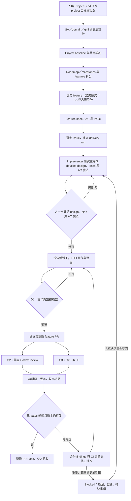

# Loop Engineering：實現藍圖

日期：2026-09-26。用途：回答「這整套流程怎麼實現」，並供正式 OpenSpec design 承接。這是基於已確認需求的設計草案，尚未批准開工；不是已完成的軟體。Orca Delivery 是目前實作專案，使用「Loop Engineering」說明整套方法，不推定使用者已要求更改 repo 名稱。

最新整合設計見 [Workflow Design v1](workflow-design.md)，派工與恢復細節見 [執行契約](workflow-contracts.md)。本文保留先前討論與設計推導；已確認政策仍以 decisions.md 為準。

依 D33，先在 orca-delivery 測通 workflow、orchestrate 與預設工具組合，再用 cross-node-file-transfer 匯入既有產品文件、從初始化跑完整流程。[舊 PR gating 實驗](experiments/pr-gating.md) 保留暫緩，不是預設下一步。本文保留 controller／adapters 的設計候選，工作順序以 [Workflow Design v1 §10](workflow-design.md#10-驗證與交付順序) 為準。

## 交付機制

Loop Engineering 把目標、執行、可驗證證據、判斷與修正連成可恢復的交付循環。人負責需求及關鍵取捨；agent 負責研究、設計、程式與審查；controller 負責現在在哪一步、證據是否適用、下一步由誰做、何時停止。

每次迭代都回答五件事：目前目標是什麼、已觀察到什麼、還差什麼、下一個允許的行動是什麼、如何證明它完成。只有明確版本的 G1/G2/G3 都通過才能記錄 PR Pass。

## Project / feature / task

| 層級 | 交接物 | 決定什麼 | 交付關係 |
| --- | --- | --- | --- |
| Project | Project spec、領域詞彙、跨功能決策 | 整個專案的共用行為、限制與契約 | 包含多個 features |
| Feature | Feature spec / issue、design、implementation plan | 本次新增什麼可驗收能力及不包含什麼 | 一個可獨立驗收切片對應一個 PR |
| Task | Assignment、code/tests、結果與 evidence | 哪個 agent 在哪個 scope 完成哪項 AC | 多個 tasks 整合成同一 feature PR |

本專案現有規劃文件採 OpenSpec 並保留原位置；authoring／planning 的組合已依 D31／Q-METHOD 重新評估。採 OpenSpec 時，project 需求與 capability specs 提供基線，feature change 的 proposal/specs/design/tasks 表達增量；不把 capability 名稱誤當成固定 project/feature 層級。

Feature spec 可以是 ticket 本文或其引用文件，不需要把 project spec 整份複製。Reviewer 必須同時讀適用的基線與增量。`to-spec` / `to-tickets` 可作其他專案的上游入口，但保留其 user-only 觸發限制；不能讓背景 worker 靜默代替使用者呼叫。

## 已確認的近期優先設計

D19 將三項納入完整 feature loop：行為可驗收且有穩定 ID 的 AC、AC 對應驗證方法與實際證據、交接文件位置與適用版本。最小契約、例子與角色責任集中在 [流程設計的 AC／驗證／交接段落](orchestrate-workflow-draft.md#已確認的優先設計ac驗證與交接)。

AC 與驗證對照在既有一次 design + plan 確認中檢查；實作、review、fix 與人工驗收沿用相同 AC 身份和版本。變更 AC 沿 D11 由使用者與 Project Lead Agent 裁決，之後重評受影響 gates。這次確認不增加簽核 gate、不指定新的強制檔名，也不表示 controller / skills 已完成。

## 從需求到 PR Pass



Diagram 的 Blocked → design 是概念路徑；實際 resume 依阻擋原因回到適當階段。基礎設施重試可回原 operation，需求變更才回設計確認，不能每次 resume 都重做整個 feature。

依 D32，Project Lead 先做 research、SA、domain modeling、grill 與 high-level design，形成 project baseline、roadmap／milestones 及 features；單一 feature 再做聚焦分析，交出 spec／AC 與設計邊界。Implementer 承接詳細設計與最終 tasks；Project Lead 可提任務草案，由 Implementer 校準。MVP controller 的自動交付入口仍是已選定且含有或引用 feature spec 的 issue，沒有擴張為自動管理所有 project backlog。

## Retro 接入提案

D21 確認要加入 Retro，D28 確認人工驗收後由 orchestrate 自動整理改善候選；feature 進行中保存線索，驗收後由 Project Lead Agent 彙整證據，選下一個 feature 前評估是否需要 Replanning。後者也可由 milestone / MVP 驗收或重大架構新知觸發。這延伸的是 project loop，PR Pass 仍是 feature 自動化終點。

改善要有來源證據、承接者、驗證方式與適用版本；必要缺陷立即回原 fix loop，工程規範/工具改善可獨立安排，重大 spec / scope / policy 變更回人。Orchestrate 明示整合回顧方法與輸出契約；原版 Matt retro 的 user-only 限制保留，不在背景隱式呼叫。完整時點、角色與契約見 [Retro 接入設計](orchestrate-workflow-draft.md#retro-接入設計建議)。

## 如何接起各元件

| 元件 | 具體責任 | 接收與產出 |
| --- | --- | --- |
| Agent 入口（預設 OpenCode，Orca 等選配）與 Project Lead Agent | 與人研究、SA／domain／grill、高層設計、roadmap／milestones 與 feature 規格；收集裁決並協助驗收 | Issue、規格、roadmap、人工決策；feature 詳細設計與交付交由 Implementer Agent |
| Delivery controller | 單一狀態機、任務依賴、版本判斷、gates、重試、恢復 | Assignment → result/evidence → 下一個 action |
| Implementer Agent 與 implementation subagents | 實作研究、詳細設計與最終 plan／tasks；依批准範圍經 controller 派發核准 runtime 的 workers，在指定 worktree TDD 實作、整合或修正 | Code、tests、commits、Red/Green/refactor 證據、阻擋問題 |
| Reviewer Agent（獨立 Codex） | 讀 spec/design、完整整合 diff 與必要 codebase，覆核舊 finding 並查新問題 | Finding 清單、review evidence、clean/changes_required/blocked |
| Git / GitHub / CI adapters | 操作 worktrees、issue/PR、check-runs/statuses、發布結果 | 真實 SHA、checks、URLs、API receipts，不替 agent 判需求 |
| Skills | 定義各角色如何工作與結果格式 | 可重用方法與薄封裝；沒有整體 Pass 或重試政策的決定權 |

持久化已改採使用者指定的人可讀檔案。建議 YAML 保存 workflow/gate 設定，排版過的 JSON 保存 run、assignment 與 result，JSONL 保存事件歷史，測試 logs 與 review 報告保留可直接閱讀的檔案。Controller 仍建議用本機 Python CLI，以單一前景 process 運作；預設接 OpenCode，模型依角色設定；Orca／Codex／Claude Code 是選配，不是核心啟動條件。核心保存自己的 run/task/attempt；Orca 的 Run/Task/Dispatch 或 OpenCode 的 session/message 身份由各 adapter 對應，透過 CLI/API 操作 GitHub；不新增 dashboard 或另一個 scheduler。詳細布局及一致性提案見 [檔案狀態設計](file-state.md)。

## Controller 的核心循環

下面是邏輯順序示意，不是已存在的 API 或可執行程式：

```text
取得 feature 控制鎖與 run lock，核對 worktree writer lease，載入持久化狀態
核對 GitHub PR head/base、適用 spec/design/plan 與 worker 實況
保存觀察，將不適用目前版本的 gate 結論標為 stale
匯入尚未處理的完整 result，核對 IDs、digest 與可讀取 evidence
查必要 CI checks，處理待發布 GitHub 紀錄
套用 gate policy、dependency policy、重試與時間上限
若需人的決策：保存 Blocked 與決策摘要
否則：保存唯一下一步的 operation intent，再執行允許的派工/重試
收到通知或到 reconcile 時間後，再讀實況
```

先保存 operation intent 再呼叫外部服務，可知道 crash 前曾經打算做什麼；外部執行結果未知時，先查原 request/task/dispatch，不能直接再派同一工作。MVP 將同一 run 的 tasks、gates、findings 與待執行操作放在一份 `run.json`，由唯一 controller 在鎖內原子替換整份檔案，避免必須同時修改多份權威狀態。事件紀錄與大份 evidence 分開保存，其寫入順序和 crash recovery 見檔案狀態設計；外部 API 的 ambiguous outcome 仍需 reconcile。

通知僅縮短等待時間。即使通知遺失，controller 也能從 result files、native dispatch 和 GitHub 讀回結果；重複事件則對照 attempt/result IDs 去重。

## 需要持久化的資料

| 資料 | 最少保存內容 |
| --- | --- |
| Run / versions | Issue/PR、phase、head/base、spec/design/plan/policy digests、批准紀錄、預算 |
| Tasks / attempts | 角色、依賴、scope/AC、repo/worktree、native IDs、dispatch 狀態、重試原因 |
| Evidence | Task/attempt、command、時間、退出碼、原始 logs、source snapshot、digest、驗證用途 |
| Gate assessments | G1/G2/G3、狀態、原因、適用版本、來源 evidence、觀察時間 |
| Findings | 穩定 ID、severity/blocking、依據、位置、狀態、fix commit、reviewer 覆核 |
| Operations / publication | 待執行 action、去重 marker、request/receipt、GitHub URLs、失敗與 unknown outcome |
| Human decisions | 哪項問題、對哪個版本、明確決定與理由、紀錄來源 |

D24 已確認本機 JSON finding registry 為權威；PR 發完整 review，原 issue 發可採取行動的摘要與連結。GitHub 討論由 controller 匯入為證據／裁決，解除 blocking 沿 D09，不讓兩邊各自改狀態。Implementer 的 disputed 反證依 D25 交獨立 Reviewer 覆核一次，仍有 blocking 爭議就 Blocked 回人；釐清沿用原 batch，不另計修正輪次。

## 三 gates 如何避免誤判

- **G1**：驗證 task 與 AC 的測試證據。Red 可以是較早 snapshot，必須確實是相關行為的失敗；Green 與回歸須對目前整合 head。Agent 寫「TDD done」不能替代命令、退出碼、logs 與版本關係。D26 選用 Superpowers TDD；純文件／註解 N/A 先由獨立 Reviewer 核對適用性再判 G1，不等於正式 G2 clean。
- **G2**：獨立 Codex Reviewer 審完整 PR；D30 將核心契約與底層實作解耦，D38 明確 runtime 可用 OpenCode，Codex CLI 非必要；精確 reviewer model 與能力仍待查證。實作者提出 fix 不等於 finding 已解決；reviewer 要針對最新版本確認，或有明確人工裁決。CI 綠不會覆蓋未解決 blocker。
- **G3**：adapter 讀 GitHub 的必要 checks/statuses，逐項核對名稱、來源、版本與 conclusion。缺少、pending、cancelled、timeout、unknown 不算成功；skipped/neutral 的接受規則需明確 policy。

PR head、review base 或適用文件變更時，重新評估受影響 gates。新 push 要有新的驗證與 CI，reviewer 也要對新版本覆核。Pass 前再次讀取版本，Pass 紀錄帶觀察時間；後續偵測新 push 就使現行 Pass 過期。

`PR Pass = G1 ∧ G2 ∧ G3`。GitHub 發布狀態獨立保存，不把它暗中命名為第四品質 gate；即使品質已通過，應發但未發的結果仍要顯示 publication pending，交付工作不能假稱已全部完成。

## 一次 finding → fix → re-review 的例子

以下是預期行為示例，不是已發生的 demo 證據：

1. Feature issue 要求狀態查詢明確區分 CI pending 與 passed。Plan 拆為幾個實作 tasks，共同交付一個 PR。
2. Implementer 在核准 runtime/model 完成 TDD，controller 驗證 G1，PR head 是 `H1`。獨立 Reviewer 按核准 model profile 審查，與 CI 並行。
3. Reviewer 發現某個 pending 路徑被顯示為 passed，建立 blocking finding `F001`；CI 在 `H1` 成功。
4. Controller 判定 G2 失敗，把 `F001` 的依據與預期行為交給修正 worker，啟動 correction round 1。
5. Worker 重現失敗、修正、提交 `H2`，回傳 `F001 → fix commit → tests` 的對應；不把 `F001` 自行關閉。
6. Controller 對 `H2` 驗證 G1、取得 CI；Codex 重新讀完整適用版本，覆核 `F001` 並檢查新增問題。
7. Reviewer 確認解除 blocker、G3 成功、版本未變，才記錄 `PR Pass @ H2`。Review 與 issue 紀錄必須能連回相同版本及 findings。

## Skills 的最小集合

以下四個交接薄封裝是較早的包裝候選；新草案提出 `orchestrate` router + references。正式 implementation plan 將選定實際包裝，角色契約可沿用，但不據此啟動兩套外層 loop：

| Wrapper | 沿用的方法 | 明確結束點 |
| --- | --- | --- |
| delivery-plan | Implementer 的規劃方法候選為 Writing Plans，與 OpenSpec tasks 的整合待 Q-METHOD；Project Lead 的前段分析另行交接 | 保存可派工 DAG、scope、AC、測試與版本，等人的 design+plan 確認 |
| delivery-implement | D26 選定的 Superpowers TDD | 保存指定 task 的 code/evidence/result，交回 controller |
| delivery-review | 獨立 reviewer rubric，對照 spec 與 standards | 保存版本化 verdict/findings；不修改 author branch |
| delivery-fix | Review response；需要時使用 debugging | 保存 finding→fix→evidence 或 disputed/blocked，交 reviewer 覆核 |

每個 wrapper 都必須有 trigger、inputs、允許工具/scope、步驟、output schema/path、完成條件、failed/blocked 回報。Installed skill 的實際檔案和引用版本要固定，不只記套件的版本號。Writing Plans 的外層執行交棒依已確認的單一 controller 工作流調整，不能再啟動另一套 SDD loop。

## 人何時介入

已確認：每個 feature 在 design+plan 完成後開工前確認一次；scope/spec/AC 變更、設計缺陷與阻擋爭議回到人。正常的 code finding 修正與 CI 診斷在批准範圍內持續執行。

已確認上限：主動執行 4 小時，最多 3 輪 correction，每項基礎設施操作額外重試 2 次。三輪 correction 表示初次 review 之後最多再修三輪，不是只有三次 reviewer 呼叫。到限停止新派工、持久化 Blocked 與待決事項；不把 timeout 當作原 worker 已死亡。

MVP 終點是 PR Pass / Ready for human acceptance。Merge、close issue、release、deploy 仍不在自動流程內。

## 落地順序與目前進度

現行順序見 [Workflow Design v1 §10](workflow-design.md#10-驗證與交付順序) 的 V1–V6：核心規則與持久化先於真實 adapters，包含 Skills dry run。以下保留較早的能力查核與設計推導，不作另一套實作排程。

現況：本機 repo、研究、決策紀錄、Orca 真實 bounded probes 已完成；controller、四個 wrappers 與真實 feature E2E 尚未完成。Claude 的完整 native result/completion/release 已驗證。Codex 的 sandbox utility 已能在允許特定 socket 時唯讀查詢 Orca；真實 worker lifecycle 及 reviewer 工具隔離未驗證。新 repo 登錄存在，但 Orca workspace/ref discovery 仍有缺口。

D33 更新實驗順序：本 repo 先測通 workflow／orchestrate／預設工具組合，再以 cross-node-file-transfer 驗完整初始化與 feature 交付；適用產品文件可沿用，來源版本、路徑映射及新證據須可追溯。D15／D16 的舊 pre-PR 接入維持暫緩，日後另行恢復才核對 issue／session。Finding 權威、TDD／例外及真實 G1 證據要求維持。

相關文件：[決策紀錄](decisions.md)、[設計準備稿](research/2026-09-25/design-foundation.md)、[整合缺口](research/2026-09-25/integration-gaps.md)、[demo ticket 草稿](research/2026-09-25/demo-ticket-draft.md)。
