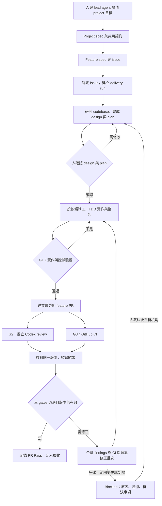

# Loop Engineering：實現藍圖

日期：2026-09-26。用途：回答「這整套流程怎麼實現」，並供正式 OpenSpec design 承接。這是基於已確認需求的設計草案，尚未批准開工；不是已完成的軟體。Orca Delivery 是目前實作專案，使用「Loop Engineering」說明整套方法，不推定使用者已要求更改 repo 名称。

## 交付機制

Loop Engineering 把目標、執行、可驗證證據、判斷與修正連成可恢復的交付循環。人負責需求及关键取捨；agent 負責研究、設計、程式與審查；controller 負責現在在哪一步、證據是否適用、下一步由誰做、何時停止。

每次迭代都回答五件事：目前目標是什麼、已觀察到什麼、還差什麼、下一個允許的行動是什麼、如何證明它完成。只有明確版本的 G1/G2/G3 都通過才能記錄 PR Pass。

## Project / feature / task

| 層級 | 交接物 | 決定什麼 | 交付關係 |
| --- | --- | --- | --- |
| Project | Project spec、領域詞彙、跨功能決策 | 整個專案的共用行為、限制與契約 | 包含多個 features |
| Feature | Feature spec / issue、design、implementation plan | 本次新增什麼可驗收能力及不包含什麼 | 一個可獨立驗收切片對應一個 PR |
| Task | Assignment、code/tests、結果與 evidence | 哪個 agent 在哪個 scope 完成哪項 AC | 多個 tasks 整合成同一 feature PR |

本專案已選 OpenSpec 作規格來源。Project 需求及既有 capability specs 提供基線，feature change 的 proposal/specs/design/tasks 表達增量。這是本專案的文件安排，不把 OpenSpec 內建的 capability 名稱誤當成固定 project/feature 層級。

Feature spec 可以是 ticket 本文或其引用文件，不需要把 project spec 整份複製。Reviewer 必須同時讀適用的基線與增量。`to-spec` / `to-tickets` 可作其他專案的上游入口，但保留其 user-only 觸發限制；不能讓背景 worker 靜默代替使用者呼叫。

## 從需求到 PR Pass



Diagram 的 Blocked → design 是概念路徑；實際 resume 依阻擋原因回到適當階段。基礎設施重試可回原 operation，需求變更才回設計確認，不能每次 resume 都重做整個 feature。

Upstream 的 project/feature 定義由人與 lead agent 協作。MVP controller 的自動交付入口仍是已選定且含有或引用 feature spec 的 issue，沒有擴張為自動管理所有 project backlog。

## 如何接起各元件

| 元件 | 具體責任 | 接收與產出 |
| --- | --- | --- |
| Orca 入口與 lead agent | 與人討論、呈現 design/plan、收集裁決、解釋 Blocked | Issue、規格、人工決策；不另啟外層排程 loop |
| Delivery controller | 單一狀態機、任務依賴、版本判斷、gates、重試、恢復 | Assignment → result/evidence → 下一個 action |
| Claude Code implementation worker | 依批准 plan 在指定 worktree TDD 實作或修正 | Code、tests、commits、Red/Green/refactor 證據、阻擋問題 |
| 獨立 Codex reviewer | 讀 spec/design、完整整合 diff 與必要 codebase，覆核舊 finding 並查新問題 | Finding 清單、review evidence、clean/changes_required/blocked |
| Git / GitHub / CI adapters | 操作 worktrees、issue/PR、check-runs/statuses、發布結果 | 真實 SHA、checks、URLs、API receipts，不替 agent 判需求 |
| Skills | 定義各角色如何工作與結果格式 | 可重用方法與薄封裝；沒有整體 Pass 或重試政策的決定權 |

技術選型建議是本機 Python CLI + SQLite + evidence files。單一前景 process 在專用 Orca terminal 運作，以原生 Run/Task/Dispatch 追蹤 workers，透過 CLI/API 操作 GitHub；不新增 dashboard 或另一個 scheduler。語言和資料布局屬實作提案，最終 design 會固定版本與安裝命令。

## Controller 的核心循環

下面是邏輯順序示意，不是已存在的 API 或可執行程式：

```text
取得 run 控制鎖，載入持久化狀態
核對 GitHub PR head/base、適用 spec/design/plan 與 worker 實況
保存觀察，將不適用目前版本的 gate 結論標為 stale
匯入尚未處理的完整 result，核對 IDs、digest 與可讀取 evidence
查必要 CI checks，處理待發布 GitHub 紀錄
套用 gate policy、dependency policy、重試與時間上限
若需人的決策：保存 Blocked 與決策摘要
否則：保存唯一下一步的 operation intent，再執行允許的派工/重試
收到通知或到 reconcile 時間後，再讀實況
```

先保存 operation intent 再呼叫外部服務，可知道 crash 前曾經打算做什麼；外部執行結果未知時，先查原 request/task/dispatch，不能直接再派同一工作。SQLite transaction 保證本機結果匯入與状态更新的一致性；外部 API 的 ambiguous outcome 仍需 reconcile，不宣稱跨 GitHub/Orca 的全域 transaction。

通知僅縮短等待時間。即使通知遺失，controller 也能從 result files、native dispatch 和 GitHub 讀回結果；重複事件則對照 attempt/result IDs 去重。

## 需要持久化的資料

| 資料 | 最少保存內容 |
| --- | --- |
| Run / versions | Issue/PR、phase、head/base、spec/design/plan/policy digests、批准紀錄、預算 |
| Tasks / attempts | 角色、依賴、scope/AC、repo/worktree、native IDs、dispatch 狀態、重試原因 |
| Evidence | Task/attempt、command、時間、退出碼、原始 logs、source snapshot、digest、驗證用途 |
| Gate assessments | G1/G2/G3、狀態、原因、適用版本、來源 evidence、觀察時間 |
| Findings | 穩定 ID、severity/blocking、依據、位置、狀態、fix commit、reviewer 覆核 |
| Operations / publication | 待執行 action、去重 marker、request/receipt、GitHub URLs、失敗與 unknown outcome |
| Human decisions | 哪項問題、對哪個版本、明確決定與理由、紀錄來源 |

Q-PUBLISH 尚未回答：建議以上 structured findings 為權威，GitHub 為對人可讀取的發布紀錄。若選 GitHub threads 為權威，需更改同步與裁決設計，不能兩邊都可獨立關閉同一 finding。

## 三 gates 如何避免誤判

- **G1**：驗證 task 與 AC 的測試證據。Red 可以是較早 snapshot，必須確實是相關行為的失敗；Green 與回歸須對目前整合 head。Agent 寫「TDD done」不能替代命令、退出碼、logs 與版本關係。TDD 方法及非行為變更例外仍是 Q-TDD。
- **G2**：另一個 Codex runtime 審完整 PR。實作者提出 fix 不等於 finding 已解決；reviewer 要針對最新版本確認，或有明確人工裁決。CI 綠不會覆蓋未解決 blocker。
- **G3**：adapter 讀 GitHub 的必要 checks/statuses，逐項核對名稱、來源、版本與 conclusion。缺少、pending、cancelled、timeout、unknown 不算成功；skipped/neutral 的接受規則需明確 policy。

PR head、review base 或適用文件變更時，重新評估受影響 gates。新 push 要有新的驗證與 CI，reviewer 也要對新版本覆核。Pass 前再次讀取版本，Pass 紀錄帶觀察時間；後續偵測新 push 就使現行 Pass 過期。

`PR Pass = G1 ∧ G2 ∧ G3`。GitHub 發布狀態獨立保存，不把它暗中命名為第四品質 gate；即使品質已通過，應發但未發的結果仍要顯示 publication pending，交付工作不能假稱已全部完成。

## 一次 finding → fix → re-review 的例子

以下是預期行為示例，不是已發生的 demo 證據：

1. Feature issue 要求狀態查詢明確區分 CI pending 與 passed。Plan 拆為幾個實作 tasks，共同交付一個 PR。
2. Claude 完成 TDD，controller 驗證 G1，PR head 是 `H1`。另一個 Codex review 與 CI 並行。
3. Reviewer 發現某個 pending 路徑被顯示為 passed，建立 blocking finding `F001`；CI 在 `H1` 成功。
4. Controller 判定 G2 失敗，把 `F001` 的依據與預期行為交給修正 worker，啟動 correction round 1。
5. Worker 重現失敗、修正、提交 `H2`，回傳 `F001 → fix commit → tests` 的對應；不把 `F001` 自行關閉。
6. Controller 對 `H2` 驗證 G1、取得 CI；Codex 重新讀完整適用版本，覆核 `F001` 並檢查新增問題。
7. Reviewer 確認解除 blocker、G3 成功、版本未變，才記錄 `PR Pass @ H2`。Review 與 issue 紀錄必須能連回相同版本及 findings。

## Skills 的最小集合

沿用現有方法，新增四個交接薄封裝作為設計方向：

| Wrapper | 沿用的方法 | 明確結束點 |
| --- | --- | --- |
| delivery-plan | Writing Plans；研究/設計沿用 grilling、domain-modeling、codebase-design | 保存可派工 DAG、scope、AC、測試與版本，等人的 design+plan 確認 |
| delivery-implement | Q-TDD 建議的 Superpowers TDD | 保存指定 task 的 code/evidence/result，交回 controller |
| delivery-review | 獨立 reviewer rubric，對照 spec 與 standards | 保存版本化 verdict/findings；不修改 author branch |
| delivery-fix | Review response；需要時使用 debugging | 保存 finding→fix→evidence 或 disputed/blocked，交 reviewer 覆核 |

每個 wrapper 都必須有 trigger、inputs、允許工具/scope、步驟、output schema/path、完成條件、failed/blocked 回報。Installed skill 的實際檔案和引用版本要固定，不只記套件的版本號。Writing Plans 的外層執行交棒依已確認的單一 controller 工作流調整，不能再啟動另一套 SDD loop。

## 人何時介入

已確認：每個 feature 在 design+plan 完成後開工前確認一次；scope/spec/AC 變更、設計缺陷與阻擋爭議回到人。正常的 code finding 修正與 CI 診斷在批准範圍內持續執行。

已確認上限：主動執行 4 小時，最多 3 輪 correction，每項基礎設施操作額外重試 2 次。三輪 correction 表示初次 review 之後最多再修三輪，不是只有三次 reviewer 呼叫。到限停止新派工、持久化 Blocked 與待決事項；不把 timeout 當作原 worker 已死亡。

MVP 終點是 PR Pass / Ready for human acceptance。Merge、close issue、release、deploy 仍不在自動流程內。

## 落地順序與目前進度

以下為工作順序，正式 task plan 會列出檔案、介面、依賴、Red/Green 命令及完成條件：

1. **完成設計與執行契約**：本輪剩餘 policy 決策落定後，產出 OpenSpec 的 proposal/specs/design/tasks，交一次具體開工前 review。
2. **先證明整合邊界**：用可識別的獨立 workspace，證明 Claude/Codex 都能接指定版本任務、保存結構化結果及安全結束。解決真正 worker 的 Codex IPC/工具隔離與新 repo placement 缺口。
3. **做出可恢復的 controller**：以 TDD 實作版本與 gate evaluator、store/reconcile、單一控制權及 adapter contracts；用可控 adapters 驗證 stale SHA、缺 check、crash、重複事件與發布失敗。
4. **接通完整 feature 交付**：加入真正的派工、Git/PR/CI、review/fix、發文與 resume。假 adapter 通過和真實 GitHub/agent 證據分開保存。
5. **跑真實 demo**：選定 issue，用固定版本的 controller 交付一個獨立 feature PR，留下至少一次實際 finding→fix→re-review 與最新版本三 gates 的證據。不能虛構 finding 來完成展示。

現況：本機 repo、研究、決策紀錄、Orca 真實 bounded probes 已完成；controller、四個 wrappers 與真實 feature E2E 尚未完成。Claude 的完整 native result/completion/release 已驗證。Codex 的 sandbox utility 已能在允許特定 socket 時唯讀查詢 Orca；真實 worker lifecycle 及 reviewer 工具隔離未驗證。新 repo 登錄存在，但 Orca workspace/ref discovery 仍有缺口。

尚待使用者選定的三項維持不變：TDD 方法/例外、finding 發布與權威来源、真實 demo repo/issue。本藍圖沒有把這三項提案當作已確認政策。

相關文件：[決策紀錄](decisions.md)、[設計準備稿](research/2026-09-25/design-foundation.md)、[整合缺口](research/2026-09-25/integration-gaps.md)、[demo ticket 草稿](research/2026-09-25/demo-ticket-draft.md)。
