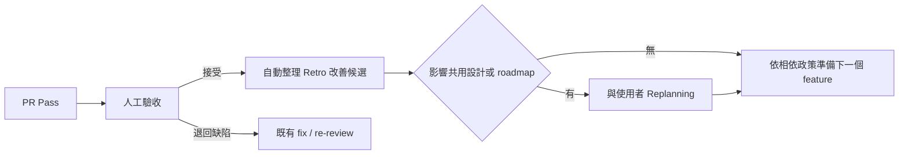

# Orchestrate：project / feature workflow 草案

日期：2026-09-26。狀態：供流程討論與 skill 開發使用，尚非安裝完成的 skill。

最新整合設計見 [Workflow Design v1](workflow-design.md)，派工與恢復細節見 [執行契約](workflow-contracts.md)。本文保留先前討論與設計推導；已確認政策仍以 decisions.md 為準。D34 的 Project／Feature Research＋SA 方法、七項 Spec 內容及進入 Design 的確認，統一見 [Project Lead SA 契約](project-lead-sa.md)；下方早期流程不取代此交接。

## 目前順序與授權邊界

依 D33，先在 orca-delivery 測通 workflow、orchestrate 與預設工具組合，再啟動 cross-node-file-transfer 的完整 project／feature 流程。舊 gigaxfer PR 接入保留暫緩，本文件不接管其 session／branch 或 GitHub 狀態。

1. 收斂流程、角色、產物與預設方法，固定版本及交接契約；具體組合由 Q-METHOD 決定。
2. 在本 repo 實作並測通 orchestrate、controller／adapters、skills 與恢復，分開保存模擬及真實執行證據。
3. 後續新專案匯入 gigaxfer 的適用需求／設計／roadmap，保留來源版本並映射文件位置，不重做已確認需求的完整 grill。
4. 新專案從 Phase 0、首個 feature 到 review／fix、三 gates、人工驗收及 Retro，留下完整的新交付歷程。

具體測通檢核與目前狀態見 [Workflow Design v1 §10](workflow-design.md#10-驗證與交付順序)；記錄順序不表示工具已完成或新專案已初始化。

## 已確認、建議與待定

已確認沿用 orca-delivery `docs/decisions.md` 的 D01–D30：三個獨立 gates、獨立 Codex reviewer、一個 feature / slice 一個 PR、開工前一次 design + plan 人工確認、JSON/YAML 持久化、三輪修正上限、四小時主動執行預算、每個 infra 操作額外重試兩次、禁止自行解除 reviewer 阻擋、終點 PR Pass、不自動 merge / close / release / deploy。

本次使用者補充的方向：共同入口名為 `orchestrate`；project 由使用者與 Project Lead Agent 建立基礎與 roadmap；feature 由 Implementer Agent 協調實作、Reviewer Agent 獨立 review；每個 feature 完成後交回使用者與 Project Lead Agent final acceptance，再決定下一個 feature。

D19 已確認優先落實 AC 行為定義、AC → 驗證證據、文件位置與版本交接；具體契約見下方「已確認的優先設計」。

D21 確認加入 Retro，D28 確認人工驗收後由 orchestrate 自動整理改善候選；具體 skill 包裝仍待實作。不代表採納影片中的 reviewer 自行 commit、規範僅供 reviewer 讀取或每次強制清空 context。

以下為建議，尚未視為定案：一個 router skill 加 project / feature 兩份流程 reference；文件可合併但語意分開；Phase 0 的程式變更沿用 feature 交付流程；自動判定交給小型 helper。D27 已確認相依 feature 等上游人工接受且 merge 後才實作，等待時可準備 spec/design。

D24–D28 已收斂 finding 權威／發布、一次爭議覆核、TDD／非行為例外、相依 feature 與 Retro 觸發；CIT 依 D29 暫不處理，G3 維持必要 CI。D30 確認核心與 runtime/model 實作解耦，G2 Codex 的 runtime/model 定義仍待決；具體選型、required checks 與 timeout 等落入 design / plan；試用恢復前核對 Q-TARGET。政策以 [決策紀錄](decisions.md) 為準。使用者訊息中的「見貼圖」未包含可讀取圖片內容，該部分尚未納入。

2026-09-27 補充：D32 明確加入 Project Lead 的 research／SA／domain／grill／high-level design，再形成 roadmap／milestones、拆 features 與準備 feature spec；Implementer 承接詳細設計並維護最終可執行 tasks。D31 的 authoring／planning 選型重新開放評估，本文方法名稱不視為整套已固定；最新分工見 [v1 §4](workflow-design.md#4-project-loop從基礎到可交付-features)。

## 角色名稱與責任

依 D20 統一以下名稱；D23 於 2026-09-27 修訂為 Project Lead 負責專案協調、Implementer 負責功能交付，兩者以 spec／AC、依賴及成果交接。Project／Feature 是工作範圍，決策權依使用者授權劃分；共同入口不代表相同決策權，runtime 不綁定固定父子關係。使用者可直接與任一角色協作；完整關係見 [v1 角色與控制權](workflow-design.md#2-角色與控制權)，詞彙見 [CONTEXT.md](../CONTEXT.md)。

| 角色 | 主要責任 | 交接 |
| --- | --- | --- |
| Project Lead Agent | 專案分析與協調：與使用者做 research、SA、domain modeling、grill 與高層設計，形成 roadmap／milestones 並拆 features；以聚焦分析準備 feature spec、high-level design 與 ticket；依授權安排優先順序與委派，協助跨 feature 決策及最終驗收 | 透過 controller 委派授權範圍內的工作，與 Implementer 交接 spec／依賴及 PR Pass package；重要裁決與最終接受由使用者決定 |
| Implementer Agent | 功能交付：繼續實作研究、完成 detailed design，校準並維護最終 plan／tasks，在核准範圍內作實作決策，協調 TDD 實作、整合與修正，保存驗證證據 | 經 controller 接收 findings／CI 診斷並交修正供覆核，交回成果與超出授權範圍的待決事項 |
| Reviewer Agent | 以適用 spec、design、AC 與 repo 工程規範獨立審查完整 PR，提出 findings 並覆核修正 | 產出具版本與證據的 verdict；不直接修改被審查分支，不自行宣告整個 feature PR Pass |

`orchestrate` 是共同 skill 入口；controller 負責持久化、版本核對、派工狀態與 gate 判定。Project Lead Agent 與 Implementer Agent 透過同一 feature 控制權交接，不各自另啟一個競爭的外層 loop。

Implementer Agent 與 Reviewer Agent 都讀取適用的工程規範；規範可沿用 repo 的 AGENTS.md、CLAUDE.md 或其引用文件，不強制另建 coding-standards.md。前者遵守規範實作，後者獨立檢查。正常 finding 由 Implementer Agent 修正，再由 Reviewer Agent 覆核，維持既有 G2 邊界。

## 詞彙與文件責任

| 概念 | 回答的問題 | 文件原則 |
| --- | --- | --- |
| Mission / intent | 為誰解決什麼問題、為何值得做、成功與不做的邊界 | Project mission 可獨立；feature intent 可放 feature spec 的動機段落 |
| Project spec | 跨 feature 必須維持哪些行為、不變條件與非功能要求 | 是 feature spec 的共同基準，不只是願景 |
| Domain context | 名詞、角色與領域關係代表什麼 | `CONTEXT.md` 只放領域詞彙；實作決策另放 design / ADR |
| Feature spec / requirements | 這次必須交付什麼行為、範圍、錯誤情境與可驗收條件 | 同一語意角色；通常選一份權威文件，亦可用 issue 內文 |
| High-level design | 元件與責任如何分配、資料如何流動、跨系統契約與主要取捨 | Project Lead Agent 與使用者處理重要決策；可以是 feature design 的前半部 |
| Detailed design | 模組介面、資料結構、失敗/恢復、migration 與測試接縫如何落實 | Implementer Agent 補齊；可以接在同一 design 文件 |
| Plan | 如何拆 task、依賴、修改範圍、測試與完成條件 | 不取代 spec；task 通常不另外開 PR |
| Roadmap | milestones 交付什麼能力，feature 有何依賴與順序 | 不預先把所有未來 feature 的 detailed design 都寫死 |
| Delivery state | 哪個 run / task / attempt 在做什麼，各 gate 有哪些版本適用的證據 | 人可讀 JSON/YAML；與規格文件分開 |

SA 是分析活動、SD 是設計活動，不必各強制產生一份獨立文件。Spec 與 design 可在一個工具的同一文件內，但 controller 仍需辨識其角色與版本。`requirements.md`、`spec.md`、`intent.md` 並非每個 feature 都各寫一份。

## Project loop

Owner：使用者 + Project Lead Agent。其權限範圍是 project 的需求、共同架構、roadmap 與驗收；同一 feature 的 implementation / fix 派工提案交唯一 controller 依核准 plan 執行。

| 階段 | 工作與產物 | 完成條件 |
| --- | --- | --- |
| Intake | 記錄 mission、project repo/path、使用者、限制、既有成果 | 專案位置與目標可辨識；新專案與既有專案模式明確 |
| Research | 調查 codebase、執行環境、測試/CI、既有規格與 skills；graph 是選用的理解工具 | 所有會影響近期架構選擇的已知事實有來源；未知被列出 |
| Domain + SA | 研究使用情境、系統邊界與功能／非功能需求，互動 grill；建立/更新 `CONTEXT.md` 與 project spec | 成功條件、共通行為、不變條件、範圍及詞彙可供下游引用 |
| High-level design | 分配元件責任、主要資料流與對外契約，選擇架構／tech stack、保留重要取捨 | 足以支持近期交付切分；重要歧義交使用者，不預先寫死全部實作 |
| Roadmap／milestones 與 features | 依需求、設計、風險及依賴安排成果節點，再拆可獨立驗收的 feature slices | Roadmap 是路徑，milestone 是成果節點，feature 是交付單位；確認近期方向 |
| Phase 0 | 建立最小可建置/執行/測試的 foundation、scaffolding、CI 與開發環境 | 基礎實際可驗證；既有 repo 只補缺口，不重搭已存在基礎 |
| Feature preparation | 讀 baseline 與相關 codebase，做聚焦 research／SA／domain 釐清／grill 與高層設計，再整理 feature spec／ticket | AC、scope、依賴與適用 project baseline 可交接 |
| Feature acceptance | 接收 PR Pass package；使用者與 Project Lead Agent 驗證 feature 成果與 project 一致性 | 明確記錄接受或退回理由；更新 roadmap / project spec 的必要變動 |
| Retro | 人工驗收後自動整理改善候選；有跨 feature 影響才 Replanning | 有改善時記錄證據、承接者、驗證方式與適用版本；不新增 PR gate 或無變更簽核 |
| Next feature | 依驗收結果選下一個 slice，檢查真正的依賴條件 | 依 D27，相依 feature 等上游人工接受且 merge 後才實作；等待時可準備 spec/design |

建議 Phase 0 如需程式變更，也包成一個或數個可驗證的交付單位並走 feature loop。Project 層不另開一套繞過交付品質規則的實作 loop。`repo/path` 的權威值放 project binding，roadmap 可引用它。

## Feature loop

入口分為 `start`（從需求開始）、`adopt`（接已有設計/實作/PR）、`resume`（恢復已保存的 run）。這些是擬議的 skill 使用語意，尚非已安裝指令。完整入口意圖以 [Workflow Design v1 §1](workflow-design.md#1-一個入口兩個層級) 為準，另含建立／接手 project、準備下一個 feature、Status、Decision（處理 Blocked）與 Retro。

1. **Project Lead Agent + 使用者研究與分析 feature。** 以 project baseline 為基準，研究相關 codebase、使用情境與系統邊界，透過 SA／domain 釐清／grill 及必要高層設計，形成 feature intent、scope、限制、非目標、具穩定 ID 的 AC 與 design 引用。缺重大決策時回到 grill；不以 implementation plan 代替需求決策。
2. **Project Lead Agent 建立或更新 ticket。** 若已有 issue，保留同一交付單位的身份。Ticket 可以承載 spec，也可以連結權威 spec；避免 spec 與 ticket 各維護一份互相漂移的需求全文。
3. **Implementer Agent 繼續研究並完成 detailed design + plan。** Project Lead 可提供工作包／任務草案，由 Implementer 校準粒度、介面與依賴，維護最終可執行計畫。每個 task 有穩定 ID、依賴、allowed scope、對應 AC 與測試方式；備妥 AC → 驗證方法 → 結果／證據的輕量對照。沿用已確認的「使用者在 design + plan 完整後一次開工確認」；不默認增加每份文件的逐項簽核。
4. **Implementer Agent 提出 implementation 派工批次，由 controller 依 [v1 §2](workflow-design.md#2-角色與控制權) 派發。** 派工綁定實際文件位置、適用版本與 task / AC；依 D13 實作依序執行（並行度 1）。若日後修改 D13 允許並行，每人使用隔離 worktree，整合由單一 owner 處理。依 D26 採 Superpowers TDD，每個行為變更逐步 Red → Green → Refactor；一個 task 可以有多輪行為切片，不要求先寫完全部紅測試再寫全部程式。
5. **整合與 G1。** 保存 task 級歷史 Red/Green 關聯與實際 log；在整合後版本執行相關驗證與回歸。缺證據回補可驗證資料或 Blocked；事後重跑綠燈只證明目前 Green，不能重建歷史 test-first。純文件／註解 N/A 先經獨立 Reviewer eligibility 確認再判 G1，之後才正式 G2，細節見執行契約。
6. **建立或接續 feature PR。** 記錄真正的 PR base、merge-base、head 與 upstream dependency。G1 不足時可以辨識/讀取已存在 PR，但不據此進入本 loop 的正式 G2 送審。
7. **Reviewer Agent 獨立 Codex review + GitHub CI 並行。** Reviewer 看適用 spec/design、完整整合 diff 及必要 context。可在獨立環境執行驗證，不修改被審查 branch。成功執行 review 可得 changes_required。
8. **保存、發布、reconcile。** Finding 狀態以本機 JSON 為權威；review 結果先持久化，再將完整 review 發到 PR、可採取行動的摘要與連結發到原 issue。通知用於喚醒，controller 仍讀取結果與實際 checks。缺通知以 reconcile 恢復；重複通知/重試不重貼或重派。
9. **Fix / re-review。** 同版本 review 與 CI 收齊後合併修正批次；Implementer Agent 提出修正批次、controller 派修並派 Reviewer Agent 覆核。Finding 保持 ID；新 push 使相關驗證失效並重新評估。Implementer 的 disputed 反證經 controller 交獨立 Reviewer 覆核一次，仍有 blocking 爭議則 Blocked 回人，釐清不另計修正輪次；達限或 scope / spec / AC / 設計變更直接回人。
10. **PR Pass package。** Helper 核對三 gates 的證據與最新版本，Implementer Agent 報告 outcome。更新 issue 可讀狀態與結果連結，交給 Project Lead Agent + 使用者 final acceptance；不自動關票、merge、release 或 deploy。

G1 是送審前置；G2 與 G3 是獨立且可並行的 gates。「PR 已建立」不是 G2；「Implementer Agent 說完成」不是 PR Pass。此草案的 G3 仍沿用原需求的 CI，CIT 依 D29 暫不處理。

交接時分開報告 `PR Pass`、`等待人工驗收`、`人工已接受` 與 GitHub 的 `merged` 事實；避免一個含混的「feature done」讓 project loop 誤以為 main 已包含這個能力。PR Pass 是目前 feature 自動化終點，人工驗收屬 project loop；merge 仍由人處理。

## 品質層次與人工審查（補充提案）

來源為使用者提供的 Matt Pocock《Fixing the PR Bottleneck》摘要，收錄於 [references](references/fixing-the-pr-bottleneck.md)。以下將來源映射到既有政策；風險分級與 PR package 格式是新增建議，尚未定案。來源的「三層品質控制」與 D01 的「三個 gates」不是一對一關係。

| 品質層次 | 我們已有的落點 | 不能代替什麼 |
| --- | --- | --- |
| Automated checks | G1 的行為測試與驗證；G3 的必要 CI checks | CI 綠燈不證明歷史 TDD，也不證明測試真的涵蓋 AC |
| Automated review | G2：Reviewer Agent 對照 spec / design / AC、規範與完整整合變更，覆核修正 | 不只檢查 style；不取代 CI、G1 或人工接受 |
| Human review | D11 的 design + plan 確認，以及 project loop 的 feature final acceptance / 重大裁決 | 不改名為 G3 或增加 G4；PR Pass 與人工接受仍分開記錄 |

### 建議：依風險決定人工審查深度

在 design / plan 中由 Implementer Agent 提出風險依據，Project Lead Agent 協助使用者判斷；PR 前依實際 diff 更新，Reviewer Agent 可指出低估或遺漏。風險依據包括影響範圍、可逆性、外部副作用、資料處置與驗證信心，不能只以 diff 大小、agent 自評或 CI 綠燈判定。

- **局部且容易復原：** 人工驗收聚焦 AC 的可觀察結果、變更摘要與關鍵證據，縮短閱讀；G1/G2/G3 的必要條件維持。
- **難以復原或影響廣泛：** 例如資料刪除、昂貴 migration、對外大量發送等，design / plan 階段就釐清影響、預演/驗證及可行恢復方式；不可逆項明寫限制。沿 D11 在重要決策未解時回人，人工接受時檢查實際證據，不等 PR 最後一刻才發現風險。
- **證據不足：** 明列未知與待查事項，不自行當作低風險。這不是自行授權部署、資料操作或 merge 的機制。

### 建議：可快速驗收的 PR Pass package

沿用 feature loop 第 10 步，由 Implementer Agent 整理、controller 核對版本與 gate references，Project Lead Agent 用於和使用者驗收。優先放在 PR 本文或既有 validation 文件並互相連結，不強制新增一份 summary.md。

| 內容 | 人需要判斷的事 |
| --- | --- |
| 變更原因、before / after 行為及範圍 | 交付是否符合原本 intent；有沒有意外擴大 scope |
| AC → 驗證結果 / evidence；必要 demo | 哪些行為已證明、哪些未涵蓋；不能只列測試總數 |
| 適用 head/base、spec/design 版本、三 gates 證據與未結項目 | 結論是否適用目前版本，是否還有必要裁決 |
| 風險依據、實際受影響的相容性/migration/恢復說明 | 變更的後果及可接受條件；只列與本次變更相關內容 |
| 必要時的 Mermaid 或小型 before / after 圖 | 看懂資料流、狀態轉移或架構差異；簡單修改不強制畫圖 |

Deep Modules 與介面行為測試可減少測試耦合，但不能自動保證測試有效。Review 仍需抽查 assertion 對應 AC，必要時在隔離環境以關鍵錯誤變體確認測試確實會失敗；方法與成本依風險選擇，不增加全案 mandatory mutation suite。

來源的 reviewer 自行 commit 與規範只讓 reviewer 讀取，不整體採用：本流程仍由 Implementer Agent 修正、Reviewer Agent 獨立覆核；實作必要規範可按任務載入。Retro 將反覆問題轉成有證據的改善候選，再依既有授權實作與驗證，不因收到建議就自動改全域 skill 或 gate policy。

## Retro 接入設計（建議）

D21 確認加入 Retro，D28 確認人工驗收後自動整理改善候選；本節保留原標題以維持連結，方法包裝仍是接入提案，尚非已安裝的 skill。來源整理與本機 skill 查核見 [Retro 參考](references/dual-loop-retro.md)。兩種回顧沿用既有 project / feature 分工，不新增兩個常駐控制迴圈。

### 何時做

| 時點 | 工作 | 負責者 |
| --- | --- | --- |
| Feature 進行中：review / CI / 人工回饋出現問題 | 正常 finding 立即走 fix / re-review；留下值得回顧的線索，例如重複 finding、測試失效、找錯文件、通知未送達。不在每個 task 後啟動完整 Retro | Implementer Agent 保存執行證據；Reviewer Agent 保存 findings 與覆核 |
| Feature 人工驗收後、選下一個 feature 前 | Orchestrate 自動整理一次輕量 Retro 改善候選，納入既有驗收收尾；建議優先挑 1–3 個有證據、有實際效益的改善，不要求人重新讀完整 session | Project Lead Agent 彙整；Implementer / Reviewer 提供各自證據與觀察 |
| Milestone / MVP 驗收後，或 Retro 顯示跨 feature 影響 | 視需要 Replanning：校準 project spec、architecture / tech、roadmap 與共用 skills | 使用者 + Project Lead Agent |

圖中 PR Pass 仍是 feature 自動化終點；驗收後自動整理候選已由 D28 確認，屬 project loop 收尾，不新增 G4；改善落地依既有授權。人工退回的缺陷立即修；scope/spec/AC 或重大架構歧義立即沿 D11 回人，不等 Retro。Run 被取消、Blocked 或到限時也可利用已保存證據回顧，不能因此重置預算或繼續無限派修。每週彙總屬可選節奏，MVP 不預設再加一次同內容回顧。

### 怎麼做

1. **讀取有關的證據。** PR / issue、AC 驗證對照、穩定 finding IDs、fix / re-review、CI 結果、必要 session 片段、適用 spec/design/plan/policy/skill 版本。Session 文字是線索，實際 code、命令結果與可讀 logs 用來驗證判斷。
2. **區分問題與原因。** 分清程式缺陷、無效驗證、規格歧義、交接/工具問題。Reviewer 沒看見某條規範，不一定需要增加新規範；可能只需修引用或簡化入口。確認原因前標為假設。
3. **選最小有效改善。** 能可靠判定的交給測試、lint 或 controller 檢查；需要判斷的修 reviewer rubric / 規範；找資料困難的修 navigation pointers；重複步驟才考慮 skill/helper；共用需求或架構問題交 Replanning。沒有可靠判定方法時，不為形式而造一條 lint 規則。
4. **安排落地。** 當前 feature 的必要缺陷留在原 fix loop；可獨立的工具、規範或 skills 改善列為小型 follow-up，交 Implementer Agent 或指定 maintainer，按適用範圍審查與驗證。跨 feature 的 spec/AC、架構、roadmap、gate policy、工具權限或全域 skill 變更先提出具體差異與影響，不能借 Retro 自行擴權。規範沿用實際文件，不強迫更名。
5. **證明改善有效。** 新增自動檢查要能攔住已知失敗案例，並讓有效案例通過；測試品質問題可對關鍵路徑做有針對性的錯誤注入/變異驗證，不要求每項都跑完整 mutation suite。人工規範更新則留下 reviewer 可實際使用的檢查依據。下一個相關 feature 再檢查是否生效、是否重犯或帶來誤報；寫進文件本身不等於改善完成。

最小紀錄可放在既有 feature 收尾或驗收文件，不強制新增 retro.md。每個改善保存：來源 finding / evidence、觀察與原因（已確認或假設）、改善方式、承接者與 scope、驗證方法、狀態及落地版本；已有 finding / follow-up ID 就沿用。Issue 發文沿專案既有授權，不由 Retro 私自擴張。無值得改善的項目就保留現況，不製造待辦或 no-change 簽核。

### 與規範、版本及 skills 的邊界

- Reviewer Agent 保持獨立，正常修正交 Implementer Agent；不能把 reviewer 自行 commit 的版本當成已獨立覆核。實作必要的工程規範須讓 Implementer 可取得，細緻 review 清單可按需載入，避免把全部內容塞進常駐 prompt。
- 本機 Matt `retro` 的 `disable-model-invocation: true` 與 `allow_implicit_invocation: false` 要保留。D28 授權 orchestrate 在人工驗收後自動整理改善候選；以 reference 明示整合方法、來源版本、觸發與交接差異，契約見 [workflow-contracts.md](workflow-contracts.md#skills-交接契約)。Project Lead 準備指定 feature 的證據包，不隱式呼叫 user-only 原版，不自動修改規範或程式。目前尚未安裝此整合或對另一個 session 執行 Retro。
- 原版 skill 的完成點是按嚴重度提出改善候選，沒有執行修改、驗證落地與 downstream Replanning 的完整契約。新增整合只補這些交接，不重寫整套回顧方法；同名 gstack retro 偏每週 commit / metrics 回顧，不能只靠名稱混用。
- 改善未被採用前不影響原判定。若 Retro 發現已通過版本其實有缺陷，立即記錄證據並依既有 gate policy 重評，不能藏在下次 backlog；若修改現有 feature 的 code/spec/design/policy，也需依版本影響重新驗證與覆核。保存原版本與原判定的歷史。
- 新規範/skill/policy 綁定採用版本與適用範圍；新 run 使用核准 baseline，活躍 run 明確評估是否切換。不得暗中改 reviewer rubric 來放行本次 finding，也不將 project 架構變更無差別同步到所有既有 specs/code。
- Context reset 是可選手段；先持久化 run、產物位置、版本、未結 findings 與 next action，再讓新 session 重新錨定。CLI / MCP 依實際工具成本與可靠性選擇，不因 Retro 全面換工具。

### P03 的使用方式

依 D22，P03 已選為首次 Retro 試用對象，等使用者稍後明確開始。開始時重新核對 Looper、issue、branch/head 及可用的 plan、validation、review/fix/re-review 和 session 證據；不沿用過期快照當成目前成果。

若開始時仍在 pre-PR，這次是已完成工作的階段回顧；PR review、CI 或人工驗收尚未發生的部分明列未涵蓋，之後收尾再補。第一輪先提出有證據的 1–3 項改善候選與驗法，規範、skill 或程式修改依既有範圍及決策另行落地。

P03 仍由原 Looper 維持單一控制權。可以把「AC 已有對照，但某些列仍是通過（有缺口）」、歷史 TDD / review 證據保存在會清理的 SDD workspace，以及通知僅接受輸入卻未確認送達等觀察留作回顧輸入。必要 AC 證據仍須在原交付中處理，不等收尾；Retro 的改善候選則是讓下一個 feature 從 plan 起就綁定驗法、版本和證據保存方式。這不表示 P03 已驗收、已套用新 loop 或通知已送達。

## 已確認的優先設計：AC、驗證與交接

依 D19，先落實以下三項到 feature loop；沿用 D11 的一次 design + plan 開工確認。這是已確認的流程設計，尚未表示 skill / helper 已實作，也不新增人工 gate。

### 1. AC 定義可驗收的行為

- 每項 AC 使用穩定 ID，寫清楚「情境／前提、操作／事件、可觀察結果」。既有 issue 已有 ID 時直接沿用。
- 涵蓋此 feature 適用的正常、失敗與恢復情境；不為不適用情境製造形式化測試，也不要求每項標準都數值化。
- AC 描述交付行為；task 描述如何實作。驗收不以完成某個 class、檔案或 task checkbox 代替。
- Project Lead Agent 與使用者釐清 AC；Implementer Agent 在 design / plan 中指出歧義並安排驗證。影響正確性的重要歧義不能藏進假設。

### 2. AC 接上驗證方法與證據

規劃時建立最小對照「AC ID → 驗證方法 → 結果／證據」。依 feature 需要註明環境與可判定的通過條件，並讓 plan 的 tasks 引用相關 AC。方法可為行為測試、整合測試、CLI 操作或人工觀察；不同方法不能替代既有必要 G1/G2/G3。

下面僅示範新 feature 的表達方式，不改寫 gigaxfer 既有 AC 身份，也不是已執行結果：

| AC ID | 情境、操作與可觀察結果 | 驗證方法 | 結果／證據 |
| --- | --- | --- | --- |
| AC-01 | 同一已發布檔案重複 ingest 後，只存在一筆 identity，且每個 required target 的義務不重複 | 重複呼叫 ingest，查 DB 最終狀態 | 規劃期 `not_run`；執行後連結實際結果 |
| AC-02 | ingest 交易中途失敗後不留下部分登記；故障解除再掃描時能完整登記 | 注入 DB 交易失敗，再恢復並重試 | 規劃期 `not_run`；執行後連結失敗、恢復與最終狀態證據 |

- **開工前：** 與 design / plan 一起確認；每項必要 AC 都有驗法與可判定的預期結果。預期輸出不能預填成 passed。
- **實作中：** Worker 結果引用 task / AC 與實際 evidence。歷史 Red、後續 Green / refactor 的關係沿用 G1 契約；重跑綠燈不能補造歷史 Red。
- **送審與驗收：** Reviewer Agent 用 AC 對照整合後的變更與證據；controller 核對版本，使用者與 Project Lead Agent 可從對照找到驗收依據。必要證據 missing、失敗或過期時如實顯示，不能用覆蓋率或總分平均抵銷。

對照可放既有 spec、plan 或 validation 文件，透過引用保留一份權威 AC，不複製三份需求。它是驗收索引，不是第四個 gate，也不與 run state 各自決定 Pass。AC 與 tests 可多對多對應，不強制一條 AC 一個 test。

### 3. 固定交接文件位置與適用版本

每次 start / adopt / resume 與派工時，交接資料指向實際 repo、worktree、branch、issue / PR，以及適用的 project spec、feature spec、design、plan、AC 驗證對照。版本使用 commit / blob / content digest 等可核對識別；有 PR 時另記 head、實際 base 與 review merge-base。

既有檔名與工具結構維持。Orchestrator 解析交接資料，而不是只在 main 找 `spec.md` 或從檔名猜最新版本。資料變更後核對內容與版本，重新評估受影響證據；需要的固定版本或權威來源無法確認時回報具體缺項，先做不受影響的工作。

具體 binding 檔名與 schema 仍由 implementation design 選定；下一節的 `feature.yaml` / `run.json` 是格式提案，不因 D19 自動定案。

### AC 變更沿用人工裁決

一般修正保留已核准 AC，Implementer Agent 修 code 並交 reviewer 覆核。若 spec / AC 本身有錯或需變更範圍，提出理由及影響，由使用者與 Project Lead Agent 裁決；決策留存後才更新規格、plan、驗證對照與程式，並重評受影響 gates。保留既有核准版本及修訂關係，不把降低 AC 當成讓程式過關的修法。

## 文件位置與版本契約

`orchestrate` 定義文件角色與交接格式，不要求 OpenSpec、Superpowers 或既有專案改名。既有文件依實際位置引用；新文件使用選定 authoring workflow 的結構。

- OpenSpec：讀實際安裝版本 CLI 提供的 root / schema / artifact paths，分清 capability baseline 與 change delta；不只猜 `openspec/changes/<id>/spec.md`。
- Superpowers：保留 plan 原位置與名稱。已安裝 SDD helper 依 plan basename 對應執行 workspace，改名可能切斷 resume。
- Custom / issue spec：使用明示的 path / URL、scope、AC 與 authority；發現多個候選但無法判斷時回報歧義。
- 同角色可以引用多個檔案；同一檔案可以包含多個角色。不要為填滿 schema 而複製 spec。

建議用 `feature.yaml` 作 binding，`run.json` 作執行狀態；名稱與儲存路徑尚待設計定案。Binding 包括 stable feature ID、issue、repo、worktree、branch、owner、spec/design/plan references、artifact source/provider、commit/blob 或內容 hash。GitHub issue 另保存 `updated_at` 與已採用 body 的內容 hash。Local absolute worktree path 不是可跨機器使用的唯一身份。

Gates 綁定 code head、PR base / review merge-base、spec/design/plan/policy 內容版本。Ref 名稱、mtime、checkbox 或 task 名稱不能單獨代表已驗證版本。採樣時仍在變動的 worktree 只產生 observation，不能冒充固定的 handoff。

## 從 gigaxfer P03 得到的必要案例

以下是 2026-09-26 較早的研究快照，不代表目前交付狀態或 PR gating 接管授權。D22 後來已選 P03 作 Retro 試用；Retro 與 PR gating 試用分開處理。

| 觀察 | Orchestrate 必須處理的情境 |
| --- | --- |
| P03 plan 在 feature worktree 的 `docs/superpowers/plans/P03-ingest.md`；root main 沒有此 plan；OpenSpec 只有設定與佔位 | 從明示 issue/plan/worktree 發現文件，不以主工作樹或工具名猜測 |
| Feature AC 在 issue #12，plan 的 Spec 欄引用數份 `docs/design/` 文件 | Issue 可作 feature spec；project/design 是多來源版本集合 |
| Plan checkbox 全未勾、issue 仍寫未開始，ledger 與 commits 顯示已實作多個 tasks | 分開保存需求、報告進度、實際執行、證據驗證與 gate 結論 |
| `.superpowers/sdd/P03-ingest/` 被忽略；已安裝 skill 完成後會清理它 | 清理前 export ledger、review 原文、rulings 與可用證據；git clone 不等於完整 run recovery |
| Native SDD 已經在派工與 review；其裁決/修正上限與新政策不同 | Adopt 需原 owner 明確交出控制權；同一 feature 同時只有一個外層 loop；不追認 native 裁決為新 G2 |
| Task 4 finding 交給 Task 6、Task 5 concern 交給 Task 7 | Deferred finding 保有 ID、承接 task、是否 blocking 與覆核責任，不因 task complete 就消失 |
| P03 stacked 在仍 open 的 PR #11 上，尚無 P03 PR（GitHub 查核快照） | 記錄真實上游依賴；送審範圍忠於實際 PR，不默默改 base；上游變動後重評 |
| Plan 的 359 tests 是草稿副本預期；本機有局部 XML，缺完整版本/命令/退出碼關聯 | 預期值不冒充執行證據；目前尚不能據此宣告 G1；既有 Task 4 review 不是最終 Codex G2 |
| CI 明定 JDK 21，註解明示補本機 JDK 27 的 runtime 驗證 | 記錄兩者環境；它們是互補檢查，本機通過不取代 CI |

證據：`/Users/johnson.chiang/workspace/gigaxfer/docs/reports/2026-09-26-feature-artifact-audit.md`。Ignored reports 已另採研究快照，暫存於 `/private/tmp/loop-engineering-build-2HWX1qno/p03-observation-20260926/`；此快照不是原始執行捕捉，也沒有取得 gate 認證。

## Skills 接合與最小實作提案

一個 `orchestrate/SKILL.md` router，依 level / entry 載入 `references/project-loop.md`、`references/feature-loop.md`、`references/adopt-resume.md` 或 `references/retro.md`。共用資料契約、gate policy 與 deterministic helpers，JSON/YAML 為可讀持久狀態；不另加 dashboard 或資料庫。

Project Lead Agent 與 Implementer Agent 是角色，controller 管理狀態。Project owner 可準備下一個候選需求；目前 feature 的派工提案交 controller 依核准 plan 派發。兩層可以各有狀態，不能各自啟動對同一 worktree 的修正 loop。

已查到的技能接合注意事項：

- Matt `domain-modeling` 用於領域 glossary；`grilling` 用於重要歧義和取捨；它們不是固定檔名的 spec generator。
- Matt `to-spec` 會從已討論 context 合成 spec 並發布到 issue tracker，不只是寫本機 `spec.md`。它還要求確認測試接縫。
- Matt `to-tickets` 會拆完整 vertical slices 並在確認粒度/依賴後開多張票，不是通用的單張 create-ticket adapter。Project 層的拆 feature 與 feature plan 內拆 task 必須分清。
- 上述兩者均為 explicit-invocation skills。整合需明示啟用並保留其契約；本次讀取是在研究，未執行發文。
- OpenSpec 與 Superpowers 的文件角色和 workflow 不完全相同。選定實際版本、記錄讀過的內容 hash，避免把模板本身當作品質完成證據。
- 已查常用 skill 目錄未找到精確名稱 `graphipy` / `graphify` / `research-codebase`；目前列為待對應工具，不假設已安裝。可先使用既有 research 方法研究，但不宣稱已執行這些技能。

Helper 至少處理 schema、版本比對、必要 check 集合、狀態轉移、單一 writer、原子保存、attempt 去重、round/retry 上限、outbox、resume/reconcile。需求與 finding 的語意判斷留給 agents / 使用者。

每份新增 skill / reference 的執行契約包含：trigger、輸入、步驟、結構化輸出、完成條件、Blocked 與工具範圍。Task assignment 包含 run/task/attempt ID、角色、repo/worktree/branch、issue/PR、適用版本、allowed scope、依賴、AC、skills 與輸出位置。Task result 區分 execution status 與 quality verdict。

## 開發與驗證次序

| 工作 | 依賴 | 可驗證結果 |
| --- | --- | --- |
| 固定流程與資料契約 | 本草案重要決策收斂 | 權威來源與 owner 清楚；未決事項不變成默認授權 |
| Router / references / artifact binding | 契約 | 同一 feature 可採 Superpowers、OpenSpec、issue spec 而無須改名；角色缺失可診斷 |
| 檔案狀態與 gate helpers | 契約 | 用假 adapters 驗證 stale SHA、missing checks、缺 TDD 證據、重複事件、重啟與重試上限 |
| 真實 runtime / GitHub adapters | Helpers | 認證、dispatch、狀態/結果讀取、版本查核、發布去重可被獨立驗證 |
| 現有 PR 實驗 | 使用者恢復試用、指定目標、owner handoff | 真實 G1/G2/G3，finding→fix→re-review；缺原始證據如實 Blocked |
| 下一個 feature 完整使用 | 流程及 skill 可用 | 從 spec/design/plan 起收集證據，至 PR Pass 再交使用者與 Project Lead Agent 驗收 |

Current blocker：指定的 gpt-6-sol high subagent 首輪 audit 完成，第二輪 spec 派工回 401 認證失敗；本草案由主 agent 整理，未將第二輪視為成功。401 應是 infra/auth outcome，不是程式品質 finding，也不因無結果而重做 feature。

本機 Codex CLI 顯示 ChatGPT 登入；此資訊不能證明承載協作 subagent 的 runtime 使用相同認證。尚未修改任何帳戶或 credential 設定。Runtime 認證需獨立確認後才能再次驗證跨 agent 執行。

## 外部 Spec-Driven Development 流程對照（2026-09-26）

來源：使用者貼上的 SDD 流程及後續課程定位補充，未直接觀看影片。課程提供輕量的人機協作方法；下列是我們整合多 agent 自動交付時的解讀與候選取捨，不是對課程完整性的評分，也不表示使用者已核准新增政策。原先三 gates、人工變更裁決、PR Pass 終點與暫緩現有 PR 試用的邊界維持。

名稱注意：此處 SDD 指 **Spec-Driven Development**；本機 Superpowers 的 `subagent-driven-development` 則是 **Subagent-Driven Development**。前者是規格導向方法，後者是派工方法；可以配合，但其原生外層 loop 不應與 orchestrator 同時控制同一 feature。

### 值得採用或補強

| 做法 | 評估 | 在我們流程的落點 |
| --- | --- | --- |
| Greenfield / brownfield 分流 | 與現有 intake 相容 | 新專案以使命和限制訪談；既有專案先研究 code/docs/issues，把「觀察到的現況」「應維持的契約」「已知缺陷」分開，不能把既有 bug 自動升格為規範 |
| Project constitution | 可作為共同基準的總稱 | 由 mission、domain、project requirements、architecture/tech constraints、ADRs 等角色共同構成；roadmap 是可調整計畫。三個固定檔名不能取代共同行為契約 |
| 開工前 review 並版本化 spec | 與既有 design + plan 人工確認相容 | 記錄批准人、時間與適用 artifact 版本；Git 文件可 commit，issue spec 可保存 body snapshot/hash。Commit 不等於使用者已批准 |
| Validation Scorecard | 建議新增的明確交接物角色 | 在 plan 前或同時定義 AC、驗證方法、必要環境與通過標準；執行後補入可查的證據與結果。可用既有 validation 文件，不強制另建檔 |
| Inter-feature replanning | 建議將既有 final acceptance 後的更新工作正式化 | 根據驗收與新知更新共同約束、重要 ADR、roadmap / dependencies；輸出下一 feature 的適用 baseline。無變動時記 no-change，不強制另開 branch |
| Research backlog | 建議隔離不影響目前交付的探索 | 記錄研究問題、觸發條件、來源與結論；若會影響當前 AC / 重大設計，就仍是本 feature 的未決事項，不能藏到 backlog 後宣稱 ready |

### 需要調整或不能直接採用

| 外部說法 | 問題 / 衝突 | 我們的處理 |
| --- | --- | --- |
| Constitution 使用 immutable 一詞，也允許 replanning 更新 | 需要釐清是穩定基準還是永久禁止修改；不能只按字面推定後者 | 每個已核准版本是不可悄改的 snapshot；規範本身可經明確決策產生新版本，並評估對活躍 features / gates 的影響 |
| Human 提供藍圖、agent 只執行 | 若照字面採用，會把 research/design 工作全丟給人 | Project Lead Agent 與 Implementer Agent 仍可研究與提出設計；使用者決定重要產品取捨、範圍與接受變更 |
| Feature 以 plan / requirements / scorecard 組織 | 來源未分列 design 文件，不表示沒有設計；需確認我們的設計內容如何對應既有工具產物 | 保留 requirements/spec、design、plan、validation 四個語意角色；實體文件可合併或沿用 OpenSpec / Superpowers 產物 |
| 實作前一律 `/clear` | 清 context 本身不保證交接完整，可能遺失 owner、未結 finding 與 evidence 引用 | 先保存並驗證 handoff / run state，再讓新的 worker 以固定版本 context package 開始；不要求清除正在協調的 orchestrator 記憶 |
| Feature branch 防止 context decay | Git branch 隔離提交，不能保證 agent 記得對的事 | Context package 與 persistent state 解決資訊恢復；並行寫入用隔離 worktree 與單一整合 owner |
| 課程按需要選配 subagent audit | 我們另有每個 feature 都要求獨立 Codex review 的已確認需求 | 專項 audits 可按複雜度選配，必要 G2 固定存在；人的 final acceptance 與 agent G2 分開 |
| Run tests / inspect 就完成 Validate | 未完整涵蓋歷史 TDD 證據、獨立 review、必要 CI 與版本適用性 | 三個 gates 維持獨立。測試數、scorecard 勾選、console done 都不能單獨代表 Pass |
| 發現差異，同時修改 code + spec | 若 spec 已批准，可能變成降低標準以符合錯誤程式，衝突 D11/D12 | 程式違規先修程式；spec/design 確有缺陷時提出 change rationale、影響與新 AC 給人裁決。批准後再更新文件/程式並重評受影響 gates；純文字勘誤需證明未改語意 |
| 課程在人機協作收尾階段 merge | 終點範圍不同；課程的人工作法不表示我們的 agent 取得 auto-merge / issue close 授權 | 自動化停 PR Pass，使用者與 Project Lead Agent 驗收；merge 狀態另外記錄 |
| CLI 一律優於 MCP | 傳輸方式不能單獨證明 context 成本、可靠性或工具能力 | 優先選已可用、可測、能回傳結構化結果與受控權限的 adapter；CLI 可作預設偏好，不設為禁用 MCP 的規則 |
| ACP 保證不同 agent 跑完全相同流程 | ACP 標準化 editor/IDE 與 coding agent 的溝通，不定義我們的 gates、規格 authority 或 finding closure | 跨 agent 一致性由 workflow policy、skills 輸出契約與 controller 驗證落實，adapter 各自做 conformance 測試 |

工具事實查核：Context7 官方同時提供 CLI + Skills 與 MCP 模式，並非只能選 MCP；本次未安裝或切換它。[Context7 CLI 文件](https://context7.com/docs/clients/cli)。ACP 官方將其定位為 editors/IDEs 與 coding agents 的通訊協定；不能據此推論各 agent 的 workflow 語意一致。[ACP Introduction](https://agentclientprotocol.com/get-started/introduction)。

### Validation Scorecard：已確認的輕量對照

D19 已確認 AC → 驗證方法 → 結果／證據的交接方式，最小內容與使用時機以本文件「已確認的優先設計」為準；不強制獨立檔案或新的簽核。原先完整 scorecard schema 仍是實作細節，不因採用對照而擴充人工程序。

Gigaxfer 既有的 `docs/validation/P03-validation.md` 可承擔此角色；adopt 時仍需核對實際內容、證據與適用版本。NAS / Oracle 等必要環境依 feature spec 判定，未驗證部分不能自行視為通過。

### Replanning 候選契約

已併入上方 [Retro 接入設計](#retro-接入設計建議)：只有共用設計、規格或 roadmap 受影響時才修改相關基準；有實際變更再依 repo 慣例建立 branch / PR，無變更不另建檔或簽核。ADR 只記需要保留取捨理由的決策。D28 已確認人工驗收後自動整理候選；額外週期、包裝及改善實作仍依具體設計與既有授權，不自動執行 Replanning 修改。

課程以人機溝通為主要範圍；我們因已確認的自動交付需求，另需持久狀態、單一 owner、結果契約、SHA/規格版本核對、reconcile、發文去重與有上限的 review/fix loop。這些是 controller 的實作責任，不應變成使用者額外的逐項簽核。

## 按階段比較文件與檔名（2026-09-26）

參考來源完整收錄在 [Spec-Driven Development 外部工作流程](references/spec-driven-development-workflow.md)。我們目前固定的是角色與交接契約，多數新檔名仍未定案。下列現有檔案只作對照，不是對所有專案強制套用的模板。

| 階段 / 文件角色 | 來源明示的檔名 | 我們目前的角色與實際例子 | 差異 |
| --- | --- | --- | --- |
| Project 輸入 | 例如 `readme.md` | Mission / intent；orca-delivery 已有 `docs/project-intent.md` | 輸入可沿用既有文件，不先要求改名 |
| Project mission | `specs/mission.md` | Mission 角色，通用路徑未定案 | 同一目的；來源規定目錄與名稱，我們以 binding 指向實際位置 |
| Research | 獨立 research files，無固定名 | 已有 `docs/research/2026-09-25/*.md` | 兩者都可獨立保存研究 |
| Domain | 無指定文件 | `CONTEXT.md`；重要領域/架構取捨視需要留 ADR | 我們明確增加詞彙與決策角色 |
| Project 共同行為規格 | 未單獨指定 | Project spec；gigaxfer 已有 `docs/spec.md` 與設計文件，實際權威依引用判斷 | Mission 不自動涵蓋跨 feature 的完整行為契約 |
| Architecture / tech | `specs/tech.md` | Tech stack / architecture；gigaxfer 有 `docs/design/system-design.md`、`docs/adr/*.md` | 可合併在一份或引用多份；ADR 記決策理由 |
| Roadmap | `specs/roadmap.md` | Roadmap 角色；gigaxfer 為 `docs/superpowers/plans/P00-roadmap.md` | 相同職責，不能靠固定檔名尋找 |
| Phase 0 | 未指定文件 | 建議使用一般交付單位的 spec / design / plan / validation | 不為 phase 0 再發明另一套產物 |
| Feature intent / requirements | `requirements`（Markdown，精確路徑/副檔名未提供） | Feature spec 可是 issue 內文或文件；P03 為 issue #12 AC + 引用文件 | `requirements` 與 feature `spec` 通常是同角色；intent 可放其動機段落 |
| Feature design | 未單獨指定 | Design 角色；high-level / detailed 可在同文件不同段落 | 我們明確保留如何實現、介面與失敗路徑的設計交接 |
| Feature plan | `plan`（精確路徑未提供） | P03 的 `docs/superpowers/plans/P03-ingest.md` | 不要求重新複製成另一份 `plan.md` |
| 驗收方法與結果 | `validation`（精確路徑未提供） | D19 已確認輕量驗證對照；P03 worktree 已有 `docs/validation/P03-validation.md` | 規劃期先寫通過標準，執行後再填實證；檔案存在不代表 gate 已過 |
| 實作 / resume 狀態 | 未指定 | 建議 `run.json`；既有 SDD 使用 `.superpowers/sdd/<plan-basename>/progress.md` | Orchestrator 另保存可恢復狀態；不能把 Markdown checkbox 當 gate |
| PR review / CI | 未指定持久結果檔 | 結構化 result + finding/evidence references，PR 與原 issue 有可讀紀錄 | 檔名尚待契約定案，但身份、版本與完成依據是必要的 |
| Replanning | 修改 `mission.md` / `tech.md` / `roadmap.md` | 修改實際綁定的 project artifacts、必要 ADR 與 roadmap | 兩者都不必新增 `replanning.md`；我們另評估活躍 feature 的版本影響 |
| 收尾 | Changelog（檔名未定）、更新 `roadmap.md`、merge | PR Pass package → 人工驗收；roadmap 分辨 Pass / accepted / merged | 自動 merge 仍不在我們範圍 |

**目前結論：** 來源是「project 固定三檔、feature 三種文件」；我們是「project/feature 的必要語意角色 + 各工具實際產物 + 額外的執行/證據狀態」。實際文件數量可以少於角色數量，因為同一份文件可承擔多個明確區分的角色。

採用 OpenSpec 時使用實際 schema / CLI 的 artifact paths；採用 Superpowers 時保留其 spec / plan 路徑；自訂 layout 的預設檔名另行決定。此比較不新增第三份重複維護的 requirements/spec。

P03 validation 檔案存在性已於本次查檔確認；前段 audit 的「當時未存在」仍是較早的歷史觀察。這次只查文件路徑，未驗證內容或啟動 PR gates。

## 流程對照與 MVP 取捨

[workflow-gap-review.md](workflow-gap-review.md) 已依課程定位補充修訂，分開列出課程方法、使用者已確認的自動化要求與可選治理。W01–W07 不作七項必做門檻；D19 已確認其中 AC、驗證與文件版本交接的優先內容，其餘仍是候選，不新增 Project-ready、milestone 或 no-change 的人工簽核。
