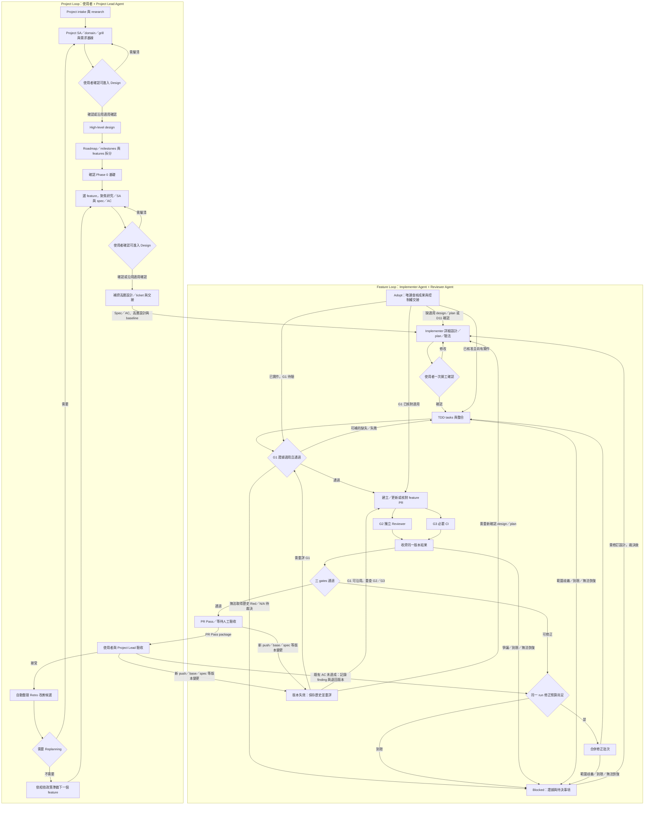

# Orchestrate：整體 Workflow Design v1

日期：2026-09-26；2026-09-27 更新 D32／D34 的分析／設計分工、D31 選型狀態、D37 選配部署及建置／後續試用順序。狀態：供使用者 review 的整合設計，尚非已安裝 skill、controller 或批准開工的 implementation plan。

本文是最新整體設計入口。[decisions.md](decisions.md) 記錄已確認政策；[先前討論草案](orchestrate-workflow-draft.md) 保留來源比較與推導；執行契約見 [workflow-contracts.md](workflow-contracts.md)。建議與未決事項不因寫入本文就成為已核准政策。現行順序依 D33：先在 orca-delivery 測通 workflow、orchestrate 與預設工具組合，再啟動 cross-node-file-transfer。P03 Retro 仍等使用者開始，既有 PR 接入保留暫緩。

部署依 D37／D38：預設 OpenCode 執行 agents，依角色選用 OpenAI／Claude models；Orca、Codex／ChatGPT 相關入口及 Claude Code 為選配。Controller 核心依賴共用 adapter 契約，不要求這些選配程式、帳戶或服務存在。入口、runtime、model 分開；詳見 [OpenCode 預設接法](delivery-harness-overview.md#11-opencode-預設接法與選配入口d37d38)。既有 Orca probes 是該接法的歷史證據，不是通用前置；精確 reviewer model 與各 adapter 能力仍須查核。

## 1. 一個入口、兩個層級

使用者透過 `orchestrate` 與目前角色協作。這是 skill 的擬議使用語意，不是已存在的 CLI：

| 意圖 | 載入哪段流程 | 第一個可驗證結果 |
| --- | --- | --- |
| 建立／接手 project | Project intake，判斷 greenfield / brownfield | Repo、project artifacts、已決定與待決事項的入口 |
| 準備下一個 feature | Project Lead 讀 roadmap／baseline，做聚焦 research、SA／grill 與必要高層設計 | 可交付 slice 的 spec / high-level design / ticket |
| 開始指定 feature | Feature start | 適用 baseline、需求、design / plan 及 AC 驗法 |
| 接入既有 feature / PR | Adopt | 唯讀查核與證據缺口；確認原 owner 交接後才派工 |
| 查進度／恢復 | Status / resume | 真實 head、workers、gates、待發文與下一個允許 action |
| 處理 Blocked | Decision | 對指定版本、問題與理由的人工裁決 |
| 對指定 feature 做 Retro | Retro | 有證據的改善候選；未涵蓋階段明列 |

Project loop 管理方向與交付順序；feature loop 完成單一 PR。每個 feature 同時只有一個 controller 擁有派工權。Skills 提供方法，agents 提出語意判斷，controller 執行版本、狀態、gate 與限制規則。

| 層級 | 主要協作者 | 管理範圍 | 與另一層的交接 |
| --- | --- | --- | --- |
| **Project Loop** | 使用者 + Project Lead Agent | Research、SA、domain、high-level design、共用基準、roadmap／milestones、features 拆分與準備、人工驗收、Retro / Replanning | 交出 feature spec / AC、high-level design 與 ticket；接回 PR Pass package 供驗收 |
| **Feature Loop** | Project Lead 準備需求；Implementer Agent 交付、Reviewer Agent 審查；使用者確認開工與裁決 | 聚焦的 feature 分析／spec／高層設計交接，接續 detailed design / plan、TDD tasks、整合 PR、review / CI、fix / re-review | 引用 project baseline；通過三 gates 後交回 PR Pass package |

交接順序是 **Project 準備 feature → Feature 交付 PR Pass → Project 人工驗收、Retro 並準備下一個 feature**。Review / fix 留在 Feature Loop；跨 feature 的改善與 Replanning 回到 Project Loop。這是兩個工作層級，共用 `orchestrate` 入口，不為同一 feature 建立兩套派工 loop。

Feature-level 的 research／SA／高層設計由 Project Lead 負責，節奏由 Project Loop 安排；交付執行由 Implementer 承接。兩層描述工作範圍，不代表每層只能有一種角色，也不新增第三個 loop。

## 2. 角色與控制權

依 D23（2026-09-27 修訂），Project Lead 負責專案協調，Implementer 負責功能交付；兩者有責任上的上下游，以 feature spec／AC、依賴與交付成果交接。Project／Feature 表示工作範圍，角色的決策權依授權劃分；共同 `orchestrate` 入口不代表相同決策權，runtime 也不綁定固定的 agent 父子關係。使用者可直接與任一角色協作，不要求每項 feature 工作都先經 Project Lead 轉達。

使用者直接交付已確認的 feature 時，Implementer 可進入 design／plan，並在已核准的 scope／design 內作實作決策；遇到跨 feature 影響或超出授權範圍的問題，交 Project Lead 分析並依 D11 回使用者裁決。若使用者明確授權 Project Lead 依 roadmap 推進指定範圍，它便承擔該範圍的優先順序、協調與委派責任；委派意圖交 controller 核對後實際派發。其角色名稱本身不授予 scope 變更、開工批准或最終接受權。

角色間的交接仍由唯一 controller 依核准 plan 派工及收取結果。使用者直接與 Reviewer 討論不等於已完成 G2；正式 review 仍須符合獨立 assignment/session 與證據契約。Controller 是執行協調機制，不是 agents 的主管。

| 角色 | 決定／負責 | 交出什麼 |
| --- | --- | --- |
| 使用者 | 產品取捨、選定 feature、重要需求／架構歧義、design + plan 開工確認、爭議裁決、最終接受 | 具適用版本的明確決策 |
| Project Lead Agent | 專案與 feature 準備：research、SA、domain modeling、grill、高層設計、roadmap／milestones、feature 拆分與 spec；依授權協調及提出委派，協助驗收與 Retro | 研究依據、project baseline、feature spec／AC、高層設計／依賴、可選任務草案、帶授權來源的委派提案與待決事項 |
| Implementer Agent | 功能交付：承接 spec 與高層設計、繼續實作研究，完成 detailed design、校準並維護最終 plan／tasks、整合與 TDD 修正；在核准範圍內作實作決策 | 詳細設計、可派工任務／AC 對照、code、tests、版本化 evidence、PR Pass package 與超出授權範圍的待決事項 |
| Reviewer Agent | 獨立 Codex review：spec 與 quality、測試有效性、舊 finding 覆核與新問題 | Verdict、穩定 findings、覆核證據 |
| Controller | 唯一派工、收結果、核查 gates、持久化、預算、恢復、發布與通知 | 可讀 run state、operation receipts、Pass／Blocked 依據 |

Project Lead 在授權範圍內提出協調／委派意圖，Implementer 提出具體任務與修正批次；controller 核對授權、核准 plan、依賴、scope 與預算後實際派發。兩個角色都不另啟競爭的外層排程；Project Lead 可準備候選需求，但不越過當前 feature owner 同時派修。

Reviewer 在隔離環境讀碼與驗證，結果／logs 可寫入指定位置；被審查 branch 不可修改。Controller 另負責 GitHub 發布，reviewer 不必持有寫入 GitHub 的權限。G2 的 Reviewer Agent 由 controller 以獨立 assignment、獨立 session 派出；不得由 Implementer 透過 opencode Task tool、Claude subagent 等方式呼叫。Implementer 在 task 內使用的 review subagent 可保留作局部品質檢查，不能取代最終整合 PR 的獨立 G2。

## 3. 完整路徑

圖中的 Phase 0 可由既有合格基礎滿足，不要求 brownfield 重做；若需 scaffolding 等程式變更，使用者與 Project Lead 準備一般交付單位，再由 controller 依核准 plan 派工，走 Feature Loop 與適用 gates，完成後再準備相依 feature。任何 phase 都可因明確原因轉 Blocked，包含 Adopt 的控制權或必要來源不明；圖中只展開主要出口。Blocked 的返回位置取決於原因：基礎設施恢復回原操作、實作缺陷回 fix，規格變更才回 design；不重做已驗證成果。依 D28，人工驗收後自動整理 Retro 改善候選；依 D27，相依 feature 等上游人工接受且 merge 後才實作，等待時可準備 spec/design。圖未包含自動 merge、close issue、release 或 deploy。

## 4. Project loop：從基礎到可交付 features

依 D34，準備 project 需求、選定 feature 或重開需求分析時，Project Lead 載入 [Research／SA 階段契約](project-lead-sa.md)。本文描述外層路徑，七項 Spec 內容、互動節奏、工具範圍及完成／Blocked 回報集中於該契約。SA 是分析活動、Spec 是成果，不強制各建一檔。

| 階段／owner | 輸入 → 產物 | 完成條件與失敗路徑 |
| --- | --- | --- |
| Intake／Project Lead | Mission、repo → project binding、限制與現有 artifacts | Repo 與權威來源可辨識；不明路徑先自行查，需求歧義回人 |
| Research／Project Lead | Mission、既有 code/docs/issues、instructions、CI、環境 → 現況、依賴、限制與缺口 | 分清事實、推論與建議；greenfield 研究需求／技術可行性，brownfield 核對實際 code；現有 bug 不自動變成需求 |
| Domain + SA／人 + Project Lead | 研究與每輪 1–3 題的 grill → 領域詞彙、七項需求內容與共識 | 依 SA 契約判斷可進入 Design，保存使用者對適用版本的確認；核心 scope／行為／驗收仍有阻擋則先釐清，不受影響研究可繼續 |
| High-level design／Project Lead + 使用者裁決 | SA → 元件責任、主要資料流、對外契約、架構／tech 取捨與限制 | 足以支援近期交付切分；重要選擇有依據，不預先寫死全部詳細實作 |
| Roadmap／milestones／人 + Project Lead | 需求、設計、風險與依賴 → 成果節點、features 候選與順序 | Roadmap 是路徑，milestone 是成果節點，feature 是可獨立驗收的交付切片；不把 milestone 直接當 task |
| Project baseline／Project Lead | 上述已決定內容 → 可引用的 mission、domain、project spec、architecture/tech、roadmap | 保存實際來源／版本與未決事項，不新增 Project-ready 簽核儀式 |
| Phase 0／Implementer | 需要的 foundation → 可重現 setup/build/test/CI | 以一般交付單位採用適用 gates；既有成果驗證後沿用 |
| Feature preparation／使用者 + Project Lead | 選定 feature、baseline、依賴 → 聚焦 research／SA／domain 釐清／grill、必要 high-level design → feature spec／AC 與 ticket | 規格有行為、scope、限制、非目標與可驗收條件；重要歧義回人，slice 可由單一 PR 交付，太大先拆 |
| Acceptance／人 + Project Lead | PR Pass package → accepted 或具理由的退回 | 接受對應版本；缺陷／新需求／規格錯誤走第 7 節路徑 |
| Retro / Replanning／Project Lead | 人工接受觸發自動整理交付證據與改善候選；必要時提出 baseline/roadmap 調整 | 改善有 owner、驗法與適用版本；落地依既有權限，重大取捨交人 |
| Next feature／使用者 + Project Lead | Accepted 成果、merge 事實、依賴 → 下一個候選 | Project Lead 提出候選、使用者選定；依 D27 等上游人工接受且 merge 才實作；等待時可準備 spec/design，核對實際採用 baseline |

Research、SA、domain modeling、grill 與 high-level design 可反覆修正，不是一次完成的瀑布式文件審批。SA 做到足以支援本層級設計並獲使用者確認後，接續高層設計與近期 milestone／feature 準備；必要決策未解時，不以隱藏假設替代。研究工具協助理解，roadmap 與 features 的切分仍須依產品價值、風險、依賴與可驗收成果判斷。

### 4.1 Feature 準備與實作交接

Project Lead 寫 spec 前，先讀 project baseline 與相關 codebase，再依 [SA 契約](project-lead-sa.md) 做本 feature 的聚焦分析，交接所屬 milestone、需求／AC IDs、來源版本及待決影響。SA readiness 由使用者確認，與稍後 D11 的 design＋plan 開工確認分開；已有適用成果與確認就沿用。Spec 定義為何做、必須達成的行為、scope／非目標、AC、依賴與必要技術限制；high-level design 記錄主要元件責任、跨系統契約及重要取捨。兩者可迭代形成，已有適用內容就引用，不要求為每個 feature 重做全部 project 研究。

| 交接內容 | 預設負責人 | 判斷尺度 |
| --- | --- | --- |
| Feature spec／AC | 使用者 + Project Lead | 要交付什麼、如何驗收、哪些限制不能突破 |
| High-level design | Project Lead；重要取捨交使用者 | 元件責任、對外介面、資料流與跨 feature 影響 |
| Detailed design | Implementer | 模組／資料結構／介面細節、失敗恢復、migration 與測試策略 |
| Implementation plan／tasks | Implementer 維護最終可執行版本；Project Lead 可提草案 | 任務 ID、依賴、scope、task→AC、修改位置、驗法與完成條件 |

例如，高層設計決定「結果先保存，再發布 GitHub，重啟可恢復」；詳細設計再決定檔案 schema、原子寫入、發布器介面、重試與測試案例。Spec 可引用必要技術限制，不把所有 how 都排除；Implementer 也需研究與提出設計，不只是照單寫碼。

Project Lead 可因跨 feature 協調、已知依賴或既有設計先提出工作包／任務草案。Implementer 研究後校準其範圍、介面、粒度及順序，再形成唯一可派工計畫；草案不直接授權 controller 派工。開工前依 D11 確認完整 design + plan；開工後在核准邊界內補細節、作實作判斷，不增加逐 task 簽核。若調整改變 spec／AC、已核准設計邊界或跨 feature 契約，先交 Project Lead 分析並回使用者裁決，保留新版本及影響。

Mission、tech、roadmap、CONTEXT 與 spec 是文件角色，不是強制每個角色各一檔。採原 repo 或所選工具的結構：例如 P03 的 issue #12 + 引用設計、`docs/superpowers/plans/P03-ingest.md`、`docs/validation/P03-validation.md`。Controller 保存實際 references；不產生另一套同義 spec / requirements / tasks。

### 4.2 Project baseline 與 Feature 產出物

共用的 [產出物契約](workflow-contracts.md#project-與-feature-產出物) 定義 mission、domain、project spec、architecture／tech、roadmap、工程驗證及研究決策的責任與讀取時機。Project orchestrate 和每個 feature 都引用實際版本；保留 Matt 原生 CONTEXT.md 作共同領域詞彙入口，不強制另建 domain-model.md。

Feature 的 requirements、plan、validation 分別對應 spec／AC、implementation plan／tasks、AC 驗證對照與實際 evidence；另外保留 design。語意已涵蓋，具體 layout 與工具接合仍是提案，現有 OpenSpec change 的 design／tasks／validation 尚待補齊。

## 5. Feature loop：每一步的交接

| 階段 | 產物與通過條件 | 下一步／退回 |
| --- | --- | --- |
| Intake / adopt | 固定 issue、repo、owner、branch/base、適用 artifacts；既有成果與缺口有紀錄 | 依已有成果進 planning、implementing 或 validating / checking；既有 design/plan 有適用版本的 D11 確認就沿用，缺確認則先 awaiting_approval；控制權或必要來源不明→Blocked |
| Planning／Implementer | 讀取 spec／AC、高層設計與 baseline，研究實作細節；校準草案後產出 detailed design、可派工 DAG、scope、task→AC、測試／文件更新、風險與依賴 | 整份 design + plan 交使用者一次確認；保留確認版本 |
| Implementing | 按依賴逐 task TDD、commit、結果與 Red/Green 證據 | 成功執行不等於 gate 通過；缺陷正常修，範圍變更回人 |
| Integrating / G1 | 單一 owner 整合；最終相關與回歸驗證適用整合 head，歷史 Red 可追溯 | 通過才正式 G2 送審；可補資料／失敗回 implementing，無法取得歷史 Red 或 N/A 未裁決→Blocked，不以重跑綠燈補造歷史 |
| PR / checking | 記錄真實 PR base/head；G2 與 G3 並行，結果先保存再發布 | 同版本結果收齊才整理修正；卡住依 timeout / infra retry 處理 |
| Correcting | Finding / CI 問題合併為一批，保留 IDs、scope 與對應 commit | 新 head 回 G1，再取得新版本 G2/G3；爭議／重複無效修正／到限→Blocked |
| Pass | 再核對 head/base/artifact/policy 版本及三 gates；持久化判定 | PR Pass package 交 Project Lead；後續版本失效回 validating 或 checking，需新開工確認則回 planning / awaiting_approval；待發布結果繼續重試，不假稱已發布 |

依 D13，implementation 依序執行（並行度 1）；不同 tasks 可以預先研究。若日後要改為並行，需新決策修改 D13，屆時各 worker 使用隔離 worktree，依賴與檔案 scope 必須相容；最終只有整合後 PR 能取得 Pass。

## 6. Gates、finding 與版本

- **G1**：task/AC 對應歷史 Red 與後續修正；最終 Green / regression 適用當前整合版本。只有綠燈、console 完成或測試總數都不夠。D26 選用 Superpowers TDD；純文件／註解 N/A 先由獨立 Reviewer 核對適用性，再判 G1，之後才正式 G2。設定等依實際行為判定，Implementer 不可自行豁免。
- **G2**：獨立 Reviewer 對照 spec、design、完整 PR diff、必要 codebase 與適用規範。成功執行仍可判 `changes_required`；未解決 blocking findings 必須為零。
- **G3**：從 GitHub 讀必要 checks，不從 agent 摘要推定。Required 集合必須明示並核對 repo 規則；空集合、缺項、pending、cancelled、timeout、unknown 不得當成功。建議 skipped/neutral 預設不接受，例外由明確 policy 指定。

當前 gate 判定綁定 repo/PR、head、review base/merge-base、spec/design/plan/policy 版本。新 push 使當前結論過期，重新驗證；非程式文件變更由影響評估決定需重跑哪些驗證，不要求所有歷史 Red 重做。可保留的證據須留適用理由，Reviewer 對新規格與修正重新下結論。

Review finding 由 Reviewer 提出；人工驗收的 finding 依第 7 節保存。Implementer 可回 `fix_submitted` 或 `disputed`；只有 Reviewer 覆核或明確人工裁決可解除 blocking。現有 ID 隨改名、行號與輪次沿用；位置相同不一定同一問題、文字相似也不能自動合併。語意判斷交 agent，controller 檢查引用與 closure 權限。依 D24，本機 JSON registry 為 finding 狀態權威，PR 保存完整 review，原 issue 發可採取行動的摘要與連結。

### Implementer ↔ Reviewer 交手

1. Controller 送出固定版本的 review assignment，派獨立 Reviewer session。
2. Reviewer 產出 result（verdict + findings）；由 worker 或 adapter 依契約完整保存檔案。
3. Controller 驗證並匯入 result，正常情況與同版本 G3 一起判定、組成 correction batch。
4. Implementer 的 result 逐 finding 回 `fix_submitted`（commit + evidence）或 `disputed`（依據 + 可重現結果）；缺回應視為 result 不完整。需要改 scope/spec 時回 `blocked`，依 D11 交人。
5. 新 head 先重過 G1，再由 controller 派 Reviewer 覆核。依 D25，`disputed` 的反證先交獨立 Reviewer 覆核一次；仍有 blocking 爭議就 Blocked 交人。釐清沿用原 batch、不另計修正輪次；scope/spec/AC 或設計變更直接沿 D11 回人。

Implementer 與 Reviewer 不直接傳訊或互相呼叫；Orca／runtime 的交接通知只喚醒 controller，引用已保存的 result ID/path，不攜帶權威 finding、verdict 或回應內容。Runtime 原生 assistant messages 可由 adapter 捕捉為 result，與 agent 間通知分開。

「以檔案為準」是交接通道，D24 另指定本機 JSON registry 為 finding 狀態權威；controller 核對結果後匯入。GitHub 留言可作為新證據或裁決來源，不能直接關閉本機 finding；解除 blocking 仍需 D09 的 Reviewer 覆核或明確人工裁決。

詳細的版本、派工、結果、例外與恢復契約見 [workflow-contracts.md](workflow-contracts.md)。

## 7. 人工介入與退回

| 情境 | 動作與下一位 owner |
| --- | --- |
| 人工驗收發現原 AC／已核准設計未達成 | Controller 保存人工退回的版本與 stable finding（source=human_acceptance）；沿用同一 run，先查 D13 剩餘預算，再派 Implementer 修正、Reviewer 覆核；到限→Blocked |
| 原需求以外的新想法 | Project Lead 建立候選 feature；若要併入當前 scope，先明確裁決並更新 design/plan/AC 版本 |
| Spec / design 本身錯誤 | Project Lead 整理影響與方案，交使用者裁決；不降低 AC 來掩蓋程式缺陷 |
| Reviewer 與 Implementer 對 blocker 有爭議 | Controller 保存反證並交獨立 Reviewer 覆核一次；仍有 blocking 爭議則 Blocked，Project Lead 協助向使用者呈現雙方依據。沿用原 batch，不重抽 reviewer 消除 finding |
| 必要環境／權限缺失或 runtime 無法查詢 | Controller 保存 Blocked 與最小恢復條件；未確定舊 worker 結束時不派競爭 writer |
| 新風險或不可逆副作用 | 在允許執行之前提出具體影響與需人決定事項；人工 review 深度提案見原草案 |

正常 finding 修正與 CI 診斷在已批准 scope 內持續執行，不逐 task 重新請人批准。`PR Pass`、phase `ready_for_acceptance` + Human acceptance `pending`、Human acceptance `accepted`、GitHub `merged` 分開：接受不授權自動 merge；PR 新版本也不沿用舊版本的接受紀錄。人工退回缺陷沿用同一 run 與最多三輪 correction 上限，不重置預算；以被退回的交付版本為基準，首次退回不要求先有 accepted 紀錄。Finding 的 identity、來源及歷史接受紀錄見執行契約。

## 8. Retro 接回下一個 feature

依 D28，節奏為「開發中保存線索 → 人工驗收後自動整理 Retro 改善候選 → 有跨 feature 影響才 Replanning」。Orchestrate 明示整合回顧方法，不隱式呼叫 Matt user-only 原版 skill。第一輪挑 1–3 個有依據的改善，記錄來源、原因（事實或假設）、改善、承接者、驗法與落地版本；下一個相關 feature 再看重犯與誤報。

修復當前必要缺陷留在原 fix loop；可獨立的規範／工具改善作 follow-up。修改已核准 spec/AC、架構、gate policy 或工具權限沿 D11 回人。沒有改善不造待辦或 no-change 簽核。完成快照與 findings 保存後，再按需要換 fresh session；context reset 本身不是交接。

D22：P03 是第一次 Retro 試用對象，等使用者明確開始。若尚在 pre-PR，就只回顧已完成部分，後續 PR/CI/驗收列為未涵蓋；不啟動新的 PR gating loop。Matt 原版 user-only skill 的限制及選用契約見 [Retro 接入設計](orchestrate-workflow-draft.md#retro-接入設計建議)。

## 9. 最小實作形態與 skills

依 D30，workflow／controller 核心只依賴穩定的角色、派工／結果與能力契約；底層 runtime／model 透過 adapter 與設定接入。換工具仍需驗證派工、恢復、結果及隔離能力，不因可替換而放寬 gates。G2 既有獨立 Codex review 要求維持；精確 reviewer model 與可用能力仍待查證。D38 將 OpenCode 定為預設 runtime，Orca／Codex／Claude Code 均選配；G2 的精確 reviewer model 與隔離能力仍需核准及查證，不將 Codex CLI 作必要前置。

初始部署沿用 D08 的 lead agent + 小型持久化 controller。相較純 prompt：可以確定地處理 SHA、重試及恢復；相較全面 workflow framework：用本機檔案、單一 process 與窄 runtime／GitHub adapters 可分段驗證。預設直接 OpenCode 接法；有 Orca 時可選其整合入口，Codex／Claude Code 也可作已配置的 runtime 選項。現階段不新增 dashboard、多 repo swarm 或第二個 scheduler。

D31 的 authoring／planning 組合已重新開放評估，Q-METHOD 尚待收斂；既有 OpenSpec 文件保留，比較稿只作研究樣本。D32 確認工作責任，不等於選定以下工具；每個 skill 的實際名稱、安裝版本、觸發限制及輸出契約要在採用前核對。

| 工作位置 | 候選方法／skills | 交接成果 |
| --- | --- | --- |
| Project Lead：project／feature research | 使用者提出的 graphiphy、research-codebase 等；graph 為選用工具 | 有來源的現況、依賴、限制、風險與未知；不以工具名稱當研究完成證據 |
| Project Lead：domain／SA／重要設計釐清 | domain-modeling、grilling；設計方法按需使用 | 詞彙、需求與邊界、設計取捨、已決定／待決事項 |
| Project Lead：整理 feature spec | 建議優先試驗 OpenSpec proposal／specs；Matt to-spec 保留比較候選，非必經，Q-METHOD 尚未固定 | 一份權威 spec／AC 與高層設計引用；不由 authoring skill 代替前段分析 |
| Implementer：detailed design → plan | Writing Plans 是候選；可與 OpenSpec tasks 整合，格式／handoff 待定 | 可交給新 session 執行的任務、介面、測試步驟與驗法；唯一 plan／tasks 權威 |
| Implementer：task 實作 | D26 的 Superpowers TDD；具體包裝與引用版本待定 | Test-first 過程、code 與 G1 可核對證據 |

建議 project 文件承載 baseline／roadmap，feature 由兩個角色接續同一 OpenSpec change；SA 的七項內容是品質要求，不因格式改變而省略。角色交接採可分步產出的方法，不用一次產出全部 artifacts 取代 Implementer 的詳細設計責任。此為試驗方向，尚無整合證據；Matt to-spec 若採用，須明示其 user-only、測試介面確認及 tracker 發布契約。

Writing Plans 的儲存路徑可以依使用者偏好調整，但原生任務格式與 execution handoff 仍需明示適配。若採 OpenSpec tasks 為唯一計畫來源，需保留其追蹤格式並補足交接細節；不能聲稱只改檔名就完成整合，也不另維護一份可獨立漂移的 plan。技能候選不因此取得派工權；既有單一 controller 與 G2 獨立性要求維持。

依 D17 使用單一 `orchestrate` 入口；建議以 router 按意圖載入 project / feature / adopt-resume / retro references；共用 gate、assignment/result 與 owner 契約。Skill 程序與輸出範圍見 [契約文件](workflow-contracts.md#skills-交接契約)。自動呼叫限制不靠 wrapper 名稱繞過；保留原方法或明示整合調整。

Controller 建議為本機 Python CLI，YAML 保存設定、JSON 保存狀態、JSONL 保存事件；運作原子性見 [file-state.md](file-state.md)。OpenCode 為預設 runtime adapter；Orca／Codex／Claude Code 為選配接入，GitHub／git／CI 各有窄 adapter，核心規則可用 fake adapters 測。所選 profile 才載入其依賴及 preflight；未選用的接入失敗不阻斷 controller 的核心或 OpenCode 路徑。實際語言與執行命令將在 implementation plan 固定，目前沒有可直接啟動的產品指令。

## 10. 驗證與交付順序

| 步驟 | 要證明什麼 | 可交付成果 |
| --- | --- | --- |
| V1 設計收斂 | 決策、角色、全部正常／退回路徑與 artifacts 一致 | 本設計、契約、政策選擇；既有 OpenSpec 規格與待完成的 design／可派工 plan，方法組合依 Q-METHOD 收斂 |
| V2 核心規則 | 舊版本、缺證據、未知 check、未解 blocker 不放行；round 與 retry 分開 | 經 TDD 驗證的 gate evaluator／狀態轉移 |
| V3 持久化與恢復 | Crash、重複結果、遺失通知、未知發文結果不重派／重貼 | 檔案 store、outbox、reconcile 與故障注入證據 |
| V4 真實 adapters | 正確 workspace / worker 身份、隔離、結構化結果與生命週期；以無 Orca／Codex CLI／Claude Code 的 OpenCode 路徑為基線，選配接入分別驗證 | 各核准部署的 integration 證據；不可將一種接法的成功當作另一種已通過 |
| V5 Skills／預設工具組合驗證 | Member 經 orchestrate 入口按預設方法前進，新 session 讀交接能接續、不繞 gates 或啟動第二 loop | 固定版本的工具組合、可安裝 skill、操作說明及可追溯交接證據；mock／真實執行分開 |
| V6 真實完整試用 | 本 repo 測通後，cross-node-file-transfer 從既有基準匯入、初始化到 feature 交付；含 finding → fix → re-review 與最新版本三 gates | 可追溯的 project／feature 歷程及 PR Pass package／Blocked 證據；舊 P03 接入不是預設前置 |

先完成 V1 的正式 plan 與一次具體開工確認，再執行程式開發。初始手工研究報告並不證明 V4 已過：先前 Codex native completion、reviewer 工具隔離與新 repo workspace discovery 都有未解缺口。實驗開始前重查現況，參見 [integration-gaps.md](research/2026-09-25/integration-gaps.md)。

### 10.1 先測通 orca-delivery，再啟動新專案（D33）

已確認順序：**本 repo 收斂並測通 workflow／orchestrate／預設工具組合 → cross-node-file-transfer 匯入既有基準 → Phase 0 → 首個 feature 完整交付 → 人工驗收與 Retro**。本輪記錄此方向，尚未初始化新專案；具體開工確認仍對應 D11 的 design／plan 版本。

目前工作集中在 orca-delivery：收斂 Q-METHOD，固定各角色／階段的預設方法、版本與 artifact 交接；實作 orchestrate 與 controller／adapters，按 V2–V5 保存測試及真實能力證據。Member 應從同一入口知道目前階段、必要輸入、下一步與待決事項，由流程載入適用技能，無須每次自行組合工具。工具版本及使用限制要可核對，不能靠本機剛好裝了某套 skill 才能重現。

以下是「測通」的設計檢核方向，具體案例與完成條件納入 implementation plan：

- 預設組合能在核准 runtime 下載入並完成角色／artifact 交接，重要決策仍交人。
- 新 session 能從持久化文件與狀態接續，需求、tasks、驗證、review／fix 與結果可追溯。
- Controller 能拒絕過期／缺失證據，處理重複事件、恢復與 Blocked；skills 不另啟外層 loop。
- 可控制案例、真實 adapter／agent 測試及完整 feature E2E 分別標示；本 repo 測通不直接宣稱後續產品 E2E 已完成。

新專案沿用 gigaxfer 適用的 intent、spec、CONTEXT、設計、ADRs／決策與 roadmap。初始化做來源版本核對、路徑／結構映射、引用修復及未決事項承接，不為已確認內容重做完整 grill；若出現新衝突或重要缺口，只釐清該差異。原有決策保留來源，新實作建立自己的 TDD、review、CI 與驗收歷程。舊 goal／reviewer／夜間 loop 指令作歷史參考，與新 workflow 規則分開，不因搬文件而啟動舊迴圈。

D15／D16 的既有 PR 接入保留為暫緩方案，非目前前置；如使用者日後恢復，再核對 Q-TARGET 與原 owner 交接。P03 Retro 仍可由使用者單獨啟動，不混入本輪新專案準備。

### 10.2 建置 harness 本身與後續試用

Controller／adapters／orchestrate 是本專案的正式交付範圍，不是可拋棄的練習。依 D04／D05，當 feature spec、AC 與可獨立驗收切片清楚時，建立或沿用對應的 GitHub feature issue，引用唯一規格及後續 design／plan／validation；正式 implementation 前須有可核對 ticket，tasks 留在該 feature 計畫。若整個 change 過大，先在 roadmap 拆切片，再各自對應 issue／PR，不用一張含糊大票強塞所有工作。

本次先更新及 review 既有設計，不以 ticket 存在作為文件研究前提，也未批准現在建立 GitHub issue。待目標 repository 與切片確定後再發布；目前 orca-delivery 尚無 remote。Ticket 草稿可先保存在本 repo，不能冒充已發布紀錄。

使用者已提出依本 workflow 開發 controller 本身。首次建置由目前協作者交接 spec／AC 與高層設計，指定的 Opus 5.5 Implementer 承接詳細設計／plan，D11 確認後再實作；獨立 Reviewer 與真實 CI 分開留證。依 D39，本次 bootstrap 先協調 Opus 與 GPT／Codex agents，使用已核對的派工通道，OpenCode 登入不是此階段前置。產品依 D38 維持 OpenCode 預設及其他 runtime 選配；不能依賴尚未完成的 controller 自動完成自身 bootstrap。這次設計文件 review 也不是產品 PR 的 G2。Controller 可執行後再分別驗證其核心、恢復、runtime 接入及自動交付流程，清楚標示由人／協作者協調與由 controller 自動執行的區段。

依 D33 及使用者本輪再次確認，先完成並測通本 repo 的 harness／controller 實作，再以新 workflow 從頭啟動 cross-node-file-transfer，作為完整 Project＋Feature 流程的驗證與操作練習。它沿用適用的既有專案基準，仍有自己的 spec／issue／PR 與新證據；不是先拿新專案代替尚未完成的 controller。控制用假 adapter 或有意設置的失敗案例屬測試，不能冒充真實 feature 的獨立 finding → fix → re-review。真實 review 沒有 finding 時如實記未覆蓋該展示條件。

建議在設計 review 結束後準備可讀 handoff，再 compact 或開新 session：交接已確認／待決事項、artifact 位置與版本、review findings／覆核結果、目前狀態、下一步及授權邊界。Compact 不代表開工批准或 gate 通過；新 session 先讀交接及實際文件，不重問已有適用確認的問題。

## 11. 本輪決策前緣

D24–D28 已確認 finding 權威／發布、一次爭議覆核、TDD／非行為例外、相依 feature 啟動條件及自動 Retro 候選；CIT 依 D29 暫不處理，G3 維持必要 CI。

D32 已確認分析與設計的角色責任；Q-METHOD 收斂 authoring／planning 的工具、原生格式與交接方式，不重開三 gates 或角色基本分工。

D30／D38 已確認核心不綁定底層實作且預設 OpenCode；接下來將 G2 的精確 reviewer model、OpenCode 模型推論與隔離能力（本機安裝及無推論 probe 已完成）、repo-specific required checks、timeout／active time 計算及 skill 包裝落入具體 implementation plan。這些不改動已確認的角色、三 gates 與預算上限。正式開工仍依 D11 確認具體 design + plan；順序依 D33，Q-TARGET 僅在另行恢復舊 PR 試用時核對。
