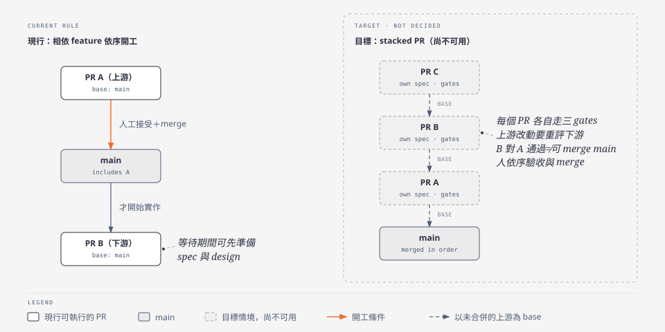
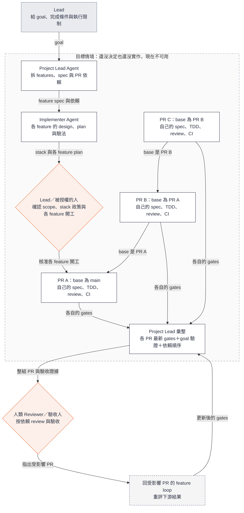

# Stacked PR：目標情境（尚未決定）

這是設計文件，不是操作說明：記錄「給一個 goal，用 stacked PR 推進多個 Feature」的目標情境。它還沒決定、也還沒實作（決策紀錄 Q-STACK；現行規則是 D27：有依賴的 Feature 等上游接受並 merge 後才開始實作）。使用者現在的做法見[參考](../guide/reference.md#給一個-goal推進多個-feature)。圖的原稿是 [stacked-pr.html](stacked-pr.html)，SVG 由它匯出。

**Stacked PR 是還沒決定、也還沒實作的目標情境，現在不能這樣執行。** 現在能做的是：goal 拆成多個 feature，一個接一個推進。

先對照現行規則與目標：

未來可以這樣說：

> 請用 project-lead skill 把〈已確認的 goal〉拆成可驗收的 features，提出 spec、依賴與 PR stack，讓我確認。在我授權的範圍內依序啟動 feature loop，每個 PR 都完成自己的 gates。達到 goal 後交出整組 PR、依賴順序、驗收證據與已知限制，保留 worktrees。

圖中的 A／B／C 只是 stack 結構示例，不是已選定的 cross-node features。每個 PR 對應一個有界、可驗收的 feature；goal 不取代各 feature 的 spec、開工確認與 gates，也不能只用最後一個 PR 通過就宣告整組完成。

**交給人 review 的內容**：goal 與達成情況、PR 依賴圖及閱讀順序、每個 PR 適用版本的 gates 與 AC 證據、整組成果的驗證方式、剩餘問題。

**與目前規則的邊界**：現行規則要求相依 feature 等上游人工接受、實際 merge、採用 baseline 後才開始實作。未來啟用 stack 前，要先確認每個 PR 的依賴與 review base、上游變動後哪些證據失效，以及人工驗收與合併順序。B 相對 A 通過，不代表 B 可以直接合併 main。這件事還沒決定。
