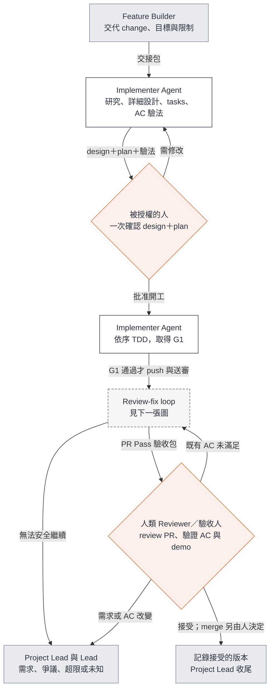
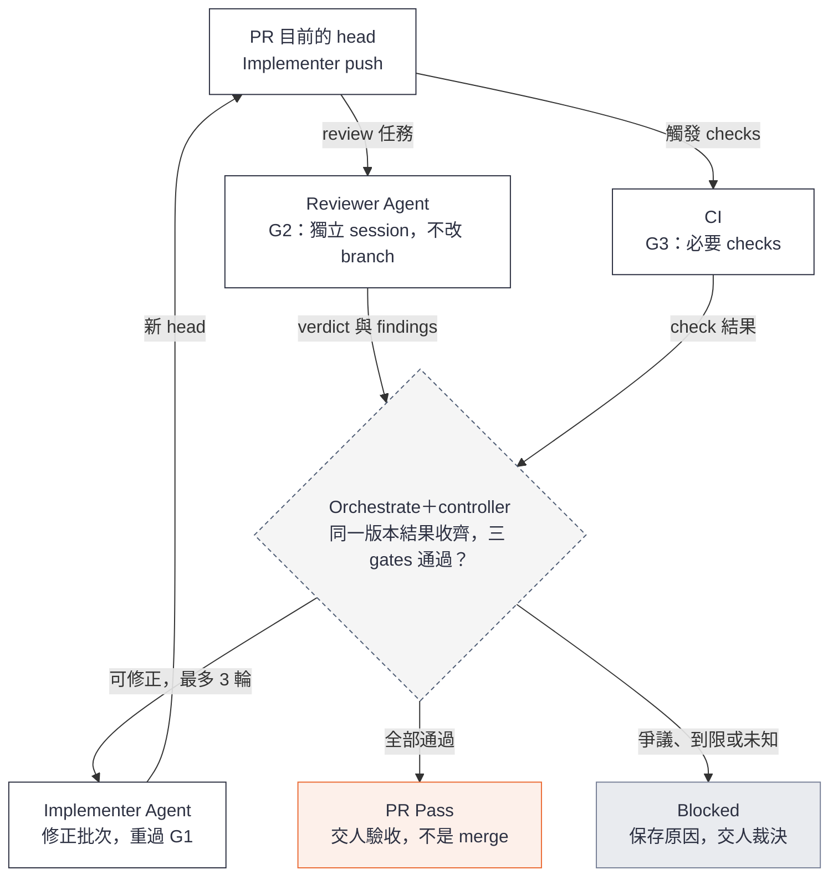

# Loop Engineering 使用指南：Feature Builder

**給接 feature 的 Feature Builder（工程師）。** 你從 Project Lead 拿到交接包，帶 Implementer Agent 完成詳細設計與 plan，確認開工後由 feature loop 跑到 PR Pass，交人驗收。先讀 [總覽](user-guide.md) 了解角色；需求怎麼來的見 [Project Lead 指南](user-guide-project-lead.md)。

**狀態：預期流程草案。** `orchestrate` skill 與薄 controller 的第一片正在實作，完整 loop 尚未可用。

## 你會收到什麼

Project Lead 交給你一個交接包，內容見 [總覽的兩個介面](user-guide.md#兩層之間只交兩樣東西)。缺東西或有衝突時，先回報 Project Lead 和 Lead，不要自己補需求。

## 怎麼開始

> 請用 orchestrate 承接〈change ID〉。先由 Implementer 讀取它引用的 project baseline、spec／AC 與高層設計，提出 detailed design、可執行 tasks 及 AC 驗證方式，交我確認後開工。保留 worktree 與證據；終點是 PR Pass，等待人驗收。

feature loop 從收到交接包就開始，第一步是 design＋plan，然後停下等開工確認。交接包本身不含開工確認。

你只改同一個 change 的 `design.md` 與 `tasks.md`，驗法寫進 validation 文件。`proposal.md` 與 `specs/` 屬於 Project Lead；需要改需求或 AC 時回去找 Project Lead 和 Lead，不在程式裡繞過。

## 完成一個 feature，包括 PR

先看主線：人只在開工確認與驗收兩處介入，中間由 agents 跑 review-fix loop。

再看 review-fix loop：G2 與 G3 對同一個 head 並行，收齊後才判定。

G1 缺原始證據、必要結果無法取得或出現未知執行狀態時，先保存原因並交人處理，不為了走到 PR Pass 補造證據。Implementer 對 finding 有異議時，反證先交獨立 Reviewer 覆核一次，仍有 blocking 爭議才交人。

你負責確認技術交付安排、查看進度、處理自己有權決定的問題；Agent 負責實際工作。若你被授權批准 design＋plan，由你完成開工確認，否則交指定決策者。正常已授權工作不需要每個 task 都回來簽核。

Task 是 PR 內的工作單位。預設一個可獨立驗收的 feature 對應一個 PR；過大的 feature 先請 Project Lead 拆成完整切片。

## 計畫要讓 AC 真正能驗證

每個 AC 都要有「怎麼驗、在哪裡驗、何謂通過、證據放哪」。以下只是寫法示例，並非已核准的 cross-node 功能需求：

| AC 示例 | 驗證方法／環境 | 通過標準 | 保存的證據 |
| --- | --- | --- | --- |
| 成功傳送後，目的檔案內容與來源一致 | 對採用的兩節點測試環境執行傳送，再獨立比對檔案 | 傳送成功且內容完全相符 | 測試輸出、環境資訊、適用程式版本 |
| 傳送失敗時，呼叫端不會收到成功結果 | 在受控環境製造傳送失敗，檢查公開回傳行為 | 明確回報失敗，不誤報成功 | 行為測試結果及原始 Red→Green 紀錄 |

## PR Pass 到底代表什麼

| Gate | 足以通過的證據 |
| --- | --- |
| G1：實作／TDD | 與本次行為及 task 可追溯的 Red→Green 過程，最終相關與回歸驗證適用目前整合後的 head |
| G2：獨立 Review | Reviewer 已對照 spec、design、完整 PR diff 與必要 context；未解 blocking findings 為零 |
| G3：CI | 設定要求的 checks 全部取得可接受的成功結果，且適用目前版本 |

G1 先於送審；G2 與 G3 彼此獨立，可以並行。Red 通常來自較早版本，不要求與最後 Green 同 SHA。CI 綠燈不能補上缺失的 TDD 證據，agent 的「完成」也不能當作 gate 結果。純文件或註解的 TDD N/A 須有理由與檢查，並由獨立 Reviewer 確認。

新 push、review base 或適用 spec／design 改變時，重新評估證據；過期結果不能放行。缺 check、pending、取消或未知都不算成功。

**PR Pass 表示可交給人驗收。** 不代表已被接受、已合併或已部署。人發現原需求未滿足，回修正；若是新增需求或改變 AC，先回 Project Lead 更新並確認需求，不能為了讓程式過關而反改 spec。

## 讓單一 feature 持續跑

一個可執行的 goal 包含：交付範圍、何謂完成、允許的動作、執行限制，以及需要你回來的情況。

> 請推進〈change ID〉，以已確認的 design／plan 為準。可依計畫實作、更新 PR、執行獨立 review／CI 及修正循環。直到目前版本的三 gates 通過，整理驗收包後停下。保留 worktree，不自動 merge、close issue 或 deploy。需求／AC 或設計需改變時回來裁決；最多三輪修正、四小時主動執行時間。

Orchestrate 按授權工作，controller 核對狀態與證據。每個基礎設施操作最多額外重試兩次，和三輪程式修正分開計算；未知的執行結果先保存並停止，不反覆重派。

查進度時，你應看得到：目前 feature／PR 與版本、哪個角色正在工作、各 gate 的證據或缺口、下一步，以及是否有需要人的問題。

轉為 **Blocked** 時，agent 應交出問題、已嘗試事項、證據、可選方案與需要你決定的事。你補上決策後，再從保存的狀態核對並接續；不能只憑一句「proceed」忽略尚未解決的正確性問題。

## 你交回什麼

| 結果 | 交給誰 |
| --- | --- |
| PR Pass 驗收包（內容見 [總覽](user-guide.md#兩層之間只交兩樣東西)） | 人類驗收人，副本給 Project Lead |
| Blocked：需求或 scope | Project Lead 與 Lead |
| Blocked：環境、權限、爭議或到限 | 有權裁決的人 |

驗收後的 Retro 與下一個 feature，以及 merge 後的 archive，都由 Project Lead 處理。依賴與 stacked PR 的規則見 [總覽](user-guide.md#兩層之間只交兩樣東西)。
