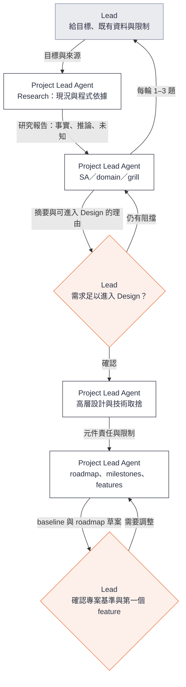
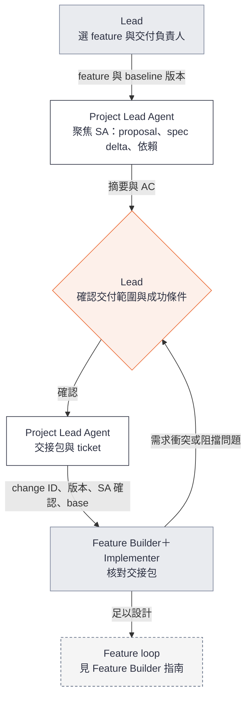
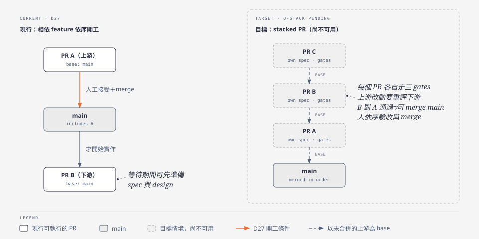
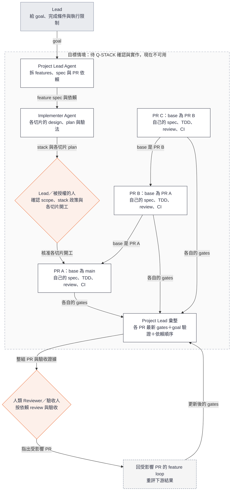

# Loop Engineering 使用指南：Project Lead

**給帶專案的 Lead。** 你和 Project Lead Agent 一起決定做什麼、先後順序，把 feature 一個一個交給 feature loop，驗收後收尾。先讀 [總覽](user-guide.md) 了解角色與控制方向；接 feature 的 Feature Builder（工程師）讀 [Feature Builder 指南](user-guide-feature-builder.md)。

**狀態：預期流程草案。** `project-lead` skill 是草稿，尚未實際演練。

## 你和 Agent 各做什麼

| 你（Lead） | Project Lead Agent（`project-lead` skill） |
| --- | --- |
| 給目標、限制與既有資料 | 先研究現況，再只問需要業務判斷的問題 |
| 用白話回答問題，說「先延後」也可以 | 把答案寫進對應的文件：需求進 spec、待決進 proposal、共用詞彙才進 `CONTEXT.md`；決定拆成哪些能力規格 |
| 看一頁摘要，確認「可進入 Design」 | 提出摘要與理由；你沒確認前不往下走 |
| 選下一個 feature、指定負責人 | 準備 change 與交接包，交給 feature loop |
| 驗收結果、決定 merge | 驗收後整理 Retro 候選、提出下一個 feature；確認 merge 後 archive |

**你不需要知道檔案怎麼拆。** 放檔案、拆能力規格、檢查格式都是 Agent 的工作；你讀的是照意思排列的摘要，想深入時再點連結。

## 怎麼開始

有三個時機會進入 SA：開新專案或匯入既有專案、選定下一個 feature、新證據推翻原本的需求。開一個 agent session，這樣說：

> 請用 project-lead skill，做〈project／某個 feature〉的 SA。Repo 在〈路徑〉，既有資料在〈位置〉。我想解決的問題是〈一兩句〉。

只要給四樣：哪一層、repo 在哪、既有資料、想解決什麼。第四樣講不清楚也沒關係，Agent 會先問。

進去之後：

1. **Agent 先研究，不先問問題**：用 research-codebase 查現況，交一份摘要，分清事實、推論和未知。
2. **每輪問你 1–3 題**：每題附為什麼現在要決定、選項、影響與建議。
3. **邊問邊寫**：每輪告訴你改了什麼、還剩哪些阻擋。
4. **提出「可進入 Design」**：附一頁摘要。
5. **你確認或退回**：確認後才進入高層設計；這不是開工批准。

中途離開不影響進度，答案都已寫進文件。下次說「接續〈project／feature〉的 SA」，Agent 會先讀文件，已確認的不重問。

## 完成 project level

以未來的 `cross-node-file-transfer` 演練為例：

> 請用 project-lead skill 準備 cross-node-file-transfer。先核對可沿用的 gigaxfer 需求、領域、設計與 roadmap，保留來源版本；把 `docs/spec.md` 拆成能力規格，先給我拆法對照表。只釐清差異與阻擋問題，最後交出專案基準、milestones 與第一個 feature 的建議。



Research 記錄「目前如何運作」，研究報告不是已批准的 spec。Spec 說「要達成什麼」，design 說「如何達成」。

專案基準（project baseline）要能回答以下問題：

| 內容 | 位置 |
| --- | --- |
| 為誰解決什麼問題、哪些不做 | project intent 或 `mission.md` |
| 共用領域語言 | `CONTEXT.md` |
| 跨 feature 的行為、系統責任與共用限制 | `openspec/specs/<能力>/spec.md`，一個能力一份；共用限制自成一個能力 |
| 架構、技術棧與重要取捨 | 既有 system design、ADR 或 `tech.md` |
| Milestones、features、順序與完成條件 | roadmap |
| 如何 setup、build、test；工程規則與必要 CI | repository 指引、scripts、CI 設定 |

交接時保存採用的路徑與版本。已確認的需求可以沿用；新 example 的程式必須留下自己的驗證證據。需要先建立專案骨架（測試、CI、工程規則，常稱 Sprint 0 或 bootstrap）時，把它當作第一個交付切片，編號和其他切片一致，例如 F0。

完成這個階段，代表已有足以展開近期工作的基準與 roadmap，不要求提前寫完所有未來 features 的 spec。

### Roadmap 要切多細

Roadmap 會一直改，所以問題不是「切得越細越好」，而是哪一層值得提早做：

- **切片清單很便宜**：只有名稱、一句範圍和依賴。當前 milestone 的切法有依據時，可以整個列出來，方便看平行和依賴。
- **Spec 只寫接下來 1–2 片**：每片寫 spec 都要經過 SA 和你的確認，寫太早容易作廢。
- **詳細設計等開工前才做**：由 Implementer 負責。

每個切片標「近期」或「暫定」，讓人分得出哪些已經要做。每片驗收後回頭看一次 roadmap；改範圍或順序時記進決策紀錄。

以 cross-node-file-transfer 為例：M1 的切片來自 gigaxfer 已經實作過的計畫，所以可以整個列出，只有專案骨架 F0 和第一片 F1 標近期；M2 只列 feature。規則見 [SA 指引](project-lead-sa.md#roadmap-怎麼規劃)，業界做法與出處見 [Roadmap 規劃參考](../references/roadmap-planning.md)。

## Spec 怎麼寫、放哪

SA 要回答七個問題，它們是檢核表，不是七個章節：問題與目標、範圍與非範圍、角色與端到端情境、行為與業務規則、例外與必要限制、驗收條件、假設依賴與待決。Agent 把它們放進四個位置：

| 位置 | 裝什麼 |
| --- | --- |
| `proposal.md` 的 Why | 問題與目標 |
| `proposal.md` 的 What Changes 與「不做」 | 範圍與非範圍 |
| `specs/<能力>/spec.md` 的 Requirement 與 Scenario | 情境、行為與規則、例外與限制、驗收條件；每個 Scenario 就是一條帶 ID 的 AC |
| `proposal.md` 的待決與依賴 | 假設、依賴與待決 |

你確認時看到的是這樣的摘要：

```text
目標：……                          → proposal.md#why
不做：……                          → proposal.md
規則：ING-01 ……、ING-02 ……        → specs/file-ingest/spec.md
例外：AC-I03 重複寫入、AC-I04 逾時
待決：Q1 容量上限（阻擋 Design，等你決定）
版本：<commit 或檔案 hash>
```

需求 ID 每個能力一個前綴，用過不重用，archive 後也不變，讓 review 與證據能一直追溯。格式由 `openspec validate` 檢查；內容對不對由你和 Reviewer 判斷。

## 把 feature 交出去

> 請用 project-lead skill 準備〈feature〉：補足 spec、AC、必要高層設計與依賴，引用專案基準的實際版本。交接給〈Feature Builder〉，列出已確認事項與阻擋問題。



交接包的內容見 [總覽的兩個介面](user-guide.md#兩層之間只交兩樣東西)。Ticket 連到 change，不重貼內容。Project Lead 可以附 tasks 草案，但最終 plan 由 Implementer 校準。

**交接完成**是 Feature Builder 知道要交付什麼、能開始詳細設計；不等於已開工。啟動 feature loop 有兩種方式：

- **手動**：你把交接包交給 Feature Builder，由他啟動。
- **授權**：你明確授權 Project Lead 負責某個範圍，且該 feature 的 SA 已確認，Project Lead 就能自己啟動。loop 產出 design＋plan 後會停下等開工確認，Project Lead 不能代你批准。

## 驗收之後：收尾

feature loop 回來的結果只有兩種：

- **PR Pass 驗收包**：交給你或指定的驗收人，內容見 [總覽](user-guide.md#兩層之間只交兩樣東西)。
- **Blocked**：如果原因是需求或 scope，你和 Project Lead 分析影響、更新 spec 並記錄決策，再把新版本交回去。

你接受之後，Project Lead 會：

1. **整理 Retro 候選**：只挑 1–3 個有證據的改善，寫明來源、原因、改善、owner 與驗法。沒有證據就不寫。
2. **提出下一個 feature**：更新 roadmap、檢查依賴，讓你選。

確認 PR 已 merge 之後，再：

3. **Archive 這個 change**：把 spec 差異併回 `openspec/specs/`，project spec 就此更新。

依 D27，有依賴的 feature 等上游接受並 merge 後才開始實作；等待期間可以先準備它的 spec。Milestone 還需要自己的跨 feature 整合驗證，不能把一串 PR 綠燈直接加總成完成。

## 給一個 goal，推進多個 feature

**Stacked PR 是待 Q-STACK 確認並完成實作後的目標情境，現在不能這樣執行。** 現在能做的是：goal 拆成多個 feature，依 D27 一個接一個推進。

先對照現行規則與目標：



未來可以這樣說：

> 請用 project-lead skill 把〈已確認的 goal〉拆成可驗收的 features，提出 spec、依賴與 PR stack，讓我確認。在我授權的範圍內依序啟動 feature loop，每個 PR 都完成自己的 gates。達到 goal 後交出整組 PR、依賴順序、驗收證據與已知限制，保留 worktrees。



圖中的 A／B／C 只是 stack 結構示例，不是已選定的 cross-node features。每個 PR 對應有界、可驗收的切片；goal 不取代各切片的 spec、開工確認與 gates，也不能只用最後一個 PR 通過就宣告整組完成。

**交給人 review 的內容**：goal 與達成情況、PR 依賴圖及閱讀順序、每個 PR 適用版本的 gates 與 AC 證據、整組成果的驗證方式、剩餘問題。

**與目前規則的邊界**：現行規則（D27）要求相依 feature 等上游人工接受、實際 merge、採用 baseline 後才開始實作。未來啟用 stack 前，要先確認每個 PR 的依賴與 review base、上游變動後哪些證據失效，以及人工驗收與合併順序。B 相對 A 通過，不代表 B 可以直接合併 main。此決策保留在 [Q-STACK](../decisions.md)。

## 查進度

你問進度時，Project Lead 應列出 roadmap 上每個 feature 的狀態：準備中、SA 已確認、feature loop 進行中（附 run ID）、PR Pass、已接受、已 merge 並 archive，或 Blocked 與原因。狀態來自文件、ticket、PR 與 controller 的唯讀狀態，不靠對話記憶。這個專案進度視圖的自動化列在 S2。
