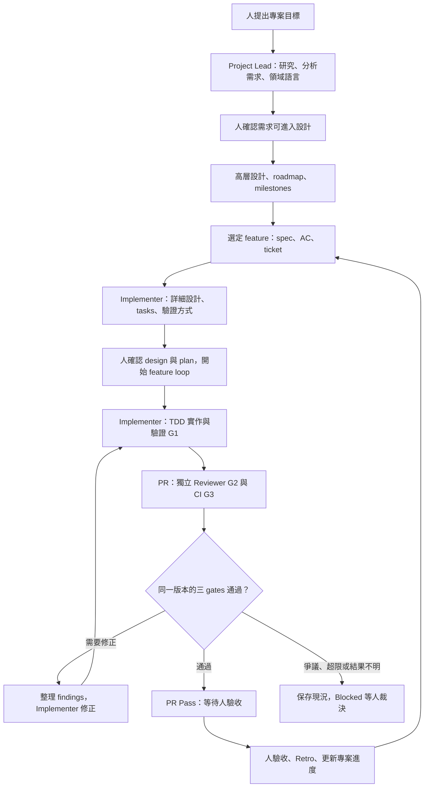

# Loop Engineering Workflow

**狀態：預期使用流程草案。** 用來檢查角色、使用情境與交接是否合理；可照做的操作指南，待實作完成並以 example 演練後定稿。

這份指南給要帶領專案、交付 feature，或中途接手工作的使用者。以 `cross-node-file-transfer` 為貫穿範例，說明你何時下指令、agent 接著做什麼，以及下一位協作者會拿到什麼。

**目前可依本指南討論與人工演練；完整自動 loop 尚未可用。** 新版 orchestrate／薄 controller 還在設計修訂，example 尚未啟動。下方操作文字是預期的自然語言請求，不是已安裝的指令。實作進度與未決能力見文末。

## 先看整體流程

你提出目標，與 Project Lead 建立專案共識；選一個 feature，交 Implementer 完成詳細設計與計畫。你確認開工後，orchestrate 協調實作、獨立審查與修正，直到 PR 通過三個 gates，交回你驗收。

Project Loop 管「往哪裡走、接下來交付什麼」；Feature Loop 管「把這個功能交到可驗收」。圖中的下一個相依 feature，仍須等上游人工接受、實際合併並採用新基準，才開始實作。

## 人與 agents 的角色

| 角色 | 主要工作 | 交給下一位的東西 |
| --- | --- | --- |
| 使用者／負責人 | 提目標、決定範圍與取捨、確認開工、處理爭議、最終驗收 | 明確的決策與適用範圍 |
| Project Lead Agent | 研究與 SA、領域建模、高層設計、roadmap、feature spec／AC；驗收後重新規劃 | 專案基準、可交付的 feature 及其依賴 |
| Implementer Agent | 承接 feature、詳細設計、最終 tasks、TDD、整合 PR、修正 findings | 程式、測試證據、PR 與待決事項 |
| Reviewer Agent | 獨立對照 spec／design／diff 審查，覆核修正 | Findings 與適用版本的 review 結論 |

Project Lead 與 Implementer 有工作上的上下游；你可以直接和任一角色合作。也可以由甲帶 Project Lead、乙帶 Implementer，不必把乙的對話塞進甲的 session。委派範圍與決策權由人授權，角色名稱本身不授予批准開工或修改需求的權力。

Reviewer 使用獨立 session 與工作區，不能直接修改被審分支。修正交 Implementer；blocking finding 由 Reviewer 覆核或由人明確裁決，不能由作者自行關閉。

**Orchestrate 與 controller 是協作工具。** Orchestrate skill 帶領協調 agent 推進流程、呼叫既有 runtime 派工；薄 controller 保存可讀的 JSON／YAML 狀態、核對版本與證據、計算 gates 及下一個允許動作。每個 feature 只有一個外層協調 loop；Project Lead 不另外開一套競爭的 loop。

## Use case 1：帶 Project Lead 從專案目標開始

以未來的 `cross-node-file-transfer` 演練為例，你可以這樣開始：

> 請以 Project Lead 角色，依 Loop Engineering Workflow 準備 cross-node-file-transfer。先核對可沿用的 gigaxfer 需求、領域、設計與 roadmap，保留來源版本；只釐清差異與阻擋問題。先交出專案基準、milestones 與第一個 feature 的建議，讓我確認。

| 步驟 | Agent 做什麼 | 你會看到／決定什麼 |
| --- | --- | --- |
| 1. 研究與 SA | 讀既有文件及相關程式，釐清角色、流程、規則、例外與責任邊界 | 有依據的現況、差異與未知；每輪 1–3 個需要你決定的問題 |
| 2. 建立共用語言與需求 | 維護 `CONTEXT.md`，整理目標、範圍、情境、規則、限制與 AC | 確認關鍵歧義已解決，需求可進入 Design |
| 3. 高層設計與路線圖 | 決定主要系統責任與技術約束，安排可展示的 milestones，拆 features | 每個 milestone 的成果、完成條件與依賴；近期工作較細 |
| 4. 準備第一個 feature | 針對選定切片補足 spec／AC、必要高層設計與 ticket | Implementer 可據此做詳細設計，而不用重新猜需求 |

SA 是分析活動，spec 是分析成果；不必各寫一份相同內容。Spec 說「要達成什麼」，design 說「如何達成」。Project Lead 定義系統邊界，Implementer 接續細化介面、實作與測試策略。

專案基準應能回答以下問題，檔名沿用 repository 慣例：

| 內容 | 常見承載位置 |
| --- | --- |
| 為誰解決什麼問題、哪些不做 | `mission.md` 或既有 project intent |
| 共用領域語言；必要的概念關係與邊界 | `CONTEXT.md`；關係圖與規則按需放入適用 spec |
| 跨 feature 的行為、系統責任與共用限制 | Project spec／能力規格 |
| 架構、技術棧與重要取捨 | `tech.md`、既有 system design／ADR |
| Milestones、features、順序與完成條件 | `roadmap.md` 或既有 roadmap |
| 如何 setup、build、test；工程規則與必要 CI | Repository 指引、scripts、CI 設定及其文件 |

這些內容組成後續所有角色共用的 **project baseline（專案基準）**。交接時保存採用的路徑與版本，不讓 agents 各自找一份看起來最新的文件。已確認且仍適用的需求可以沿用；新 example 的程式必須留下自己的驗證證據。

若需要 Phase 0 建立 scaffolding、測試與 CI，就把它當作有範圍、AC 與 PR 的交付切片。它也走下面的 Feature Loop。Phase 0 完成後，才依 roadmap 開始依賴它的功能。

## Use case 2：接到 feature，完成一個可驗收的 PR

Implementer 的使用者可以從另一個 session 接手：

> 請以 Implementer 角色承接這個 feature ticket：〈連結〉。讀取它引用的 project baseline、spec／AC 與高層設計，先提出 detailed design、可執行 tasks 及 AC 驗證方式，交我確認後開工。保留 worktree 與證據；終點是 PR Pass，等待人驗收。

| 階段 | 執行與交接 | 人何時介入 |
| --- | --- | --- |
| 接件 | 核對 ticket、文件版本、依賴、repo／branch、owner 與未決事項 | 需求衝突或缺少必要決策時 |
| 詳細設計與計畫 | Implementer 研究實作，補 design、task 順序與 AC 驗法；Project Lead 的 tasks 草案由 Implementer 校準 | 確認這一版 design＋plan，才開始實作 |
| TDD 實作 | 依相依順序逐 task 實作，保存原始 Red、Green 與回歸證據 | 正常已授權工作持續執行，不逐 task 簽核 |
| PR 審查 | G1 通過後建立／更新 PR，獨立 Reviewer 與 CI 可並行 | 需要規格、設計裁決或 finding 爭議時 |
| 修正循環 | 收齊同版 review／CI 結果，整理一次修正批次；修正後重新驗證、review 與 CI | 達上限、結果不明或 scope 擴張時 |
| 交付 | 三 gates 通過，交出 PR、AC 結果、證據、剩餘限制與 demo 步驟 | 人實際驗收；merge 是另外的動作 |

Task 是 PR 內的工作單位。預設一個可獨立驗收的 feature 對應一個 PR；過大的 feature 先拆成完整切片。

### 計畫要讓 AC 真正能驗證

每個 AC 都要有「怎麼驗、在哪裡驗、何謂通過、證據放哪」。以下只是寫法示例，並非已核准的 cross-node 功能需求：

| AC 示例 | 驗證方法／環境 | 通過標準 | 保存的證據 |
| --- | --- | --- | --- |
| 成功傳送後，目的檔案內容與來源一致 | 對採用的兩節點測試環境執行傳送，再獨立比對檔案 | 傳送成功且內容完全相符 | 測試輸出、環境資訊、適用程式版本 |
| 傳送失敗時，呼叫端不會收到成功結果 | 在受控環境製造傳送失敗，檢查公開回傳行為 | 明確回報失敗，不誤報成功 | 行為測試結果及原始 Red→Green 紀錄 |

### PR Pass 到底代表什麼

| Gate | 足以通過的證據 |
| --- | --- |
| G1：實作／TDD | 與本次行為及 task 可追溯的 Red→Green 過程，最終相關與回歸驗證適用目前整合後的 head |
| G2：獨立 Review | Reviewer 已對照 spec、design、完整 PR diff 與必要 context；未解 blocking findings 為零 |
| G3：CI | 設定要求的 checks 全部取得可接受的成功結果，且適用目前版本 |

Red 通常來自較早版本；不要求與最後 Green 同 SHA。CI 綠燈不能補上缺失的 TDD 證據，agent 的「完成」也不能當作 gate 結果。純文件／註解的 TDD N/A 須有理由與檢查，並由獨立 Reviewer 確認適用性。

新 push、review base 或適用 spec／design 改變時，重新評估證據；過期結果不能放行。缺 check、pending、取消或未知都不算成功。Review 明細保留在 PR，原 ticket 提供可採取行動的摘要與連結。

**PR Pass 表示可交給人驗收。** 不代表已被接受、已合併或已部署。若人發現原需求未滿足，回修正；若是新增需求或改變 AC，先更新並確認需求，再重新規劃，不能為了讓程式過關而反改 spec。

## Use case 3：設定 goal，讓 loop 持續推進

一個可執行 goal 應包含：要交付的範圍、何謂完成、允許的動作、執行限制，以及需要你回來的情況。

> 請推進〈feature ticket〉，以已確認的 design／plan 為準。可依計畫實作、更新 PR、執行獨立 review／CI 及修正循環。直到目前版本的三 gates 通過，整理驗收包後停下。保留 worktree，不自動 merge、close issue 或 deploy。需求／AC 或設計需改變時回來裁決；最多三輪修正、四小時主動執行時間。

Orchestrate 按授權工作，controller 核對狀態與證據。預設每個基礎設施操作最多額外重試兩次，和三輪程式修正分開計算；未知的執行結果先保存並停止，不反覆重派。

你查進度時，應看得到：目前 feature／PR 與版本、哪個角色正在工作、各 gate 的證據或缺口、下一步，以及是否有需要人的問題。

若轉為 **Blocked**，agent 應交出問題、已嘗試事項、證據、可選方案與需要你決定的事。你補上決策後，再從保存的狀態核對並接續；不能只憑一句「proceed」忽略尚未解決的正確性問題。

### Goal 涵蓋多個 features 時

例如「完成第一個 milestone」可以作為 Project Lead 的協調目標，但每個 feature 仍有自己的 spec、開工確認、PR 與驗收。首版跨 feature 的推進由 workflow／skill／人依交接契約承接，不宣稱薄 controller 已會自動管理整個專案。

每個 feature 驗收後，Project Lead 整理 Retro 改善候選、更新 roadmap，檢查下一項的依賴。Milestone 還需要自己的跨 feature 整合驗證，不能把一串 PR 綠燈直接加總成完成。

### 多個 PR 與 stacked PR：還有一個待決邊界

多個獨立 PR 與真正相依的 stack 不同。Stack 例如 `main ← PR A ← PR B`，B 以未合併的 A 為基底。

**Stacked gating 是成品目標，啟動政策尚未定案。** 現行規則要求相依 feature 等上游人工接受、實際 merge、採用 baseline 後才開始實作；等待時可準備 spec／design。因此現在不能把「給一個 goal，自動堆出多個相依 PR」當成已可使用的能力。

未來啟用 stack 前，需要確認每個 PR 的依賴／review base、上游變動後哪些證據失效，以及人工驗收／合併順序。B 相對 A 通過，不代表 B 已可直接合併 main。此決策保留在 [Q-STACK](../decisions.md)，不因本文展示情境而默認批准。

## 跨人、跨 session 要交什麼

換人或重開 session 時，交文件位置與適用版本，再讀保存的結果。聊天可補背景，但不承擔唯一的進度與需求記憶。

| 交接 | 接收者至少要拿到 |
| --- | --- |
| Project Lead → Implementer | Repo／feature／ticket、project baseline、spec／AC、設計邊界、依賴、來源版本、未決問題與下一位 owner |
| Implementer → 開工確認 | Detailed design、最終 tasks、scope、AC 驗法、必要環境、風險與執行限制 |
| Orchestrate → 執行角色 | Run／task／attempt、角色、worktree／branch、允許範圍、文件版本、base／head、驗收與結果位置 |
| Implementer → Reviewer | Spec／design、完整 PR 與 review base／head、實作證據及尚未覆核 findings |
| Reviewer → 修正循環 | 穩定 finding ID、問題與依據、blocking 與否、預期行為、適用版本；後續修正及覆核證據 |
| Feature → 人／Project Lead | PR Pass 驗收包、AC 結果與限制、PR／CI／review 連結、worktree、待人接受的項目 |

完成執行與品質通過分開：review 可以成功執行，但結論仍是 `changes_required`。先保存結果，再發布／通知；通知只是喚醒接收者。詳細欄位留在 [交接契約](contracts.md)，使用者不必先讀 schema 才能開始討論需求。

### OpenSpec、Matt 與 Superpowers 的檔案怎麼接

我們統一交接內容與版本，沿用工具原生檔名。每種內容只保留一份權威：

| 內容 | 採 OpenSpec 時的對應 |
| --- | --- |
| 動機與範圍 | Change 的 `proposal.md` |
| Requirements／spec／AC | Change 的 `specs/`，引用 project baseline |
| 詳細設計 | Change 的 `design.md` |
| Plan／task groups | Change 的 `tasks.md`；Writing Plans 方法可協助補足可執行細節 |
| Validation | 既有驗證文件或 plan 的明確區段，執行後補證據；不是 OpenSpec 必有的原生檔 |

Project Lead 與 Implementer 接續同一份 change。採別的 authoring 工具時，交接指向實際權威文件，不再複製一份平行的 `requirements.md` 或 `plan.md`。`CONTEXT.md` 保留原名與領域語言用途。

## 會用哪些 skills 與工具

| 用途 | 目前方向與界線 |
| --- | --- |
| 研究、SA、領域語言與 grill | [Project Lead SA 指引](project-lead-sa.md)；按需使用 Matt 的 research／domain-modeling／grilling 方法，先核對本機可用 skill 與觸發限制 |
| 規格與詳細計畫 | 本次 controller 採既有 OpenSpec；Writing Plans 的計畫方法作適配。通用預設組合仍在驗證，不要求每位使用者自行串兩套 loop |
| TDD | 已選 Superpowers TDD 方法；每個行為 task 保存可追溯證據 |
| 審查與修正 | 獨立 Reviewer，依 spec／工程規則審查；Implementer 使用適用的 debugging／review-response 方法修正 |
| 持續協調 | 待完成的 orchestrate skill 呼叫薄 controller，再使用既有 runtime 的執行能力 |
| Example 執行環境 | Herdr 管 sessions／工作區；本機 OpenAI 經 OpenCode，Claude 直接用 Claude Code；Orca 是選配入口 |
| 程式與協作紀錄 | Git branches／worktrees、GitHub issues／PRs／CI，以及可讀的執行結果與狀態 |

模型與 runtime 分開設定；角色不綁某個模型名稱。Reviewer profile 仍須符合採用的獨立審查要求。公司 OpenCode-only 接法需在公司環境驗證，不能由本機的小型交接測試推定已完成。

## 用 cross-node-file-transfer 跟走一遍

這是後續演練路線，feature 名稱與切法以沿用並確認的 roadmap 為準，本指南不另立產品 spec。

1. **準備基準**：Project Lead 匯入適用的既有 mission／需求、domain、設計與 roadmap，記錄來源、差異及文件位置。人確認適用性。
2. **完成 Phase 0**：Implementer 提 design／plan，經確認後建立必要骨架與驗證能力；走完 PR gates，再由人驗收。
3. **交付第一個 feature**：從 roadmap 選一個完整切片，依 Use case 2 執行；讓另一個 session 的 Reviewer 接手。
4. **驗證修正循環**：有真實 blocking finding 時，留下 finding → fix → re-review 的歷程。若 review 沒找到問題，如實記錄該展示條件尚未覆蓋，不製造缺陷湊演示。
5. **人驗收與 Retro**：驗收功能後，整理值得加入測試、工程規範或 skills 的改善候選；跨功能取捨交 Project Lead 與人重新規劃。
6. **接續下一個 feature**：核對依賴、人工接受、merge 與 baseline；交給相同或另一位使用者帶領 Implementer。保存各 feature 的 branch／worktree、文件與交付證據。
7. **展示 milestone**：執行跨 feature 的整合情境，讓人從目標一路查到 spec、PR、修正及驗收。真正 stacked PR 展示等政策確認與能力驗證後再加入。

Demo 結束時，觀眾應能沿一條路徑找到：「目標 → milestone → feature／AC → design／tasks → worktree／PR → TDD／review／CI → 人的決策」。保留 worktree 是為了重看與接手；刪除／清理另行決定。

## 現在做到哪裡

截至 2026-09-28：

- **已有**：兩層 workflow 與交接設計、現有 OpenSpec artifacts、controller 候選設計；Herdr 搭配 Luna／OpenCode、Sonnet／Claude Code 的小型真實交接紀錄。
- **設計修正已覆核**：新版薄 controller 候選已修正 Opus 初審的 16 項及覆核新增的 2 項；獨立覆核為文件修正 `clean`，見[修正紀錄](../reviews/2026-09-28-opus-review-d45-04-resolution.md)。D11 開工確認尚未完成，產品驗收仍未執行。
- **尚未完成**：新版 orchestrate／controller 實作、完整真實 PR gating loop、cross-node-file-transfer 的 Project→多 features 演練、跨人驗證與 stacked gating。

目前先把 loop-engineering 本身測通，再啟動 example。小型 runtime 測試與舊 controller 測試不能代替新流程驗收。

需要追實作時讀 [最新 handoff](../handoffs/2026-09-27-controller-design.md)；需要修改流程規則時讀 [設計詳述](overview.md)、[交接契約](contracts.md) 與 [決策紀錄](../decisions.md)。日常操作先從本指南對應的 use case 開始。
