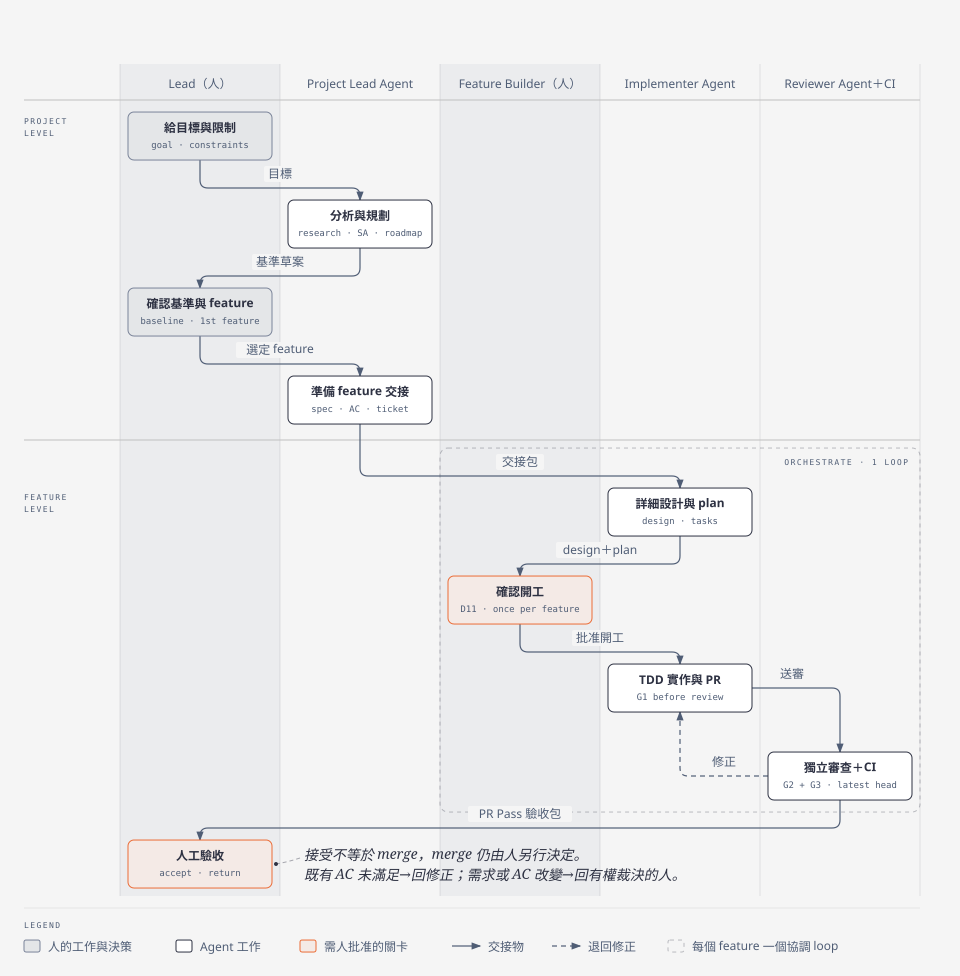
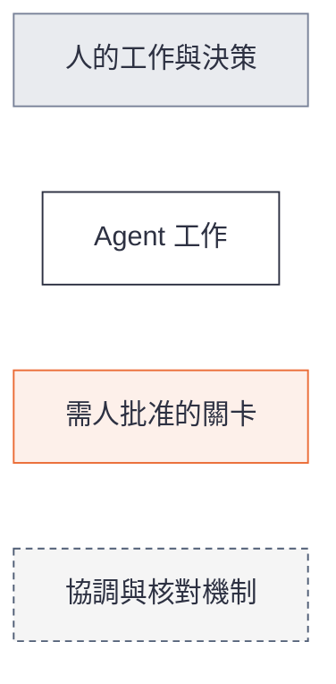
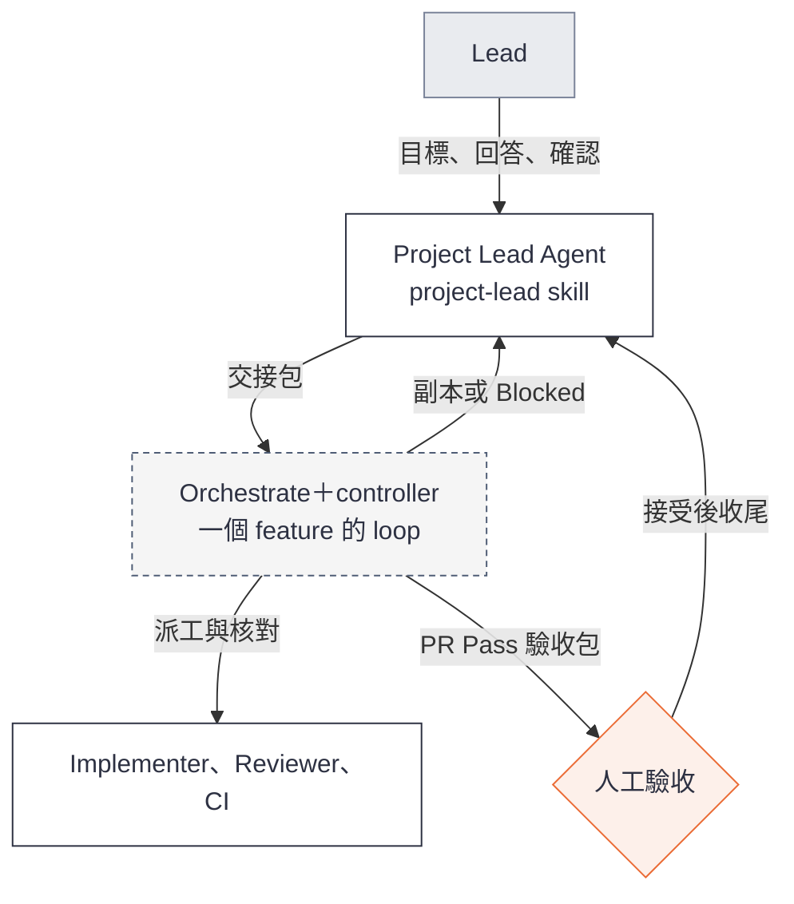

# Loop Engineering 使用指南：總覽

**狀態：預期使用流程草案。** 用來檢查角色、使用情境與交接是否合理；可照做的操作指南，待實作完成並以 example 演練後定稿。

**目前可依本指南討論與人工演練；完整自動 loop 尚未可用。** 薄 controller 第一片正在實作，`project-lead` skill 是草稿，example 的 Project 層即將開始（D56）。下方操作文字是預期的自然語言請求，不是已驗證的指令。進度見文末。

## 三份指南，依角色讀一份

| 你要做什麼 | 讀哪份 | 用哪個 skill |
| --- | --- | --- |
| 了解全貌、角色與交接 | 本文 | — |
| 帶專案：研究、SA、spec、roadmap，把 feature 交出去，驗收後收尾，或用一個 goal 推進多個 feature | [Project Lead 指南](user-guide-project-lead.md) | `project-lead` |
| 接 feature：詳細設計、TDD、PR、review-fix，交人驗收 | [Feature Builder 指南](user-guide-feature-builder.md) | `orchestrate` |

個人專案可以同一人兼兩個角色，照順序讀兩份即可。以 `cross-node-file-transfer` 為貫穿範例。

## 一張圖看全貌

灰底泳道是人，白底方框是 Agent 的工作，橘框是需要人批准的關卡；箭頭上的字是交接物，虛線是退回修正。虛線範圍是每個 feature 唯一的協調 loop：Orchestrate 派工與追蹤，controller 核對版本、證據與 gates。

瀏覽器版與 stacked PR 對照圖見 [圖解頁](user-guide-visual.html)；圖以 [diagram-design](https://github.com/cathrynlavery/diagram-design) skill 製作，修改時改 HTML 再重新匯出 SVG。

## 角色：Project 與 Feature 兩層

**Lead、Feature Builder（工程師）、人類 Reviewer／驗收人都是人**；名稱帶 **Agent** 的才是代理。這是工作責任，不是強制三個職位。每個 feature 開始時，明確指定誰能確認開工、誰裁決需求、誰驗收；職稱本身不授予決策權，也不新增逐 task 簽核。

| 誰 | Project level：決定做什麼、先後順序 | Feature level：交付可驗收的功能 |
| --- | --- | --- |
| **人** | **Lead**：給目標與限制，確認需求可進入 Design、專案基準、roadmap 與要做的 feature | **Feature Builder（工程師）**：接件、安排技術交付、確認或轉交 design＋plan 開工。**人類 Reviewer／驗收人**：檢查意圖、AC 與 demo，接受或退回 |
| **Agent** | **Project Lead Agent**（`project-lead` skill）：研究、SA、grill、spec、高層設計、roadmap，驗收後收尾 | **Implementer Agent**：詳細設計、plan、TDD、PR 與修正。**Reviewer Agent**：獨立審查與覆核；CI 跑必要 checks |
| **機制** | 文件與版本是交接權威，聊天不是 | **Orchestrate**（`orchestrate` skill）跑一個 feature 的 loop；**controller** 保存狀態、核對版本、證據與 gates |

**Lead（人）和 Project Lead Agent 不同。** Lead 做決定；Project Lead Agent 做分析、提出建議並整理文件。同理，人類 Reviewer／驗收人判斷是否符合意圖與可接受，不是 G2 Reviewer Agent 的另一個名稱。

Reviewer Agent 使用獨立 session 與工作區，**不直接修改被審 branch**；修正由 Implementer 做。每個 feature 只有一個外層協調 loop。角色不綁模型或 runtime，Orca 是選配入口。

以下各圖使用同一套顏色：

## 控制方向：Project Lead 呼叫 feature loop

Project 層是人和 Agent 一來一回的對話，不需要派工或 gates；feature 層有多個 Agent 並行，需要 controller 核對證據。所以兩層分成兩個 skill，控制只往下走：

Orchestrate 從不呼叫 Project Lead。feature 內遇到需求或 scope 問題時回報 Blocked，由人和 Project Lead 接手。同一套 skill 有兩種自主程度：

| 模式 | 誰啟動每個 feature | 適合 |
| --- | --- | --- |
| 手動 | 人拿 Project Lead 準備好的交接包，自己啟動 orchestrate | 第一版、個人使用 |
| 授權 | Project Lead 在人核准的範圍內啟動；各 feature 的 SA 確認須先完成。loop 產出 design＋plan 後停下，等人確認開工，Project Lead 不能代批 | goal 模式、多 feature 的 demo |

依據見 [D55](../decisions.md)。

### 兩層之間只交兩樣東西

兩份角色指南都以這裡為準，不另外重寫。

| 介面 | 方向 | 至少包含 |
| --- | --- | --- |
| **交接包** | Project Lead → feature loop | OpenSpec change ID 與檔案版本；SA 確認紀錄；引用的專案基準；依賴、base branch，以及必須先接受並 merge 的上游；未決問題與各自的決策者；誰批准開工、誰驗收。不含開工確認：design＋plan 在 loop 裡產出後才由人確認 |
| **PR Pass 驗收包** | feature loop → 人類驗收人，副本給 Project Lead | run ID；變更原因、範圍與 before／after 行為；每條 AC 的結果與證據；適用的 head、base 與 spec 版本和三 gates 證據；風險與已知限制；PR、CI、review 連結與 worktree |

feature loop 無法安全繼續時，改交 **Blocked**：run ID、問題、已嘗試事項、證據、可選方案與需要誰決定。

**PR Pass 不是接受，接受也不是 merge**，三者分開記錄。有依賴的 feature 要等上游被接受並 merge 後才開始實作（D27）；以未合併 PR 為 base 的 stacked PR 待 [Q-STACK](../decisions.md) 決定。

## 跨人、跨 session 要交什麼

換人或重開 session 時，交文件位置與適用版本，再讀保存的結果。聊天可補背景，但不承擔唯一的進度與需求記憶。Implementer 與 Reviewer 不直接互傳結果，都經由保存的檔案與 orchestrate 交接；先保存結果，再發布或通知，通知只是喚醒接收者。各角色之間的交接內容見 [交接契約](contracts.md#角色交接摘要)。

## 文件放哪

每種內容只保留一份權威，沿用工具原生檔名。Spec 採 OpenSpec（[D54](../decisions.md)）：

| 內容 | 位置 | 誰寫 |
| --- | --- | --- |
| Project spec：系統目前已接受的需求 | `openspec/specs/<能力>/spec.md` | Project Lead；feature 驗收並 merge 後由 archive 併入 |
| Feature 的動機、範圍、不做、待決 | `openspec/changes/<id>/proposal.md` | Project Lead |
| Feature 的需求與 AC | `openspec/changes/<id>/specs/<能力>/spec.md`（只寫差異） | Project Lead |
| 詳細設計、tasks | 同一個 change 的 `design.md`、`tasks.md` | Implementer |
| AC 驗法與證據 | 既有 validation 文件 | Implementer 補驗法，執行後補證據 |
| 領域語言、mission、架構、roadmap | `CONTEXT.md`、project intent、design／ADR、roadmap | Project Lead |

## 會用哪些 skills 與工具

| 用途 | 目前方向與界線 |
| --- | --- |
| Project 層與 feature 準備 | [project-lead](../../skills/project-lead/SKILL.md) skill（草稿）；規則見 [Project Lead SA 指引](project-lead-sa.md) |
| Codebase 研究 | [research-codebase](../../skills/research-codebase/SKILL.md)，改寫自 HumanLayer 的 research_codebase；記錄現況，不批准需求或決定設計 |
| SA、領域語言與 grill | Matt 的 grill-with-docs、grilling、domain-modeling，由 project-lead 按需叫用 |
| 規格 | OpenSpec（D54）；Writing Plans 與 tasks 的接合仍在驗證 |
| 單一 feature 的 loop | `orchestrate` skill 呼叫薄 controller，第一片實作中 |
| TDD | Superpowers TDD；每個行為 task 保存可追溯證據 |
| 審查與修正 | 獨立 Reviewer，依 spec 與工程規則審查；Implementer 修正 |
| Example 執行環境 | Herdr 管 sessions 與工作區；本機 OpenAI 經 OpenCode，Claude 直接用 Claude Code；Orca 是選配入口 |
| 程式與協作紀錄 | Git branches／worktrees、GitHub issues／PRs／CI，以及可讀的執行結果與狀態 |

本次 controller 開發依 [D52](../decisions.md)，預設 Opus 5.5 實作、GPT 審查；Reviewer 必須使用不同的實際模型與獨立 session。其他專案的 profile 仍需明確設定及驗證。

## 用 cross-node-file-transfer 跟走一遍

這是後續演練路線，feature 名稱與切法以沿用並確認的 roadmap 為準，本指南不另立產品 spec。

1. **準備基準**：Project Lead 把 gigaxfer 的 `docs/spec.md` 拆成能力規格，連同 domain、設計與 roadmap 記錄來源版本。人確認拆法與適用性。見 [Project Lead 指南](user-guide-project-lead.md)。
2. **做專案骨架 F0**：repo 骨架、CI 與工程規則當作第一個交付切片，常稱 Sprint 0 或 bootstrap。依 D56 可以手動協調，歷程標明「人工協調」，再由人驗收。
3. **交付第一個 feature**：Project Lead 準備 change 與交接包，Feature Builder 帶 Implementer 完成 PR；另一個 session 的 Reviewer 審查。
4. **驗證修正循環**：有真實 blocking finding 時，留下 finding → fix → re-review 的歷程。review 沒找到問題就如實記錄，不製造缺陷湊演示。
5. **驗收與收尾**：人驗收後，Project Lead 整理 Retro 候選、提出下一個 feature；確認 merge 後再 archive 這個 change。
6. **接續下一個 feature**：核對依賴、人工接受、merge 與 baseline；保存各 feature 的 branch／worktree、文件與交付證據。
7. **展示 milestone**：執行跨 feature 的整合情境。真正的 stacked PR 展示等 Q-STACK 確認與能力驗證後再加入。

Demo 結束時，觀眾應能沿一條路徑找到：「目標 → milestone → feature／AC → design／tasks → worktree／PR → TDD／review／CI → 人的決策 → archive 後的 project spec」。

## 現在做到哪裡

截至 2026-09-28：

- **已有**：兩層 workflow 與交接設計；spec 位置與格式（D54）；兩個 skill 的分工（D55）；`project-lead` skill 草稿。
- **實作中**：薄 controller 第一片的 design＋plan 已由 [D53](../decisions.md) 核准，文件已合進 main，正在 `delivery/thin-controller` 分支依 tasks 實作。第一片只管單一 feature，不受 D55 影響。
- **即將開始**：依 [D56](../decisions.md)，cross-node-file-transfer 的 Project 層先用 project-lead skill 做，不等 orchestrate；專案骨架 F0 可手動並標明人工協調，第一個真正的 feature 等 orchestrate 可用。
- **尚未完成**：orchestrate 與 controller 的完整 loop、project-lead skill 的實際演練、cross-node-file-transfer 的多 features 演練、跨人驗證與 stacked gating。

設計核准與 skill 草稿都不代表已驗收。需要追實作時讀 [最新 handoff](../handoffs/2026-09-27-controller-design.md)；需要修改流程規則時讀 [設計詳述](overview.md)、[交接契約](contracts.md) 與 [決策紀錄](../decisions.md)。
